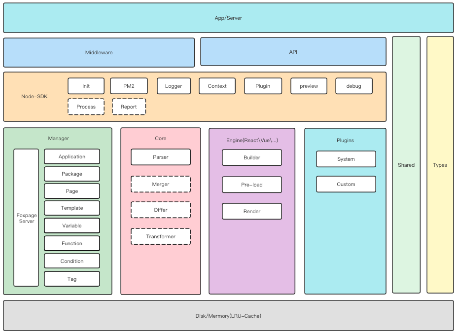
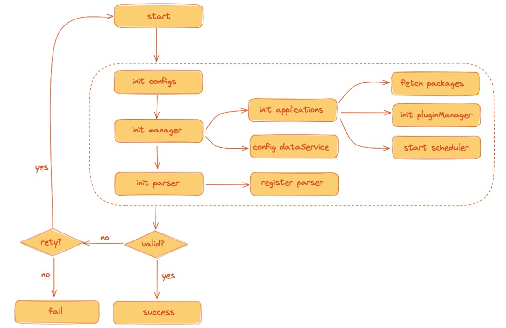
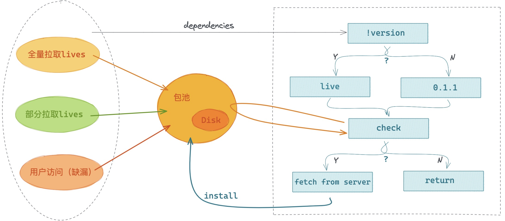
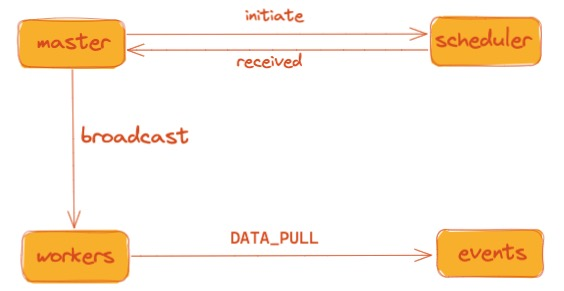
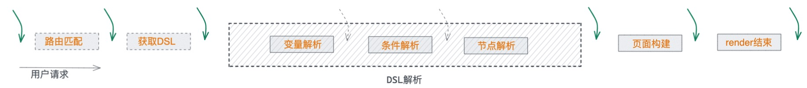
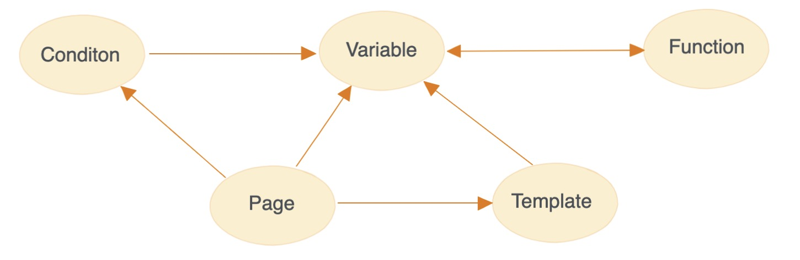
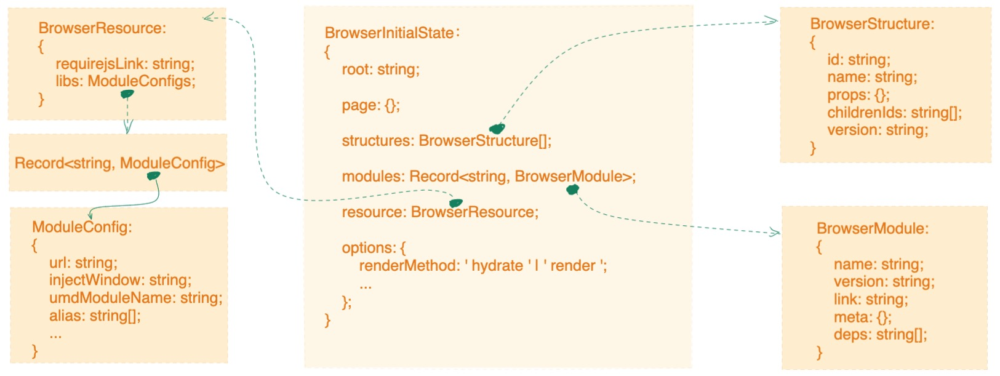
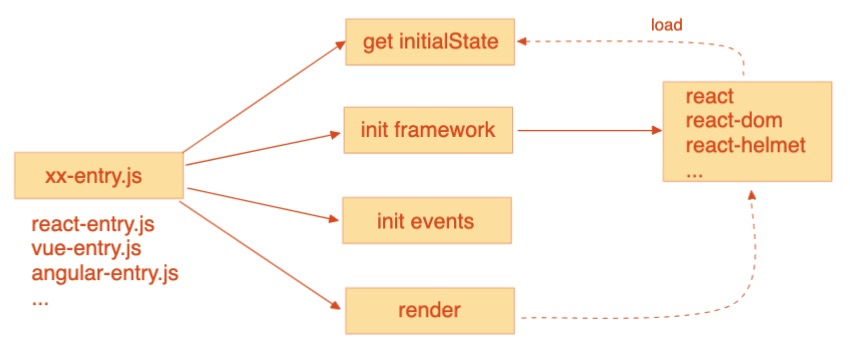
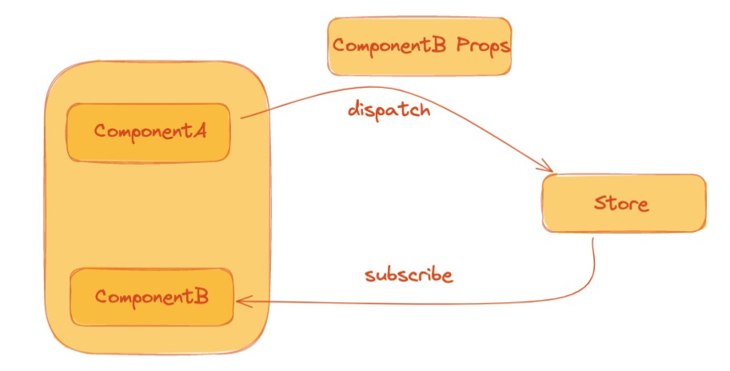

<!-- ## Node SDK 实现 -->

## 介绍

`Foxpage Node SDK`（以下简称：SDK）是供 Node 服务端使用的，为已接入的应用提供`资源管理`、`页面解析`和`页面渲染`的一系列功能。

首先，介绍下 SDK 的整体架构，如下：

<div style="text-align: center;">
  
</div>

> - `App(Site) server` 指的是应用（站点）服务
> - `App(Site) server` 可以通过 `Middleware` 和 `API` 两种方式来接入 SDK（`Node-SDK`）
> - SDK 包含多个模块：
>   > - `Manager`：资源管理器，统一方式管理所有依赖资源
>   > - `Core`：SDK 核心，当前提供 `DSL` 解析功能
>   > - `Engine`：渲染引擎，主要包含页面构建和渲染功能。
>   > - `Plugin`：插件系统，结合 `微内核` 理论，提供快速扩展能力
>   > - ...
> - `Shared`：公共工具包
> - `Types`：公共类型包

核心能力：

- `资源管理`：负责所有依赖的 [资源管理](/advance#资源管理器-1)。通过 [多进程间通讯](/advance#多进程间通讯) 方式来同步各个进程间的资源信息，并将资源进行本地 [缓存](/advance#缓存) 来提升性能，同时会建立调度器开启 [定时任务](/advance#定时任务) 来更新本地资源。为了提高扩展性，我们接入了 [插件](/advance#插件) 系统，通过插件来增强相关能力。
- `页面解析`：包含从用户访问到输出页面结构`DSL`的一系列过程。首先是 [路由](/advance#路由) 解析，获得用户访问的页面信息，根据页面信息获取所有的依赖信息`relations`，并创建[上下文](/advance#上下文（context）)，最后使用 [解析器](/advance#解析器-1) 进行内容解析，输出完整的`页面DSL`。
- `页面渲染`：根据已解析完成的`页面DSL`进行渲染。渲染分为：[服务端渲染](/advance#服务端渲染（ssr）) 和 [客户端渲染](/advance#客户端渲染（csr）)。

下面将分别对各个模块（功能）进行详细介绍：

## 初始化

SDK 的初始化是一个非常重要的阶段，应用启动前必须保证 SDK 已经初始化成功`success`。

<div style="text-align: center;">
  
</div>

#### 配置

配置初始化阶段会先读取本地配置文件`foxpage.config.js`或`.foxpagerc.js`。配置如下：

```ts
{
  apps: [
    {
      appId: 'appl_yqfu8BI1BRe15fs',
      configs: {
        'schedule.interval': 10 * 1000
        ...
      },
      plugins: ['@foxpage/foxpage-plugin-function-parse']
    },
  ],
  dataService: {
    host: 'http://10.32.114.170:50000',
    ...
  }
  ...
}
```

详细配置项及说明：[配置](/advance#配置项)

#### 资源管理器

资源管理器 `Manager` 初始化阶段，主要是实例化应用和数据服务配置。会根据上面获取到的配置信息，去服务端获取对应的应用列表， 接着合并应用动态`settings`，生成应用`configs`。

> 此处应用表示平台上的 [Application](/advance#应用（application）)

- **实例化应用**

  - 获取包资源[`package`](/advance#包（package）)：包资源主要是组件包资源，为了保障页面渲染的稳定性和准确性，会在应用初始化阶段全量拉取所有组件包，并`install`。
  - 初始化插件管理器[`plugin`](/advance#插件)：读取应用配置的所有插件，以便运行过程中调用。
  - 启动调度器[`scheduler`](/advance#定时任务)：调度器主要用来定时轮询获取应用最新更新，以便更新本地缓存。

- **配置数据服务**
  根据 `dataService` 配置数据服务，和后台服务建立连接。

#### 解析器

解析器 `Parser` 初始化阶段，除了初始化系统提供的解析器，还会根据已读取到的插件生成对应的解析器。

#### 重试

在以上阶段任何一个环节出现错误，会进行重试操作。

## 配置项

提供一些配置项供使用者定制自己的场景。目前主要包含应用配置（基础配置和插件）和数据服务配置。
配置文件为`foxpage.config.js`或`.foxpagerc.js`

> 目前只提供一些基础的配置，更多配置持续扩展中。

- apps - `array` - 应用列表，包含对应应用的配置信息。
  - appId - `string` - 应用 ID。
  - configs - `object` - 基础配置集合。
    ```ts
    // 是否开启调度器
    'schedule.enable'?: boolean;
    // 调度器间隔时长
    'schedule.interval'?: number;
    ...
    ```
  - plugins - `array` - 插件列表。
    > 需要哪些插件可以从 [插件市场](/resource/plugin) 自行搜索，也可以参考 [插件开发](/developer/integration/plugin) 开发自己的插件。
  - pluginDir - `string` - 插件目录，一般为 node_modules 目录，默认不配置则为当前执行目录即：process.cwd()。
- dataService - `object` - 数据服务配置。
  - host - `string` - 服务域名

## 资源管理器

以统一的机制管理着全部资源，以应用维度分类，包含`package`、`page`、`template`、`variable`、`condition`、`function`、`plugin`等。

本地资源更新机制如下：

<div style="text-align: center;">
  
</div>

- 结构体

  资源更新的数据结构体`ResourceUpdateInfo`如下：

  ```ts
  {
    "template": {
      "updates": [], //新增更新的content id列表
      "removes": [] //删除的content id列表
    },
    "component": {
      "updates": [],"removes": []
    },
    "page": {
      "updates": [],"removes": []
    },
    "variable": {
      "updates": [],"removes": []
    },
    "condition": {
      "updates": [],"removes": []
    },
    "function": {
      "updates": [],"removes": []
    }
    "tag": {
      "updates": [],"removes": []
    }
    "file": {
      "updates":[],"removes":[]
    }
  }
  ```

- 过程
  - `receive updates`：接受资源更新的消息。
  - `emit event`：触发资源更新广播事件。
  - `removes`：根据 removes 信息删除本地对应资源。
  - `filter updates`：这个是重点，各模块略有不同，只更新本地有记录（被访问过的）的资源信息。
  - `add mark`：对需要更新的本地信息添加标记（之后的访问将不可用）。
  - `fetch from server`：对需要更新的资源重新去服务端拉取最新信息。
  - `record filed`：更新失败的资源记录下来，用户下次访问将实时再向服务端拉取。
  - `update local`：更新成功的资源将同时更新掉本地的资源，删除上面 `add mark` 所添加的标记。

#### 应用（Application）

所有的资源都是以 application 维度来划分的。application 会在初始化资源管理器阶段实例化好，通过 application 可以获取到其底下的相关资源。[渲染上下文](/advance#上下文（context）) `context` 就是根据 application 来生成的。同时资源的统一管理机制就是在 application 层级上体现的。

<div style="text-align: center;">
  
</div>

应用和各个子模块管理器之间的消息传递是通过事件`event`来单向传递的，各子模块管理器完全独立，相关事件如下：

- `DATA_PULL`：调度器（schedule）轮询去服务端查询间隔时间段内更新过的资源索引集合，之后会广播该事件，所有监听了该事件的管理器会分别去处理接下来的更新操作（更新资源索引去服务端拉取对应的全量信息）。

  - 触发：应用

  ```ts
  // /foxpage-manager/src/application/application.ts
  // 调度器返回结果后执行
  public async refresh(updateInfos: AppScheduleDataType) {
    this.logger.info('refresh source');
    this.emit('DATA_PULL', updateInfos.contents);
  }
  ```

  - 监听：各个子模块

  ```ts
  // /foxpage-manager/src/common/manager-base.ts
  app.on('DATA_PULL', async (data: ResourceUpdateInfo) => {
    // 各个子模块实现
    await this.onPull(data || {});
  });
  ```

- `DATA_PUSH`：当用户首次访问`page`和`tag`的时候，会同时返回所有依赖的资源，这些资源是一个全量信息，可以直接用户缓存到本地。该事件即用来通知已取到新的全量资源信息。

  - 触发：`page`和`tag`模块触发

  ```ts
  // /foxpage-manager/src/page/manager.ts
  // /foxpage-manager/src/tag/manager.ts
  // emit event: cache user request data
  this.emit('DATA_PUSH', relations);
  ```

  - 监听：应用监听

  ```ts
  // /foxpage-manager/src/application/application.ts
  // listen push
  this.tagManager.on('DATA_PUSH', (data: ContentInfo) => {
    ...
  });
  this.pageManager.on('DATA_PUSH', (data: ContentInfo) => {
    ...
  });
  ```

- `DATA_STASH`：该事件和“DATA_PUSH”是配套的。当监听到“DATA_PUSH”事件时，会同时广播该事件，各资源管理器接收到之后进行各自的本地资源更新操作。
  - 触发：应用
  ```ts
  // /foxpage-manager/src/application/application.ts
  // listen push
  this.tagManager.on('DATA_PUSH', (data: ContentInfo) => {
    this.emit('DATA_STASH', data);
  });
  this.pageManager.on('DATA_PUSH', (data: ContentInfo) => {
    this.emit('DATA_STASH', data);
  });
  ```
  - 监听：各个子模块
  ```ts
  // /foxpage-manager/src/common/manager-base.ts
  app.on('DATA_STASH', (data: ContentInfo) => {
    // 各个子模块实现
    this.onStash(data);
  });
  ```

#### 包（Package）

包资源的更新主要有三个动作：应用启动时首次全量拉取、运行过程中轮询获取更新的包和用户访问时实时拉取缺失的包。

<div style="text-align: center;">
  
</div>

> - 在获取包资源的时候，同时获取包的依赖 `dependencies` 相关资源。
> - 包分为组件 `component` 包和库 `lib` 包
> - 包以 `name` 作唯一标识
> - 包池中会存在同一个包的多个版本
> - 包分为`live`包和非`live`包

包资源的管理使用的是 [冷热策略](/advance#缓存)。从本地获取包的流程如下：

- 第一步：判断是否获取指定版本的包，指定了，则直接使用该版本值去包池中获取。若未指定，则默认获取该包的`live`版本号。
- 第二步：根据包名`name`和包版本`version`从包池子（[缓存](/advance#缓存)）中获取包资源。
- 第三步：判断是否获取到对应的包，存在直接返回。若不存在，则即时从服务端获取，成功之后进行包的`install`操作，最后缓存到包池子（缓存）中。

包结构`FPPackage`如下：

- id - `string` - 包 id。
- name - `string` - 包名，必需且唯一。
- type - `string` - 包类型，目前只有`component`和`lib`两个值。
- version - `string` - 版本号，可为空。
- resource - `object` - 包资源信息。
  - entry - `object` - 包资源入口信息。
    - node - `string` - 必需，node 环境下的资源地址。
    - debug - `string` - 必需，debug 模式下的资源地址。
    - css - `string` - 非必需，包依赖的外部样式资源地址。
  - dependencies - `array` - 包依赖信息，可为空。
    - name - `string` - 依赖包的名称。
    - version - `string` - 依赖包的版本号。
- meta - `object` - 包配置信息（待补充）。

> 其他类型资源更新操作基本一致。

<!-- #### 页面（Page）

在用户首次访问时实时去服务端拉取相关信息，成功之后[缓存](/advance#缓存)到本地。

#### 模板（Template）

在用户首次访问时实时去服务端拉取相关信息，成功之后[缓存](/advance#缓存)到本地。

#### 变量（Variable）

在用户首次访问时实时去服务端拉取相关信息，成功之后[缓存](/advance#缓存)到本地。

#### 条件（Condition）

在用户首次访问时实时去服务端拉取相关信息，成功之后[缓存](/advance#缓存)到本地。

#### 方法（Function）

在用户首次访问时实时去服务端拉取相关信息，成功之后[缓存](/advance#缓存)到本地。

#### 标签（Tag）

在用户首次访问时实时去服务端拉取相关信息，成功之后[缓存](/advance#缓存)到本地。 -->

<!-- #### 插件（Plugin）

在应用启动时就已经初始化好了所有已配置的插件。 -->

## 多进程间通讯

JavaScript 代码是运行在单线程上的，也就是说一个 node.js 进程只能运行在一个 CPU 上，无法享受到多核运算的好处。

> Node.js 官方提供也提供的相应的解决方案 [Cluster 模块](https://nodejs.org/api/cluster.html) 。

为了更好的有效利用服务器资源，将在服务器上同时启动多个进程。

#### 问题

首先我们遇到的问题就是如何保证多进程间资源同步的问题，若同步出现了问题，将会严重影响到用户。更多问题：

- 多个 `worker` 进程之间如何共享资源？
- 多个 `worker` 进程之间如何调度？
- ...

#### PM2

为此，多进程管理我们使用的是[PM2](https://pm2.keymetrics.io/)来实现的。PM2 是一个进程守护管理器，它将帮助我们管理和保持应用程序稳定在线。

#### 实现

我们考虑到有些工作其实不需要每个 `worker` 进程都去做。为了减少资源浪费和资源冲突，我们会选举出一个主进程 `master`。例如触发调度器的工作就交给主进程来完成，然后主进程再广播通知其他子进程。结合 PM2 我们提供了自己的一套通信模型，如下：

<div style="text-align: center;">
  
</div>

- 选举出主进程 `master` 。
- 由主进程 `master` 启动 [定时器](/advance#定时任务)，发起调度。
- 主进程接收 `received` 到调度结果，将结果广播给所有子进程 `worker`。
- 各个子进程 `worker` 触发 `DATA_PULL` 事件，通知各子模块做相应处理。具体事件请看：[事件](/advance#应用（application）)

#### 总结

目前我们通过以上机制，实现了资源更新通知和多进程间资源同步的功能。

## 缓存

为了加强性能、降低成本损耗和快速响应用户访问，我们通过`冷热分离`策略来实现缓存。

<div style="text-align: center;">
  
</div>

#### 存储

用户访问的所有资源都会缓存起来。

```ts
// /foxpage-manager/src/common/manager-base.ts

// create instance
this.hotResources = createLRUCache(opt?.lruCache?.size);
if (opt?.diskCache?.enable) {
  this.diskResources = createDiskCache({ appId: this.appId, type: 'resource type' });
}
...
// cache content instance to memory
this.hotResources.set(key, instance);
// cache origin content to disk
this.diskResources?.set(key, content);
```

- `热数据`：
  - 位置：内存中
  - 详情：由于可使用内存的大小限制，一般也不会将全部数据都存在内存中，所以使用 [LRU-Cache](https://github.com/isaacs/node-lru-cache#readme)（删除最近最少使用）策略，提供可设置最大存储量的配置，默认 3000。
- `冷数据`：
  - 位置：磁盘中
  - 详情：用户访问过的资源都会写入磁盘中。

#### 访问

访问缓存流程如下所示：

<div style="text-align: center;">
  
</div>

用户访问资源，首先从热数据`hot`中查询，若命中，则直接返回；若未命中，则从冷数据`disk`中查询。

```ts
// /foxpage-manager/src/common/manager-base.ts
protected async findOneFromLocal(key: string) {
    let resource = this.hotResources.get(key);
    if (!resource) {
      resource = await this.diskResources?.get(key);

      // will set to hot
      if (resource) {
        const resourceInstance = await this.createInstance(resource);
        this.hotResources.set(key, resourceInstance);
        return resourceInstance;
      }
    }

    return resource;
  }
```

从磁盘查询命中，则将该资源存入热数据`hot`中，再返回。若未命中，则实时从服务端`server`中获取（各个模块实现不一样，此处使用多态来实现的）。服务端获取成功则将资源同时存入冷热数据中，再返回。若获取不成功则直接返回。

## 定时任务

SDK 提供了一套机制来让定时任务的编写和维护更加优雅。目前我们的资源缓存更新就是通过定时任务来实现的，定时（轮询）去服务端获取最新更新记录。

```ts
// /foxpage-manager/src/application/application.ts
// create scheduler
function createSourceUpdateSchedule(app: ApplicationImpl) {
  const options: ScheduleOptions = {
    appId: app.appId,
    interval: app.configs['schedule.interval'] || 40 * 1000,
  };
  const updateTask = async (preData?: AppScheduleDataType) => {
    const preTimestamp = preData?.timestamp || -1; // -1 will return all
    const result: AppScheduleDataType = (await foxpageDataService.fetchChanges(app.appId, preTimestamp)) || {};

    return (
      result || {
        appId: app.appId,
        contents: {}, // ResourceUpdateInfo
        timestamp: preTimestamp,
      }
    );
  };
  const schedule = new Schedule(updateTask, options);
  return schedule;
}
...
// instance resource update schedule
this.schedule = createSourceUpdateSchedule(this);
this.schedule.start();
...
```

#### 定时方式

定时任务可以指定 `interval`。

#### interval

通过 `schedule.interval` 参数来配置定时任务的执行时机，定时任务将会每间隔指定的时间执行一次。interval 可以配置成

- 数字类型，单位为毫秒数，例如 40 \* 1000。
  > 更多配置请看：[配置](/advance#配置项)

#### 扩展

后续可扩展 [cron](https://en.wikipedia.org/wiki/Cron) 定时方式：

```txt
*    *    *    *    *    *
┬    ┬    ┬    ┬    ┬    ┬
│    │    │    │    │    |
│    │    │    │    │    └ day of week (0 - 7) (0 or 7 is Sun)
│    │    │    │    └───── month (1 - 12)
│    │    │    └────────── day of month (1 - 31)
│    │    └─────────────── hour (0 - 23)
│    └──────────────────── minute (0 - 59)
└───────────────────────── second (0 - 59, optional)
```

## 路由

为了增强扩展性、简便性，支持两种路由管理方式：应用自身管理和`Foxpage`统一管理。

#### 应用路由

应用自身管理路由，用户访问的时候，应用自己实现解析路由的逻辑，最终只需要提供 `appId` 和 `pageId` 交给 SDK 渲染即可。

```ts
import { render } from '@foxpage/foxpage-node-sdk';
// get appId & pageId
const { appId, pageId } = customizeFunc();
...
// 获取渲染结果
const result = await render(appId, pageId);
...
```

> 该方式可高度自定义路由管理。

#### Foxpage 路由

`Foxpage` 路由是通过 `tag` 来设置的。

- （1）接入
  SDK 提供相应中间件 `createKoaMiddleware`，应用只需要接入该中间件即可：

```ts
import { createKoaMiddleware } from '@foxpage/foxpage-node-sdk';
...
app.use(createKoaMiddleware());
```

- （2）解析路由
  根据 `url` 获取到对应的 application `slug`，根据 `slug` 查询对应的应用。

```ts
/**
 * get user request application task
 * @param url user request url
 * @returns Application | null |undefined
 */
export const getApplicationTask = (url: URL) => {
  const { pathname } = url;
  const appSlug = pathname.split('/')[1];
  if (!appSlug) {
    return null;
  }
  return getApplicationBySlug(appSlug);
};
```

- （3）获取页面
  通过上面获取的应用，从该应用资源管理器中获取对应的 `tag` 信息，再使用 tag 信息去匹配页面内容，返回对应的 `page content` 信息。

```ts
export const getTagTask = async (url: URL, app: Application) => {
  const { pathname, searchParams } = url;
  const _pathname = (app.slug
    ? pathname.replace(`/${app.slug}`, '')
    : pathname
  ).substr(1);

  const tags = tag.generateTagByQuerystring(searchParams.toString());

  const file = await app.fileManager.getFileByPathname(_pathname);
  return await app.tagManager.matchTag(tags, {
    pathname: _pathname,
    fileId: file?.id || '',
  });
};
```

> 该方式可减少应用管理路由的繁琐工作，接入简单。

## 上下文（Context）

上下文 `Context` 是一个请求级别的对象，在每一次接收到用户的请求时，都会动态创建一个 Context 对象，这个对象封装了这次用户的请求信息和所有依赖的数据。

#### 使用方式

待补充。

#### 结构

- appId - `string` - 应用 ID
- appSlug - `string` - 应用`slug`
- page - `object` - 页面 content 信息
- tags - `array` - 页面相关的 tag 信息
- packages - `array` - 依赖的所有包列表
- componentMap - `map` - 已加载好的组件集合
- dependencies - `map` - 包依赖集合
- templates - `object` - 依赖的模板集合，已解析
  - `key` - `string` 模板 ID,
  - `value` - `object` 模板内容
- variables - `object` - 依赖的变量集合，已解析
  - `key` - `string` - 变量名，'**templates' | '**conditions' | '\_\_functions' | string
  - `value` - `string` - 变量内容
- conditions - `object` - 依赖的条件集合，已解析
  - `key` - `string` - 条件 ID
  - `value` - `boolean` - 条件执行结果
- functions - `object` - 依赖的方法集合，已解析
  - `key` - `string` - 方法 ID
  - `value` - `unknown` - 方法实体
- plugins - `array` - 插件名称列表
- hooks - `array` - 钩子集合，动态代理，详情参考：[生命周期](/advance#生命周期)
- origin - `object` - 一些原始数据，未经过解析的，更详细的结构详情请看：[资源管理器](/advance##资源管理器-1)
  ```ts
  export interface RenderContextOrigin {
    page?: Page;
    templates?: Template[];
    packages?: Package[];
    variables?: Variable[];
    sysVariables?: Variable[];
    conditions?: Condition[];
    functions?: FPFunction[];
  }
  ```
- frameworkResource - `object` - 依赖框架资源信息，可扩展

  - requirejsLink - `string` - requirejs url
  - libs - `object` - 依赖库资源地址配置信息
    > Record<string, ModuleConfig>

  ```ts
  export interface ModuleConfig<
    T = any,
    M extends Record<string, any> = Record<string, any>
  > {
    version?: string;
    deps?: string[];
    // allow load same
    softDeps?: string[];
    type?: 'umd' | 'css' | 'js';

    url?: string;
    define?: () => T;
    // custom load fn
    load?: () => Promise<T>;
    injectWindow?: string;

    // for umd module
    umdModuleName?: string;
    alias?: string[];

    // store module external info
    meta?: M;
  }
  ```

- logger - `object` - 日志对象，相关方法调用详情请看：[日志](/advance#日志)
- performance - `object` - 性能统计结果，具体结构待补充。
- 更多待扩展...

最后，上下文（Context）可通过[插件](/advance#插件)方式来扩展。

## 生命周期

生命周期（Life Cycle）的概念应用很广泛，我们所指的生命周期主要是：应用生命周期和用户访问生命周期。接下来将详细阐述各个生命周期。

#### 应用生命周期

应用生命周期包含：应用启动，配置初始化，资源管理器初始化，解析器初始化，运行中，应用关闭等。

以下是目前支持的生命周期钩子方法：

- 初始化 `Ignite`

```ts
export interface FoxpageAppIgniteHooks {
  beforeIgnite?: () => void;
  afterIgnite?: () => void;
}
```

- 解析器注册 `Parser register`

```ts
export interface FoxpageParserRegisterHooks {
  registerVariableParser?: () => void;
}
```

#### 用户访问生命周期

用户访问生命周期包含：路由匹配，获取 DSL，DSL 解析，页面构建和渲染等。

<div style="text-align: center;">
  
</div>

为了增强渲染过程的可扩展性，我们为每个生命周期阶段都添加了响应的钩子函数，供使用者接入，接入方式可参考：[插件](/advance#插件)。

以下是目前支持的生命周期钩子方法：

- 路由匹配 `Route match`

```ts
export interface FoxpageRouteMatchHooks {
  beforeRouteMatch?: (ctx: Context) => void;
  afterRouterMatch?: (ctx: Context) => void;
}
```

- 获取 DSL `DSL fetch`

```ts
export interface FoxpageDSLFetchHooks {
  beforeDSLFetch?: (ctx: Context) => void;
  afterDSLFetch?: (ctx: Context) => void;
}
```

- DSL 解析 `DSL Parse`

```ts
export interface FoxpageParseHooks {
  beforeNodeParse?: (ctx: Context, node: StructureNode) => void;
  afterNodeParse?: (ctx: Context, node: StructureNode) => void;
  beforeDSLParse?: (ctx: Context) => void;
  afterDSLParse?: (ctx: Context) => void;
}
```

- 页面构建 `Build`

```ts
export interface FoxpageBuildHooks {
  beforeNodeBuild?: (ctx: Context, node: StructureNode) => void;
  afterNodeBuild?: (ctx: Context, node: StructureNode) => void;
  beforeBuild?: (ctx: Context) => void;
  afterBuild?: (ctx: Context) => void;
}
```

- 渲染 `Render`

```ts
export interface FoxpageRenderHooks {
  beforeRender?: (ctx: Context) => void;
  afterRender?: (ctx: Context) => void;
}
```

> 在后续如果有需要提供更多的生命周期钩子，将会持续扩展。

## 插件

插件是库和框架的常见功能，采用`微内核`设计，它允许开发人员以安全，可扩展的方式添加更多功能。

#### 核心

插件核心主要是实现了插件的加载和管理功能，核心 API 如下：

- load：加载插件
- registerPlugin：注册插件
- unregisterPlugin：卸载插件
- getPlugin：获取插件
- getList：获取已注册插件列表
- hasPlugin：判断是否存在插件
- mergeVisitors：合并插件实现
- getHooks: 获取所有已合并的钩子函数
- destroy：销毁插件

#### 实体

插件实体`FoxpagePlugin`结构如下：

```ts
export interface FoxpagePlugin<T = Record<string, any>> {
  /**
   * plugin key
   * empty will use the package name
   *
   * @type {string}
   */
  name?: string;
  /**
   * visitor
   * hook implement
   * @type {T}
   */
  visitor: T;
  /**
   * options
   *
   * @type {Record<string, any>}
   */
  options?: Record<string, any>;
}
```

#### 入参

系统会给插件提供相应入参，供开发插件时调用。如下：

```ts
const myPlugin = ({
  api,
}: {
  api: FoxpagePluginApi;
}): FoxpagePlugin<FoxpageHooks> => {
  ...
  };
};
```

`FoxpagePluginApi`是 SDK 提供的 API 集合，其他系统可根据自身需求提供。有了这些 API 能够帮助插件开发更高效。

#### 注册

我们约定使用`声明式`方式，通过在[配置文件中](/advance#配置项)填写插件名称，运行时去 `node_modules` 目录下去查找对应的插件并加载。

```ts
// foxpage.config.js或.foxpagerc.js
{
    ...
    apps: [
      {
        appId: '',
        // app plugins
        plugins: [...],
      }
    ]
    // SDK (root app) plugins
    plugins: ['@foxpage/foxpage-plugin-formatter',...],
    // load plugin dir
    commonPluginDir: '/'
    ...
}
```

#### 插件加载

- 插件加载前需要先初始化插件加载器`PluginLoader`。

```ts
import {
  createPluginLoader,
  PluginLoader,
  PluginLoaderOptions,
} from '@foxpage/foxpage-plugin';
this.loader = createPluginLoader({
  baseDir: '',
  plugins: [],
  api: FoxpagePluginApi,
});
```

- 加载插件

```ts
this.loader.load();
```

#### 获取钩子集合

经过上面步骤，插件已经初始化好了，为了方便在系统各个环节中使用，可以获取所有钩子函数，赋值到上下`Context`上（其他系统可根据自身需要设定）。

```ts
ctx.hooks = this.loader.getHooks();
```

#### 使用

我们采用`钩子`机制调度插件实现。系统定义一系列[钩子函数](/advance#生命周期)，插件将自己的逻辑挂载在钩子函数上，系统通过触发钩子函数进行调度。

```ts
...
// 在各个运行阶段调用对应的钩子函数
ctx.hooks[xxx-hook]();
...
```

#### 合并处理

可能存在同一个钩子函数，多种插件实现，需要对该钩子函数做相应合并。

- 覆盖式：取最后一个
- 管道式：依次执行
- 集散式：多个并行执行，最后 merge
- 洋葱式：中间件调度方式
  目前我们第一阶段采用的是`覆盖式`，根据后续需要，扩展更多能力。

#### 说明

- 更多插件：[插件市场](/resource/plugin)
- 自己开发：[插件开发](/developer/integration/plugin)
- 插件形式：npm 包

#### 扩展

为了支持更友好的插件配置能力，后续可扩展为`CLI插件系统`和`GUI插件系统`。

- CLI 插件系统：命令行安装、卸载插件
- GUI 插件系统：可视化在线动态安装、卸载插件，类似 VSCode。

## 解析器

解析器是 Foxpage 核心之一，解析的出现，能否使得`DSL`得以更自由的扩展，同时我们提供基础内置解析器，也支持通过 [插件](/advance#插件) 方式自定义解析器。

#### 依赖

`Foxpage content` 之间存在交复杂的依赖链，包含`page`，`template`，`variable`，`condition`，`function`。如下图所示：

<div style="text-align: center;">
  
</div>

我们通过 `relation` 来绑定彼此间的依赖关系，借此方便地梳理依赖链。

```ts
{
  "test" : {
    id : '1',
    type : 'variable'
  },
  'test:a:b' : {
    id : '1',
    type : 'variable'
  },
  '__functions:funcId:funcName' : {
    id : '3',
    type : 'function'
  }
  '__templates:tempId:schemas' : {
    id : '4',
    type : 'template'
  }
  '__conditions:condId' : {
    id : '5'
    type : 'condition'
  }
}
```

- key：取值路径 `path`，不支持 JS 语法。
  - id：依赖内容 ID
  - type：依赖内容类型，目前有：`sys-variable` | `variable` | `condition` | `template` | `function`。

#### 依赖解析

梳理了依赖关系之后，我们来看下是如何解析的。

将上面的依赖关系我们抽象下（A\B\C\D\E 代表各种类型的 content），不存在循环依赖，如下：

<div style="text-align: center;">
  
</div>

- 第一步：获取到内容列表：[A，B，C，D，E]，分别获取其依赖的内容。

  - A->[B，C]
  - B->[E]
  - C->[D，E]
  - D->[B]
  - E->[]

- 第二步：开始循环解析[A，B，C，D，E]，找出当前无依赖或依赖已解析的节点。
  - 第一次循环：获得`E`无依赖，记录[E]。
  - 第二次循环：遍历到`B`，得知其依赖`E`无依赖，则解析`B`，成功之后，记录[E，B]。继续遍历到`D`，得知其依赖`B`已解析，则解析`D`，成功之后记录[E，B，D]。
  - 第三次循环：遍历到`C`，得知其依赖`D`和`E`都已解析过，则解析`C`，并记录[E，B，D，C]。
  - 第四次循环：遍历到`A`，得知其依赖`B`和`C`都已解析过，则解析`A`，并记录[E，B，D，C，A]。并判断得知所有节点都解析完成，则返回。

> 综上，我们可以看出，依赖解析是一个复杂的过程，所以建议依赖层次不要太深，影响解析效率。

#### 解析

内容类型不同，解析逻辑不同。

- 变量
  不同类型变量有不同的解析器，我们会根据变量类型，查找到适合的解析器进行解析。

```ts
// 获取解析器
const parser = this.parserMap.get(content.type);
// 获取解析内容
const parsed = parser.parse(content, ctx);
```

解析完成后，将解析结果（一般为变量执行结果）挂载到[上下文 Context](/advance#上下文（context）)中。

```ts
ctx.updateResource(ContentType.VARIABLE, variable.name, {
  content: item,
  parsed,
  parseStatus: status,
  parseMessages: messages,
});
```

- 条件
  通过指令 `Directive.if` 实现。

```ts
{
  ...
  directive: {
    if: ['{{__conditions:condId}}', '{{__conditions:condId}}']
  }
}
```

解析完成后，将解析结果（条件执行结果，一般为 boolean 值）挂载到[上下文 Context](/advance#上下文（context）)中。

```ts
ctx.updateResource(ContentType.CONDITION, item.id, {
  content: item,
  parsed: result.parsed,
  parseMessages: result.parseMessages,
  parseStatus: result.parseStatus,
});
```

- 方法
  方法实体的解析，其实就是解析器引用的一些变量解析，解析完成，是将其方法实体挂载到[上下文 Context](/advance#上下文（context）)中。

```ts
ctx.updateResource(ContentType.FUNCTION, item.id, {
  content: item,
  parsed: { [content.name]: resolvedProps.code },
  parseStatus: true,
  parseMessages: messages,
});
```

- 模板
  通过指令 `Directive.tpl` 实现

```ts
{
  ...
  schemas: '{{__templates:tplId:schemas}}'
}
```

解析完成后，将解析结果挂载到[上下文 Context](/advance#上下文（context）)中。

```ts
ctx.updateResource(ContentType.TEMPLATE, tpl.id, {
  content: tpl,
  parsed: { id: tpl.id, schemas: parsed, relation: tpl.relation },
  parseStatus: true,
  parseMessages: messages,
});
```

#### 沙箱

所有的解析都需要经过沙箱处理，隔离运行时上下文，保证安全性：

```ts
// /foxpage-core/src/parser/sandbox/main.ts
export function evalWithScope<T = unknown>(
  scope: Record<string, any>,
  expression: string,
): T {
  const __scope__ = new Proxy(scope, {
    get(target, key, receiver) {
      if (typeof key !== 'symbol') {
        if (key in target) {
          return target[key];
        }
        if (key in global) {
          return (global as any)[key];
        }
        throw new ReferenceError(`"${key}" is undefined.`);
      }
      return Reflect.get(target, key, receiver);
    },
    // expression 只能访问 scope 里面的变量
    has(_target, p) {
      if (p === '__tmp__') {
        return false;
      }
      return true;
    },
  });
  __scope__;
  let __tmp__: T = undefined as any;
  try {
    eval(`
    with(__scope__) {
      __tmp__ = ${expression}
    }
  `);
  } catch (error) {
    (error as Error).message = `eval "${expression}" fail, reason: ${
      (error as Error).message
    }`;
    throw error;
  }
  return __tmp__;
}
```

变量 DSL，将原 DSL 中变量引用的值替换成变量执行结果：

```ts
function executeObject(
  val: any,
  values: Record<string, any>,
  messages: Messages = [],
): any {
  if (typeof val === 'string') {
    return executeString(val, values, messages);
  } else if (isPlainObject(val)) {
    return mapValues(val, childVar =>
      executeObject(childVar, values, messages),
    );
  } else if (Array.isArray(val)) {
    return val.map(v => executeObject(v, values, messages));
  }
  return val;
}
```

## 服务端渲染（SSR）

服务端渲染其实非常好理解，就是服务器生成 `html` 结构返回给浏览器显示。下面将分阶段详细说明是如何生成 html 的。

<div style="text-align: center;">
  
</div>

#### 获取 `DSL`

- 解析 [路由](/advance#路由)：获取到`page content`。
- 根据`page content`信息查询所有的依赖 content 信息，并 [解析](/advance#解析器-1) 。
- 最终得到已解析完成的完整 `DSL`。

```ts
export const parseTask = async (page: Page, ctx: RenderContext) => {
  const parsed = await parser.parse(page, ctx);
  return parsed;
};
```

#### 加载组件

根据完成解析的 DSL 内容，加载所有组件包，以及组件包依赖的包，以保证正常渲染。

```ts
// /foxpage-node-sdk/src/render/main.ts

// load components & dependencies
const [components, dependencies] = await loadComponents(parsedDSL, ctx.appId);
...
```

加载好的组件包资源会加载到上下文 Context 上，以方便后续使用。

```ts
ctx.componentMap = components;
ctx.dependencies = dependencies;
```

#### 构建页面

构建页面则是根据页面 DSL 结构，创建对应的`虚拟DOM`结构。

> 目前只支持 React 框架，更多框架支持待后续扩展。

```ts
// /foxpage-engine-react/src/main.ts

function build(){
  ...
  let buildHookProps;
  // 执行组件提供的`beforeNodeBuild`钩子实现
  if (typeof factory.beforeNodeBuild === 'function') {
    buildHookProps = await factory.beforeNodeBuild(ctx, node);
  }
  const finalProps = {
    ...node.props,
    ...(buildHookProps || {}),
  };

  // 递归创建
  const element = React.createElement(factory, finalProps, ...childrenElements);
  return element;
}
...
const elements = build(dsl, ctx);
```

#### 渲染页面

渲染则是根据`构建页面`得到的 elements 来渲染。

> 目前只支持 React 框架，更多框架支持待后续扩展。
> React 服务端渲染 API 请参考：[ReactDOMServer](https://reactjs.bootcss.com/docs/react-dom-server.html)。

```ts
import ReactDOMServer from 'react-dom/server';
...
// create container
const rootElement = createElement(Container, { ctx }, ...elements);

// render
const html: string = ReactDOMServer.renderToStaticMarkup(rootElement);
return html;
```

#### 数据注水

如果支持 SSR 的同时也需要支持 [客户端渲染（CSR）](/advance#客户端渲染（csr）)，则需要进行数据注水过程（将客户端渲染需要的数据注入到 SSR 返回的 html 字符串中）。

目前我们将数据注水过程`组件化`了，提供了 [`@fox-design/react-csr-entry`](https://www.npmjs.com/package/@fox-design/react-csr-entry) 组件（可自定义）。该组件结合 [用户访问生命周期](/advance#用户访问生命周期) 中的`页面构建 Build`钩子函数`beforeNodeBuild`来实现数据注水功能。

```ts
const ReactCSREntry: React.FC<ComponentProps> & FoxpageStaticComponent = props => {
 ...
  return (
    <>
      <div id="foxpage-app">{children}</div>
      {data && (
        <script
          id="__foxpage_data__"
          type="application/json"
          dangerouslySetInnerHTML={{ __html: innerStr.replace(/<\//g, '<\\/') }}
        />
      )}
      {url && <script src={url} async={!!async} />}
    </>
  );
};
ReactCSREntry.beforeNodeBuild = (ctx: RenderContext, node: StructureNode) => {
  ...
  // 返回CSR过程中需要的数据
  return result;
}
```

CSR 组件使用：

```ts
<csr-entry initialSate={initialState} entry-link={'react-entry.js'} ...>
    <children />
</csr-entry>
```

数据注水数据结构如下：

<div style="text-align: center;">
  
</div>

如何`数据脱水`，请看 [客户端渲染（CSR）](/advance#用户访问生命周期)。

#### 头盔 `Helmet`

待扩展。

## 客户端渲染（CSR）

相较于 [服务端渲染（SSR）](/advance#服务端渲染（ssr）) ，客户端渲染（CSR）是服务端返回 html 结构之后，还有个将事件绑定水合`hydrate`的过程。下面将以`React` 框架（其他框架类似）为例，详细说明各个阶段。

<div style="text-align: center;">
  
</div>

#### 数据脱水

`get initialState` 也叫数据脱水，核心实现就是从 DOM 上获取 SSR 中注入的数据。

```ts
const jsonScriptEl = document.getElementById(INITIAL_STATE_SCRIPT_ID); // INITIAL_STATE_SCRIPT_ID: __foxpage_data__
if (jsonScriptEl) {
  const json = jsonScriptEl.innerText;
  const data: BrowserInitialState = JSON.parse(json);
  const state: InitialState = initInitialState(data);
  // inject to window
  window[WINDOW_INITIAL_KEY] = state;
} else {
  throw new Error('miss initial state');
}
return window[WINDOW_INITIAL_KEY];
```

#### 初始化前端框架

客户端渲染依赖对应的前端框架，如 react，react-dom，react-helmet 等。框架资源信息也是从 `get initialState` 获取到。

```ts
const initialState = loadInitialState();
...
// load framework
loader.initFramework({
  requirejsLink: initialState.resource.requirejsLink,
  libs: initialState.resource.libs,
});
```

除了框架之外，页面上依赖的组件资源也需要加载。

```ts
configComponents(initialState);
```

#### 页面渲染

页面渲染包含页面构建和渲染两部分。

- 页面构建
  主要是创建页面 elements。

```ts
const {
  StructureLoader,
} = require('./loaders/structure') as typeof import('./loaders/structure');
const {
  App,
} = require('./components/App') as typeof import('./components/App');

const structureLoader = new StructureLoader(initialState);
const rootStructure: BrowserStructure | undefined =
  structureMap[root as string];

return structureLoader.loadMulti(rootStructure?.childrenIds).then(children => {
  const element = React.createElement(App, { initialState }, children);
  return { element, structureLoader };
});
```

- 渲染
  往指定挂载点 `MOUNT_POINT_ID` 上挂载渲染内容，`renderMethod` 渲染方法（ `render` | `hydrate`）是服务端注入进来的。

```ts
import ReactDOM from 'react-dom';
...
const container = document.getElementById(MOUNT_POINT_ID);
const renderMethod = initialState.option.renderMethod || (structureLoader.errors.length ? 'render' : getRenderMethod());
ReactDOM[renderMethod](element, container);
```

#### 事件

这里的事件指的是组件间的联动。如下所示：

<div style="text-align: center;">
  
</div>

当组件 A 触发 `dispatch` 事件时，会携带需要更新的组件的 props 参数，由于组件 B 监听`subscribe`着`Store`的变化，则当 A 组件触发事件时会让 B 组件产生更新，从而实现组件间联动。

- Store API：

```ts
getState<K extends keyof State>(namespace: K, initValue?: State[K]): State[K] | undefined;
dispatch<K extends keyof State>(targetNamespace: K, updated: State[K]): void;
subscribe<K extends keyof State>(namespace: K, consumer: StoreConsumer<State[K]>): void;
unsubscribe<K extends keyof State>(namespace: K, consumer: StoreConsumer<State[K]>): void;
```

#### 扩展

目前框架默认提供 React 框架的实现，后续可扩展实现其他框架，如：Vue，Angular，...

## 日志

日志记录是整个系统监控和排障的重要点，所以较友好的日志系统能更有效的帮助我们开发。为此我们在 [上下文 Context](/advance#上下文（context）) 挂载了 `logger` 对象，使用的是统一的日志包。

#### 引入

```ts
import { createLogger } from '@foxpage/foxpage-shared';
ctx.logger = createLogger('logger type');
...
```

#### API

```ts
export interface Logger {
  debug(msg: string, ...params: any[]): void;

  info(msg: string, ...params: any[]): void;

  warn(msg: string, ...params: any[]): void;

  error(msg: string, ...params: any[]): void;

  timeStart(label: string, msg?: string, ...params: any[]): void;

  timeEnd(label: string, msg?: string, ...params: any[]): void;

  log(level: LOGGER_USE_LEVEL, msg: string, params: any[]): void;
}
```

#### 等级

日志等级共分为 5 个等级，应用可以自定义 [配置](/advance#配置项) 日志记录等级。

```ts
export enum LOGGER_LEVEL {
  DEBUG = 1,
  INFO = 2,
  WARN = 3,
  ERROR = 4,
  NONE = 5,
}
```

#### 日志上报

待扩展。
