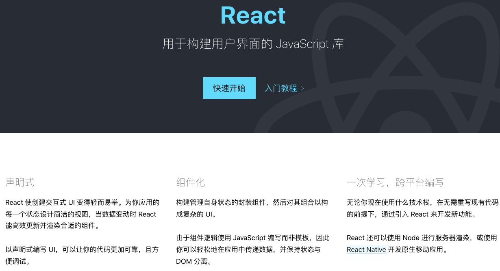
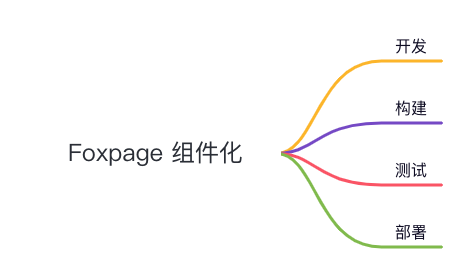
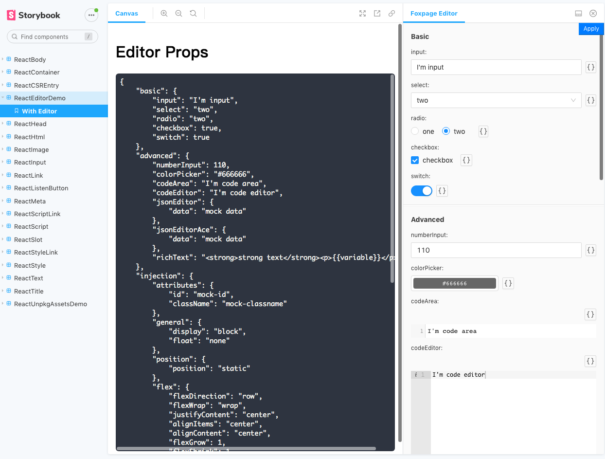
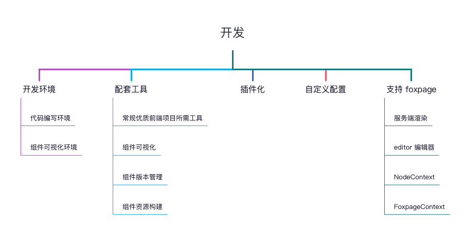
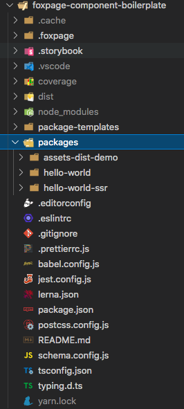
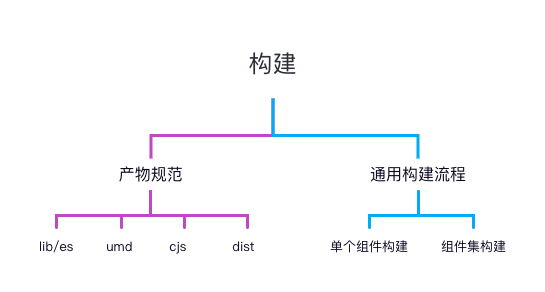
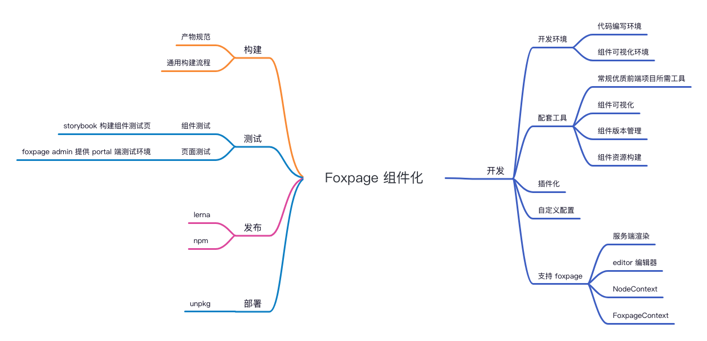

# Foxpage 低码下的组件化实践（一）

## 一、前言

随着组件化的设计和开发被越来越多的开发者，设计师，产品们所接受和认可，组件化的思维也在各式的前端项目中被发挥的淋漓尽致。当下 WEB 前端组件化从设计到落地都已经相对成熟，行业里也有了大量成功的组件化实践案例，同时也诞生了多个流行的迎合组件化的前端框架和组件库

组件化是低代码开发中非常重要的一部分，可以说组件化直接决定了低代码开发的体验。虽然开发者是可以借助市面上的成熟的组件或组件库来快速满足业务需求的，但在结合“低代码开发”时，开发者还需要考虑的更多问题，如组件配置的费力度，可视化下组件的状态展示，组件组合搭建的复杂度，组件低代码开发环境和生产环境同源等等问题

Foxpage 是一个前端低代码框架，借助 Foxpage 让前端项目可以使用低代码的方式进行迭代。在经过大量的前端项目的低码开发的锤炼打磨后，我们总结出了一套适合低代码框架的组件化最佳实践，用来对使用 Foxpage 的项目和开发者提供帮助以达到高效，高质量的解决业务需求的目的

我们将分多篇文章来介绍 Foxpage 前端低代码框架下的组件化从设计到实现在到结合业务场景落地的整个过程中的实践心得

## 二、前端组件化

### 1. 什么是前端组件化？

前端组件化是指通过组件和业务逻辑的形式对项目进行自上而下的拆分，将项目内部（之间）通用的、可复用的功能解耦，从而实现代码的高内聚、低耦合，实现可配置、可复用、可扩展的功能模块。然后，将更复杂的组件/页面通过这些组件组合起来，实现多人协作的过程中依赖解耦的项目设计和实现方法。

具有`高模块化`、`复用性`、`配置性`、`业务解耦`、`协作解耦`等优点。

### 2. 组件化的目的

1. 提高协作层面的效率

   - 通过组件设计，项目从上到下拆分
   - 从页面划分到功能组件划分
   - 通过组件的接口和配置实现功能和业务的融合

2. 提高编码水平

   - 通过基于组件的开发方式，对功能模块进行封装
   - 通过复用组件减少代码冗余
   - 功能和业务逻辑可以通过组件开发解耦
   - 通过组件扩展支持项目迭代，提高可扩展性和可维护性

3. 符合主流框架设计初衷

   - React – 主要特点

  

### 3. 功能划分

从组件的`高模块化`、`复用性`、`配置性`、`业务解耦`、`协作解耦`这些特点上我们可以对组件在做出如下划分:

- 基础组件（UI 组件或 功能组件）：包括但不限于（下拉、点击开关、弹窗、吐司提示、加载、空页、页面布局）。参考 `element ui` 和 `antd` 组件库的实现思路。需要做功能/UI 级抽象
- 通用组件（模块级复用功能）：满足多场景复用业务的需求，具有可配置性，可配置性赋予其可复用性。需要做业务级抽象
- 业务组件（无复用，不推荐）：一次性开发，由于不具备可配置性导致有相似功能时得不到复用，时间长了成为陈年老代码，开发简单，无生命力，无需任何抽象

## 三、组件开发

### 1. 规范

Foxpage 不会强制要求开发者必须按照我们建议的组件化思路来开发组件，也不会对开发者做过多其他的约束。但是会从开发环境、开发方式、开发流程上入手，提供一些支持和帮助来引导和辅助开发者完成组件开发

  

#### 1.1 组件粒度的开发

为了突出单个组件的自由和灵活性，Foxpage 推荐以组件粒度来进行开发，简单流程如下：

1. 新建一个 `my-component` 组件项目
2. 新建 src，editor，typing.ts 目录和文件（如果通过脚手架工具创建项目会自动建）
3. 提供 `ComponentProps` 类型声明
4. 撸代码，业务实现
5. 本地构建
6. 调试

组件粒度的开发脱离庞大的项目，启动快，调试快。组件独立版本不与组件集共享，使得整个迭代过程更方便和自由。开发的是独立的组件自然就保证了组件 `高模块化`、`协作解耦` 的特性

#### 1.2 Schema 文件

基于开发者提供的 `ComponentProps` 类型声明，`foxpage-cli` 会基于此声明帮助开发者生成 `schema.json` 文件及 `schema.md` 组件 API 说明文档。

其中 `schema.json` 是一种数据结构，可以清晰的描述 `JSON` 数据的结构。非常适用于描述基于 `JSON` 格式的 `Component` 的 `API`。 `schema.json` 的内容可以直观的体现一个组件的可配置性及可复用性

其中 `schema.md` 是 `foxpage-cli` 帮助生成的 `markdown` 格式的`组件API说明文档`，可读性比 `schema.json` 更友好

通过对比上述流程我们可以清楚的感知到开发者的视角全部聚焦于`组件`，开发的是组件，测试的是组件，构建的是组件，发布的是组件。专心做一件事，才能把组件化做到极致。

### 2. 开发

在组件的开发阶段，最重要的事情有如下几点:

- 舒适的开发环境
- 完善的配套工具
- 支持插件化
- 支持自定义配置
- 支持 Foxpage 框架

#### 2.1 开发环境

开发环境主要包含 `代码编写环境` 和 `组件可视化环境`

##### 1). 代码编写环境

对于`代码编写环境`，首先引入一个 `boilerplate` 的概念

###### `boilerplate` 是什么?

在信息技术中，boilerplate(样板) 是一种可以重复使用的编写单元。在计算机编程中，样板代码或样板是指必须包含在许多地方而很少或没有改动的代码段。它通常用于指代被认为冗长的语言，即程序员必须编写大量代码才能完成最少的工作.

###### `boilerplate` 存在的意义？

印刷领域：

在 1890 年代，样板实际上是用金属铸造或冲压的，准备用于印刷机，并分发给美国各地的报纸印刷机和公司。直到 1950 年代，数以千计的报纸从美国最大的供应商西方报业联盟那里收到并使用了这种样板。一些公司还将新闻稿作为样板发送，以便它们必须按书面形式印刷.

web 领域：

大多数专业的 Web 开发人员都创建了一组资产和代码片段，他们可以在项目中重用这些资产和代码片段来加速开发。所有网站都有一些通用或近乎通用的模式。大多数开发人员不是不断地重新构建这些，而是首先复制他们用于类似项目的代码，然后开始修改它.

一些开发人员认识到这些样板入门模板的价值，并花时间使样板更通用并在线共享以供其他人使用.

> 这不仅限于 Web 开发。随着越来越多的框架和库的出现，它在 `AI`(人工智能) / `ML`(机器学习)中也被广泛使用.
>
> 有一些大型科技公司甚至建立了自己的样板。他们一直将其用于各自和类似的项目.
>
> 一个完美的例子是 `react.js` 的样板:
>
> [react-boilerplate](https://github.com/react-boilerplate/react-boilerplate): 一个高度可伸缩、离线优先的基础，拥有最好的 DX，并专注于性能和最佳实践

###### `boilerplate` vs `template`?

简而言之:

- 模板提供文档的 structure(结构)和 layout(布局)
- 样板则提供了实际的 text(文本) 和 images(图像)

###### 大型项目 `boilerplate` 的必要特征：

- 良好且可读的文档
- 具有更深抽象级别的代码结构
- 遵循正确的编码标准
- 有 CLI 工具
- 可扩展
- 简单的测试工具

###### foxpage component `boilerplate`：

`foxpage` 也提供了符合上述特征的 `boilerplate`(样板)，用户可以通过 `foxpage-cli` 快速创建组件开发项目:

[foxpage-component-boilerplate](https://github.com/foxfamily/foxpage-component-boilerplate) ：内部集成了前端项目所需的各种配套工具并提供统一封装，开发者无需关心各种环境配置，开箱即用且可自定义配置，具体工具将在 [配套工具](#22-配套工具) 详细介绍

##### 2). 组件可视化环境

对于`组件可视化环境`，Foxpage 并没有考虑单独制作一个组件可视化环境，而是采用了 [storybook](https://storybook.js.org/) 开源框架来搭建组件可视化环境。选择 `storybook` 是因为其对绝大多数前端框架(react，vue，angular，web-components 等)都支持且支持插件化和可配置，是行业内做组件可视化十分成熟的框架

#### 2.2 配套工具

`foxpage` 的 `boilerplate` 需要提供哪些配套工具可以从以下角度来思考

##### 1). 常规优质前端项目所需工具

一般情况下一个优质的项目开发环境需要的工具至少如下:

- `babel`: js 编译工具
- `eslint`: 代码检查
- `typescript`: 类型声明&校验
- `jest`: 代码测试

以上工具 `foxpage` 都进行封装且通过 `npm` 包的方式提供，开发者只需 安装/更新 相关依赖即可，也可以自行额外扩展配置。同时还额外提供了 `prettier` `postcss` 等配置文件开箱即用

##### 2). 组件可视化

这个集成了 `storybook` 就不再赘述

  

##### 3). 组件版本管理

我们集成了 [lerna](https://github.com/lerna/lerna) 用于做组件的版本管理，各大知名前端框架都在用，大家可以了解下

##### 4). 组件资源构建

资源构建使用到的相关的工具有 `tsc` `babel` `webpack` `typescript-json-schema`

`foxpage` 对构建相关工具进行了封装，无需开发者自己配置相关工具及配置，`foxpage-cli` 工具即可满足组件的资源构建需求，开发者只需更新 `foxpage` 相关 `npm` 包即可，开箱即用&自由配置。

资源构建详细规范将在 [构建](#4-构建) 介绍

#### 2.3 插件化

插件化依附于 `storybook` 的插件机制，可以通过提供工具插件来优化开发体验以及业务相关环境配置

> 案例:
>
> `trip` 的业务都是国际化的，所以需要一个数据中心用于为所有组件提供上下文数据: `locale`
>
> 通过提供 `TripContext` 插件为所有组件提供 `React` 中的 `Provider` 上下文，所有组件可以通过消费者的方式来使用 `context` 中的 `locale` 数据
>
> 在开发环境中 `context` 上下文数据中的 `locale` 可以通过 `Locale 插件`(select 下拉框，storybook 的 TOOL 类型插件)来提供数据
>
> 生产环境需要提供相应的生产环境插件来接入 `TripContext` 并挂载同样格式的数据

#### 2.4 自定义配置

Foxpage 集成的所有工具包含 `foxpage-cli` 工具所依赖的配置文件都支持开发者自由配置，不会对开发者有任何限制。用户甚至可以通过修改相关配置，新增自己的插件来形成符合自身业务场景的新的 `boilerplate`。

#### 2.5 支持 Foxpage

组件要在 Foxpage 框架上使用，需要一些支持

##### 1). 服务端渲染

首先，通过 Foxpage 搭建的页面是支持服务端渲染的。所以组件的内部逻辑需要考虑服务端渲染环境，需要开发者自行兼容双端运行

如果在服务端有设计数据初始化的步骤，可通过为组件添加名称为 `beforeNodeBuild` 的钩子 `Async` 函数，在内部数数据初始化，foxpage 会将函数返回值当做组件的 Props 传给组件进行 `服务端`/`客户端` 渲染

`beforeNodeBuild` 钩子函数在 `Fxoapge` 框架中由相关 `Foxpage SDK` 负责调用，在开发环境则由 `@foxpage/foxpage-component-storybook-addon` 插件负责调用，开发者可一套代码两端运行，无需任何兼容处理

##### 2). Editor 编辑器

editor 编辑器是用于为组件提供 Props 数据注入的，一般用于提供组件的配置参数

由于 editor 既需要在 Foxpage Admin 上运行，又需要在本地开发环境运行。所以 `foxpage` 实现了一整套 editor 编辑器，里面包含 `Input` `Select` `Radio` `JsonEditor` 等常见的表单控件，开发者只需提供一个工具函数接收相关控件参数，自行提取并使用即可。

editor 相关代码会参与 `foxpage-cli` 提供的构建流程，被构建成单独的 `editor.js` 用于 Foxpage Admin 进行渲染。

editor 相关工具包如下:

- `@foxpage/foxpage-component-editor-widgets`：提供 `Input` `Select` `Radio` `JsonEditor` 等常见的表单控件
- `@foxpage/foxpage-component-editor-context`：提供两端运行依赖的上下文数据
- `@foxpage/foxpage-component-editor-storybook-addon`：提供本地开发环境的 editor 插件(storybook)

##### 3). NodeContext (SsrContext)

`NodeContext` 是服务端渲染时 `foxpage` 框架的运行时上下文对象

该数据在 `foxpage admin`(portal 端) 上是由 `框架` 和 `用户` 提供的 `plugin`(插件) 注入的数据 以及 当前组件运行时的 `nodeData` 相关数据

在本地开发环境则是由 `@foxpage/foxpage-component-storybook-addon` 插件提供

> 例子：
>
> 还是 `trip` 业务依赖的 `locale` 数据
>
> 在 `foxpage admin` 上需要开发者自行提供相关 `locale-plugin` (node 端运行的插件)。根据 `PluginSDK` 提供的相关钩子函数向 `NodeContext` 中注入 `locale` 数据
>
> 在本地开发环境则是遵循 `@foxpage/foxpage-component-storybook-addon` 插件提供的相关 `API` 来注入 `locale` 数据，`@foxpage/foxpage-component-storybook-addon` 插件提供了灵活可配置的 `API` 来让开发者扩展 `NodeContext`，上述 `locale` 的数据来源甚至可以是开发者自行提供的 `storybook-addon` 插件 (Trip 相关业务就是这么做的)。

##### 4). FoxpageContext

`FoxpageContext` 与 `NodeContext` 不同，`NodeContext` 是服务端渲染时的上下文数据，而 `FoxpageContext` 则是组件的数据中心，服务端/客户端都可正常运行并渲染

`FoxpageContext` 是不强制开发者使用的，即开发者可以自行提供自己的数据中心，但需要以下步骤：

- 自行提供 `storybook-addon` 并在项目中接入
- 自行提供 `foxpage-plugin` 并在 `foxpage admin` 中接入
- 自行在组件中使用自己提供的上下文

> Tip：由于历史原因，Trip 部分业务也是使用的自己提供的 `TripContext` 上下文，而没有使用 `FoxpageContext`

`FoxpageContext` 仅仅是一个空的数据中心吗？并不是，我们为其添加了以下内容：

- `__VERSION__`：上下文版本标识
- `FoxpageEmitter`：用于组件间数据通信，基于 `eventemitter3` 实现并做了一层封装，使用方式与使用 `eventemitter3` 基本一致

后续会持续为其添加有价值的工具方法或参数供开发者使用

开发阶段组件工作可总结如下图所示：

  

### 3. 测试

关于测试，我们支持两个维度的测试流程：`组件测试` `页面测试`

#### 3.1 组件测试

组件测试顾名思义即测试组件，专为组件化服务。该方式通过 `build-storybook` 命令工具构建出静态站点页面可用于组件测试或组件展示

优点：

- 与开发者开发环境一致，对开发者友好
- 就测试工作而言，相对于测试一个固定的静态页面，测试一个可以动态配置入参的组件能极大提升测试的质量
- 独立性高，任何开发的组件都可通过该方式测试，不依赖框架或其他环境
- 还可用于 展示/演示 组件

缺点：

- 对非开发类测试人员有学习成本
- 开发者不仅需要维护开发环境，也需要考虑测试体验，需要额外的环境配置代码，有一定工作量
- 需要开发人员额外配置 `CI/CD` 流程(可通过 `CI/CD` 直接部署到 `gitlab`/`github` 项目提供的 `page` 页上) 或 私有静态站点部署流程

#### 3.2 页面测试

页面测试则就是需要将组件注册到 foxpage 框架上，并在 `foxpage admin` 上搭建出生产页面，通过 foxpage 生成测试链接供测试人员测试

优点：

- 测试的生产页面，能直接保证生产页面的在当前配置下的正常运行，重要且必要
- 与传统测试方式一致，对测试人员而言无额外学习成本

缺点：

- 无法自由配置组件参数，仅能保证当前配置下的页面是正常的，修改完配置后需要重新测试

### 4. 构建

关于资源，我们需要清楚，开发者开发的组件，会被用到哪些地方? 怎么被使用？

通过思考以上问题，我们对需要对组件产物做一些规范，以满足通用的使用场景和使用方式，还需提供通用的构建流程来满足开发者各不相同的需求场景

基于此，我们从以下两个角度来介绍组件化流程中构建阶段做了哪些工作：`产物规范` `通用构建流程`

#### 产物规范

一个优质的组件，其资源产物需要具备多样性，需要符合前端模块化规范，需要兼容市面上常见的资源使用方式，需要兼容 `foxpage` 框架

经调研，前端模块化规范如下：

- `CommonJS`：同步加载模块，服务端运行良好，客户端需要经过 `browserify` 构建
- `Es Module`：ES6 模块的设计思想，是尽量的静态化，使得编译时就能确定模块的依赖关系，以及输入和输出的变量
- `AMD`：异步加载模块，`提前执行`，推崇 `依赖前置`。`require.js` 是其实现代表
- `CMD`：通用模在加载，同`AMD`，`延迟执行`，推崇 `就近依赖`。 `sea.js` 实现代表
- `UMD`：是 `AMD` 和 `CommonJS` 的糅合
  - 先判断是否支持 Node.js 模块（exports 是否存在），存在则使用 Node.js 模块模式。
  - 再判断是否支持 AMD（define 是否存在），存在则使用 AMD 方式加载模块。
  - 前两个都不存在，则将模块公开到全局（window 或 global）。

对比如下：

|              | CommonJS                    | AMD                          | CMD                          | ES6                                   |
| ------------ | --------------------------- | ---------------------------- | ---------------------------- | ------------------------------------- |
| 引用模块     | require                     | require                      | require                      | import                                |
| 暴露接口     | module.exports \|\| exports | define 函数返回值 return     | exports                      | export                                |
| 加载方式     | 运行时加载，同步加载        | 并行加载，提前执行，异步加载 | 并行加载，按需执行，异步加载 | 编译时加载(静态加载)，异步加载        |
| 实现模块规范 | NodeJS                      | RequireJS                    | SeaJS                        | 原生 JS                               |
| 适用         | 服务器                      | 浏览器                       | 浏览器                       | 服务器/浏览器，webpack(tree sharking) |

基于以上的思考，我们对组件的构建产物进行了如下规范化，以满足复杂多样的前端大环境：

- 组件需要构建出 `lib`(commonjs 规范) `es`(es-module 规范) 两种通用的模块化规范的资源产物(仅编译语法，方便资源优化)，用于组件进行 `npm` 发布，发布后使用方可通过 `npm` 安装依赖进行引入并使用
- 组件需要构建出 `dist`(foxpage 框架规范) `umd`&`cjs`&`style`&`foxpage` 混合资源产物，用于 `foxpage` 组件库注册
- 组件需要构建出 `umd`(browser) `cjs`(node/server) 两种类型的资源产物(便于通过 `cdn` 接入)，用于通过 `cdn` 等方式接入并使用 (待补全)

对于 `umd` 类型的资源产物，`foxpage` 提供 `production` `development` 两种类型的资源分别用于 `生产环境` 或 `debug环境`，符合行业规范，满足了开发者的 `debug` 需求

> tip:
>
> 对于上述的 `umd` `cjs` `dist` 资源，内部都是通过 `webpack` 工具构建，我们提供相关 `API` 供开发者自由配置 `webpack config` 以及 `analyze` 构建产物

#### 通用构建流程

规范是结果，流程是过程，我们不仅仅保证结果的质量，还需要提升过程的质量

先看看我们组件开发的项目的目录结构:

  

我们可以发现：

- 以 `组件` 为角度时，组件是相互独立的互不干扰的 (与组件代码位置无关，仅通过 npm 关联)
- 以 `项目` 为角度时，组件可以是一个集合，一个项目需要同时维护一批组件，包括维护它们的产物

再带入构建的角度，也就衍生出 `单个组件构建` 和 `组件集构建` 两种构建流程方式。

在实现通用构建流程之前，我们先要制定以下原则：

- 产物 `一致性`：过程不影响结果，即无论哪种流程，组件的产物必须是一致的
- 产物 `独立性`：不能破坏产物独立性，即任何一个组件的产物有缺失时都不会影响任何其他组件产物的运行
  - 例子：两个组件用了同一张图片，该图片应该被分别打进两个组件中，如有合并需要(优化)应将其剥离出组件产物，独立部署

##### 单个组件构建

对 `单个组件构建` 而言，按照之前定制的规范实现即可，无其他差异化处理

##### 组件集构建

对 `组件集构建` 而言，则有以下对比:

- `lib` / `es`：组件集暂用不到 npm 发布流程，所以无需额外处理 `lib` 、 `es`
- `dist`：批量构建，可用于 `foxpage` 框架批量处理组件，但需额外提供相关数据
- `cjs` / `umd`: 批量构建，可用于批量 发布/部署 组件的 `cjs` / `umd` 资源文件 (流程待实现)

基于此，目前我们提供了 `dist` 资源的批量构建流程，然后额外提供 `foxpages.json` 文件用于搜集组件集数据，供 `foxpage` 框架解析。额外处理了 `manifest.json` 文件搜集所有组件的 `manifest` 信息

以上是构建阶段我们设计思路以及为组件化所做的事情，可总结如下图所示：

  

### 5. 发布

这里主要是将组件发布到 npm 仓库，后续可以以 npm 仓库为源，走组件的静态资源部署的流程

## 四、静态资源部署

资源部署理论上是应该交给开发者自己去处理是最自由和安全的，`foxpage v1.0` 暂时没有提供资源部署相关服务，对于静态资源存储，开发者可以按照自身的情况来选择通过云服务自建或者使用第三方托管服务。同时 Foxpage 也不提供组件项目的 CI/CD 相关的功能，因为 Foxpage 本身没有对应的构建和部署环境。开发者可以借助市面上成熟的工具或服务来完成 CI/CD，整个过程 Foxpage 不会介入

经过我们的实践，发现行业内有许多知名的免费的前端 JS/CSS 静态资源公共库：

- [unpkg](https://unpkg.com/)
- [jsDelivr](https://www.jsdelivr.com/)
- [bytedance(字节跳动)](http://cdn.bytedance.com/)
- [css.net](https://css.net/)
- [cdnjs.com](http://cdnjs.com/cdnjs.com)

这里以 `unpkg` 为例， 在组件开发时通过在 `npm` 发布流程加入 `dist` `umd` `cjs` 等资源文件的发布，即可让组件的资源产物跟随 `npm` 包一起发布，进而可通过 `unpkg` 获取到资源文件

优势：

- 快速部署：无需自己处理资源部署服务
- 加载速度：可直接使用 `unpkg` 提供的免费 `cdn` 加速功能

缺点：

- 不稳定：`unpkg` 的稳定性谁也无法保证，
- 不安全：`unpkg` 的资源服务是公共的，源代码有泄漏风险
- 局限性：必须走 `npm` 包发布流程，无法用私有仓库发布

## 五、总结

本篇文章主要介绍 Foxpage 前端低代码框架下，组件化过程中的组件的开发，构建，测试，发布，部署等部分的实践。总结如下图所示：

  

目前 `Foxpage` 仍在组件化的道路上探索，虽已初见雏形，但未来会持续更新优化，争取能为前端领域的组件化做出贡献
