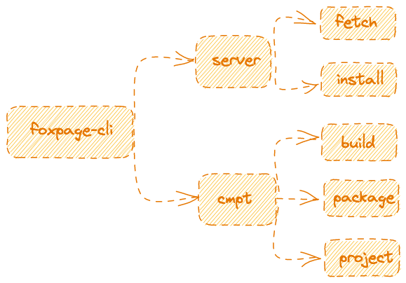
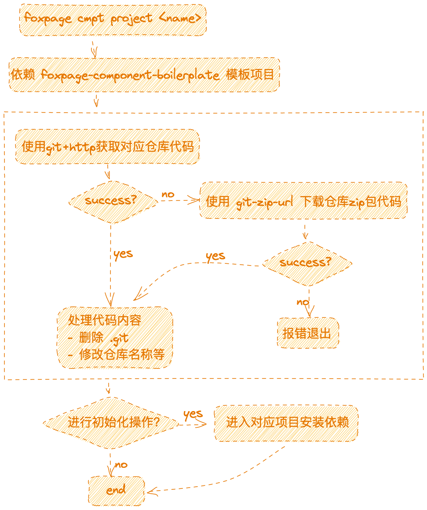
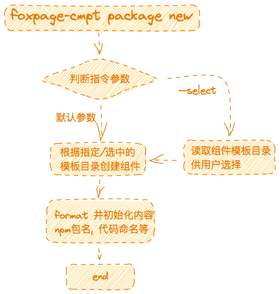
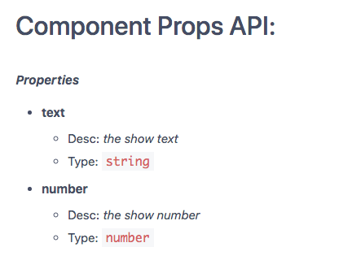
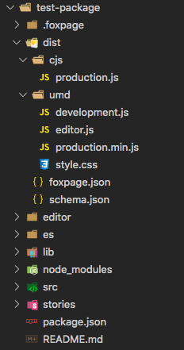

# Foxpage CLI 介绍

## 一、前言

### CLI 是什么意思?

CLI -- Command-Line Interface 命令行界面。

### 前端 CLI 存在的意义

随着前端工程化的概念越来越深入人心，`CLI` 的出现就是为减少重复性工作而引入的命令行工具，摆脱 ctrl + c, ctrl + v

现在新建一个前端项目，已经不是在 html 头部引入 css，尾部引入 js 那么简单的事了, css 都是采用 Sass 或则 Less 编写，在 js 中引入，然后动态构建注入到 html 中；

除了学习基本的 js，css 语法和热门框架，还需要学习构建工具 webpack，babel 这些怎么配置，怎么起前端服务，怎么热更新；为了在编写过程中让编辑器帮我们查错以及更加规范，我们还需要引入 ESlint；甚至，有些项目还需要引入单元测试（Jest）。

对于一个更入门的人来说，这无疑会让人望而却步。

而前端 `CLI` 的出现，就让事情简单化，一键命令，新建一个工程，再执行两个 npm 命令，跑起一个项目。

在入门时，无需关注配置什么的，只需要开心的写代码；另外，对于很多系统，他们的页面相似度非常高，所以就可以基于一套模板来搭建，虽然是不同的人开发，但用 `CLI` 来搭建，相同的项目结构与代码书写规范，是很利于项目的后期维护的；

以上就是为什么 `CLI` 存在的意义, 让项目从"搭建-开发-部署"更加快速以及规范

- `CLI` 是开发现代 Web 应用必备
- 充分利用 Webpack、Babel、ESLint、jest 等工具辅助项目开发
- 零配置，无需手动配置繁琐的工具即可开始使用
- 可以更多的去关注业务，而不是配置工具

## 二、介绍

`Foxpage CLI` 服务于 foxpage 开源框架，主要功能：

- 快速创建项目: 快速创建组件开发项目, portal 项目, API 项目, SDK 项目等. 供用户二次开发
- 组件开发常用工具: 快速新建组件, 自动生成组件 API 说明文档等
- 组件资源构建: 提供 `lib` `es` 符合行业规范的 npm 资源构建, 提供用于`foxpage`平台的资源构建

<div style="text-align: center;">
  
</div>

下面将从各个功能来进行介绍。

## 三、核心功能

### 1. 快速创建项目

说到 `CLI` 创建项目，大家肯定不会陌生. 像 `create-react-app`, `vue-cli` 这些行业标杆级别的 `CLI` 工具, 相信大家一定都有用过, 傻瓜式创建项目是不是直呼过瘾? `CLI` 固然给我们带来了许多便利, 但作为一名前端开发者, 还是需要对内部的原理有一定的了解, 离开了 `CLI` 和 `ctrl+c/v`, 也能独立的搭建整个项目.

`foxpage-cli` 创建项目技术实现上通过`仓库地址`或`zip-url`拉取对应仓库代码:

- github 仓局 地址: https://github.com/foxfamily/foxpage-component-boilerplate.git
- https://github.com/foxfamily/foxpage-component-boilerplate/archive/refs/heads/main.zip

整个执行流程如下图所示:

<div style="text-align: center;">
  
</div>

内部优先使用 `git clone` 命令工具拉取项目, 该流程会受用户本地环境因素影响, 所以我们增加了兜底流程, 直接通过 `zip包链接` 拉取模板代码, 下载一个 zip 文件则只会受网络因素影响.

### 2. 组件开发常用工具

### 2.1 新建组件

组件是 `foxpage` 平台的一个基础组成部分, 也是页面的基础组成部分.

在面对日益扩张的业务场景时, 如何更好的开发优质的组件是值得我们思考的事情. 目前我们推荐的是, 组件分为 `UI组件`, `业务UI组件`, 这里不是制造新的名词, 也不会要求必须按照这个划分, 只是提供一种新的思考方式, 具体还是要视实际情况而定

- UI 组件: 更倾向于提供功能更加通用 UI 及功能的组件, 可供其他组件或项目导入使用
- 业务 UI 组件: 则不仅仅是包含特定的业务，更需要开发者在业务维度做抽象处理, 使得一个组件可以通过配置使其有不同的数据层面的展示差异, 即 UI 一致但是数据展示不一样。(例如一个业务 UI 组件在配置了不同的 saleID 的时候可以展示不同的商品数据)
- 业务组件(deprecated): 如果一个组件只为某个特定业务场景制作, 不具备可配置性,可复用性, 这样的组件需要被赋予新的生命力, 需要开发者改造成业务 UI 组件, 否则后面也不会有人使用他维护他

开发者迭代业务的过程中，用的最多的可能就是新建组件功能了, 新建组件通过 `foxpage-cmpt package new` 命令工具来创建, 流程图如下:

<div style="text-align: center;">
  
</div>

我们提供了两种方式来创建组件, 指定某个组件模板 和 根据模板列表自己选择

针对组件的新建，我们做的不仅仅是 copy 模板到组件目录.

功能：

- `CLI` 提供了 variable (目前只内置了 name 参数) 来修改模板里的 `___variable___` 参数来帮助用户根据指定的变量名称修改(逐行解析)模板的内容

- 提供了一些特殊标识用于过滤掉模板需要但产物不要的内容
  ```ts
  /* foxpage-template-ignore-start */
  /* eslint-disable no-underscore-dangle */
  /* foxpage-template-ignore-end */
  ```

示例: 例如模板里有 `___Name___` 和 `___ComponentName___` 两个变量参数, 用户新建组件时需要输入组件名称, `CLI` 会根据输入的组件名称来自动替换掉模板里的变量参数

> 后续优化: 后续会进一步优化该流程, 会解析模板内容, 提取所有的变量参数, 让用户输入变量名来自动修改模板内容

### 2.2 生成组件 API 文档

好的 API 文档是组件不可或缺的组成部分, 可以说它与底层代码一样重要. `CLI` 提供了 `foxpage-cmpt build --schema-md` 工具帮组开发者快速创建 API 说明文档

该流程基于 `<package>/src/typing.ts` 文件构建出 `schema.md`, 文件内部需要提供 `ComponentProps` 类型声明, 声明的内容需要遵循[schema 规范](https://github.com/YousefED/typescript-json-schema/blob/master/api.md)

`CLI` 内容调用 `typescript-json-schema` 开源工具生成 `schema.json` 文件, 然后根据 `schema.json` 文件解析并转译成 md 文件如下:

<div style="text-align: center;">
  
</div>

关于生成 `schema.json` 的过程感兴趣的可以自行查看 `typescript-json-schema` 开源工具.

应为行业内已经对 `schema.json` 有一套成熟且完整格式规范, 所以解析并生成 `markdown` 成为可能, 解析过程不外乎解析提取 `schema` 字段转换成对开发者友好的 markdown 文件格式的字符串并输出`schema.md`文件

### 2.3 组件资源构建

说到组件资源构建, 可以从两个关键字来思考: `组件资源` `构建工具`, 有了答案后, 我们的 foxpage-cli 需要接管并处理哪些事情也就显而易见了

首先, 我们需要清楚, 开发者开发的组件, 会被用到哪些地方? 怎么被使用?

`foxpage` 期望的是, 一个优质的组件, 可以被用在任何常规的符合前端规范项目以及 `foxpage` 独有的 `foxpage` 平台, 被使用的方式需要兼容市面上常见的资源使用方式.

基于以上的思考, 我们确定了最终的方案:

- 组件需要构建出 `lib (commonjs)` `es (es-module)` 两种类型的资源产物(仅编译语法, 不整合构建, 方便资源优化), 用于组件进行 `npm` 发布, 发布后使用方可通过 `npm` 安装依赖进行引入并使用
- 组件需要构建出 `dist (foxpage 平台)` `umd&cjs` 混合资源产物, 用户 `foxpage` 平台注册
- 组件需要构建出 `umd (browser)` `cjs (node)` 两种类型的资源产物(整合构建, 便于通过 `cdn` 接入), 用于通过 `cdn` 等方式接入并使用 (待补全)

对 browser 类型的资源产物, 我们还需要分别提供 `production` `development` 两种类型的资源, 以及 `style.css` 样式文件

dist 产物目录如下图所示:

<div style="text-align: center;">
  
</div>

其中 `editor.js` 是为了处理 `foxpage` 平台上使用资源, 之后 `editor` 可以独立成组件也可跟随组件一起.

想要构建并得到上述资源文件, 我们用到了哪些构建工具呢? 经过对 github 中开源的优质项目的研究后, 我们决定使用 `tsc` `babel` `webpack` `typescript-json-schema` 构建工具

对于 `lib` `es` 资源依次进行以下构建步骤:

1. 构建类型声明文件

- 构建类型声明文件使用的是 `typescript` 提供的 `tsc` 工具
- 依赖项目根目录的 `tsconfig.json` 文件为基础模板

2. 通过 babel 编译`/src`目录

- 依赖项目根目录的 `babel.config.js` 文件为 babel 配置文件

3. 判断是否处理样式并通过 `webpack` 进行处理

> 注意: 一般情况组件的使用方配置了对应的 `loader`(less-loader, sass-loader) 则组件的 npm 资源可以直接使用 `.less` or `.sass`, 而无需对样式做处理. 如果想要强制使用 `.css` 格式的文件, 你需要注意以下几点:
>
> - 无论组件目录下有多少个样式文件, 仅以 `src/index.(scss|less|css)` 为入口文件, 仅构建出一个 `.css` 文件, 防止文件嵌套引用导致样式重复
> - 搭配 `--remove-style-import` 移除所有 `.js` 文件中关于样式文件的引入代码
> - 可让组件使用方在引入组件的同时手动引入组件的样式 或者 组件开发者搭配 `--import-index-css` 自动在 `index.js` 中添加 `index.css` 的样式引入代码自动引入组件样式

对于 `dist` 资源依次进行以下构建步骤:

1. 根据 `--modes` 决定需要构建哪些资源
   - `--modes` 默认值为 'production,debug,node,editor'
   - 可通过 `--modes` 指定构建哪些类型的文件
   - 可通过 `<package>/.foxpage/webpack.js` 修改对应 mode 的 webpack 构建参数
   - 可通过开启 `--file-hash` 启用 webpack ContentHash 模式
   - 可通过开启 `--analyze` 启用 webpack analyze 模式, 建议搭配 `--modes` 且指定某一类型使用
2. 构建 `schema.json` 组件类型描述文件
   - 读取 `src/typing.ts` 或 `src/index.ts` 文件内命名为 `ComponentProps` 的类型声明描述(参考[typescript-json-schema](https://github.com/YousefED/typescript-json-schema/blob/master/api.md)文档)
   - 通过 `<root>/schema.config.js` 文件可指定 `typescript-json-schema` 工具的[构建参数](https://github.com/YousefED/typescript-json-schema#command-line)
   - 通过 `typescript-json-schema` 工具解析 `ComponentProps` 生成 `schema.json`文件
3. 处理构建产物
   - 处理并生成 `foxpage.json` 文件

另外, 根据 `dist` 被使用的方式(cdn) 我们发现: `dist` 是可能被单独部署的静态资源, 基于此按组件维度来单独部署是费时费力的, 所以我们新增了按项目维度批量部署组件 `dist` 的方案:

1. 获取所有需要构建的组件的目录列表

   - 默认指定 `--root-cache`, 为组件目录生成文件 hash, 若文件未变动, 则 hash 匹配则不会重复构建
   - 缓存文件存放在 `.cache/foxpage/root-cache.json`
   - 注意: 不要随便修改或删除 `dist/component/<package>/*` 内部的文件, 这种行为会导致`<package>`缓存内容丢失, 不会参与后续的构建, 如果想要重新构建某个组件, 只需修改 `.cache/foxpage/root-cache.json` 文件, 删除掉对应的 `key,value` 即可.

2. 根据组件列表进入相应目录并发执行 `yarn foxpage:build`

   - 可通过 `--npm-client` 指定 npm 客户端工具, 可选 `npm` 或 `yarn`, 默认 `npm`
   - 可通过 `--concurrency` 指定并发数, 默认 `Max(os.cpus().length - 1, 2)`;

3. 将执行成功的组件的 `/dist` 目录提取到 `<root>/dist/component/<package>`

4. 打印执行结果列表(成功或失败)

### 2.4 组件资源优化

对于所有 `webpack` 构建的组件资源, 我们提供了 `webpackFinal` 钩子函数给用户来改造 webpack 配置参数, 钩子函数使用方式如下

例子: 有一个公共模块 `lodash`, 我们在为某个组件构建资源的时候不想把他构建到构建产物里去, 我们可以通过 `<package>/.foxpage/webpack.js` 为某个组件单独配置, 也可以通过 `<root>/.foxpage/webpack.js` 为所有组件做统一配置, 配置方式如下:

```js
const webpackFinal = (mode, config) => {
  if (['debug', 'production', 'node'].includes(mode)) {
    config.externals['lodash'] = {
      root: 'lodash',
      commonjs: 'lodash',
      commonjs2: 'lodash',
      amd: 'lodash',
    };
  }
  return config;
};
module.exports = webpackFinal;
```

此时在 foxpage 平台注册时, 需要指定该组件依赖 `lodash` (需要先在 foxpage 平台上注册 lodash).

> 注意: 这种优化策略不建议过分的滥用, 建议以业务场景为维度, 为每个业务场景维护一个 `shared` 包资源, 组件都依赖这个资源, 从而避免出现过分嵌套的依赖链

## 四、总结

通过以上介绍, 我们对 `Foxpage CLI` 的功能模块以及设计思路有了一个整体的了解, 希望能帮助大家对 `Foxpage CLI` 有个整体的认知.
