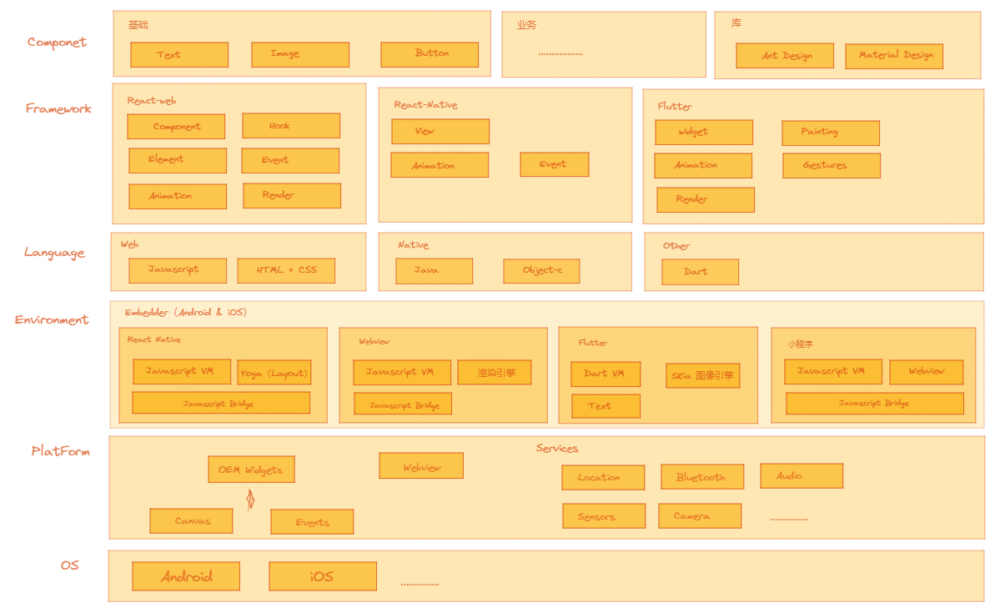
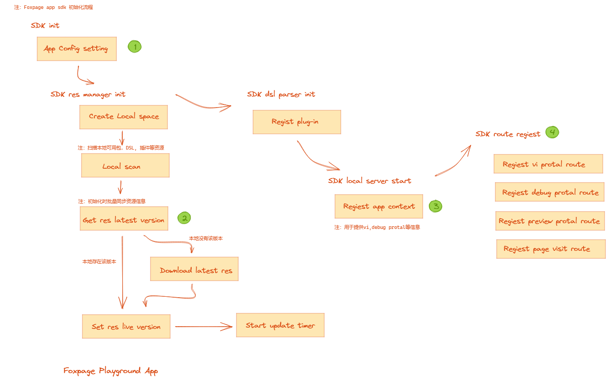
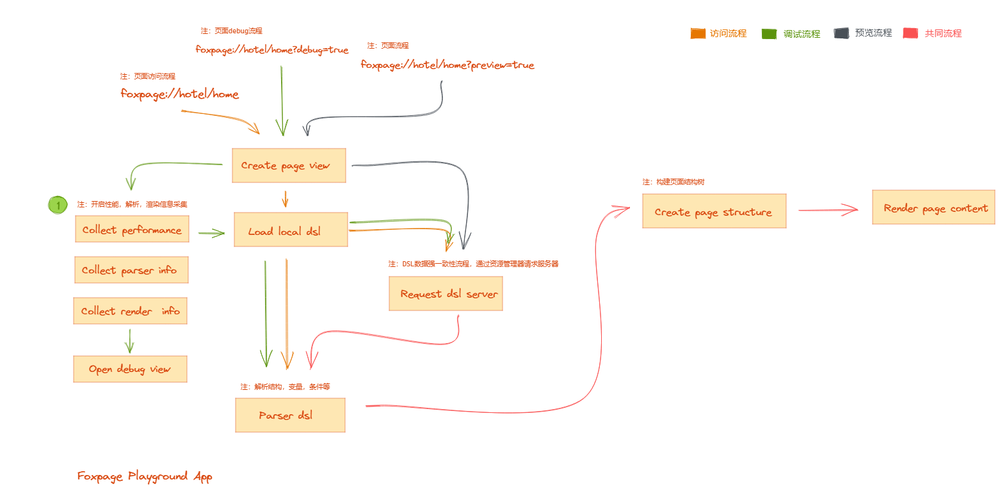
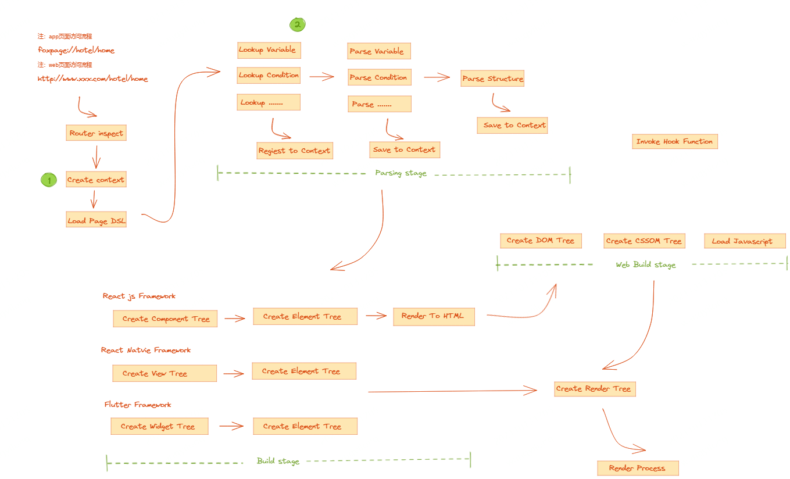
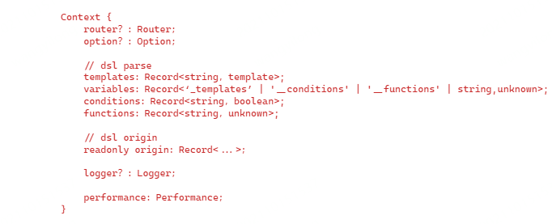
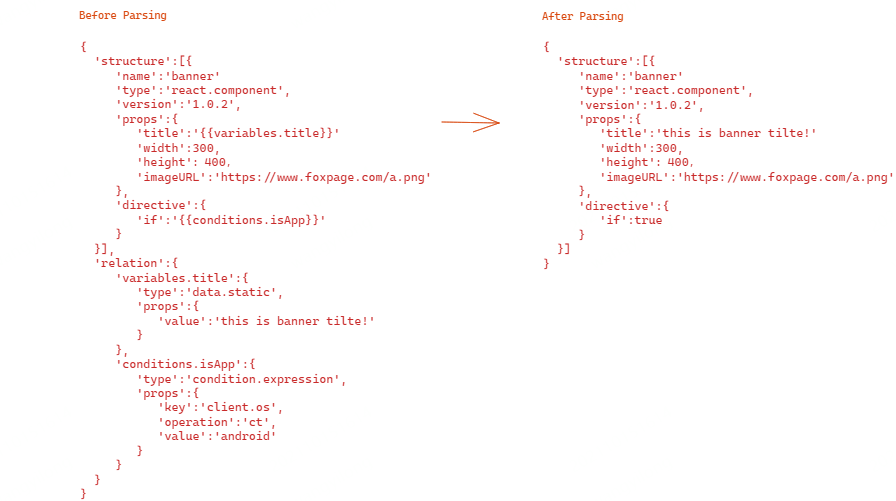
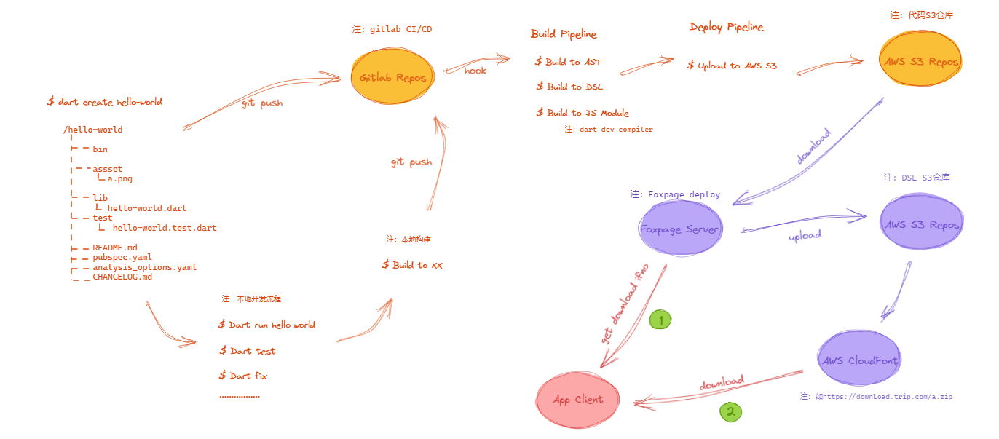
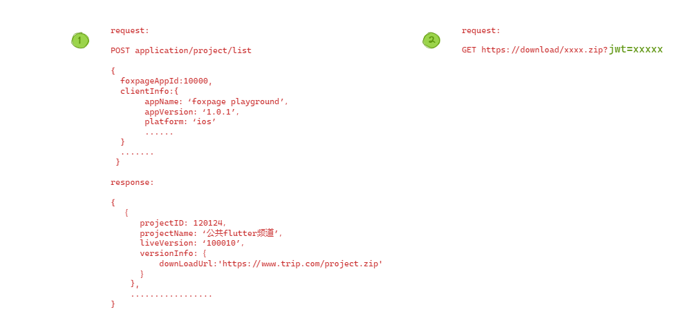

## 移动端方向

移动端应用开发技术现在有几大块，我试着梳理了下。如下简图（建议从下往上看）

移动端应用开发大概有三种模式，一是原生开发模式（Native App），一种是混合开发模式(Hybrid App)，还有一种是（Web App）。个人认为这三种模式各有各的优势，也有各自的使用场景，应该会一直存在下去。Foxpage 作为应用层框架，开源的部分只是我们在 Web 端先做的一些探索尝试。你可以借助他提供的整体设计思路，在结合具体技术方向和场景落地。移动端技术大的方向，这里不做过多的判断，当前主要还是结合 Foxpage 来选择适合我们的技术方向来做探索

首先 Foxpage 的几个技术目标：

- 提高效率，效率包括组件开发效率，页面开发效率，发布效率等
- 降低成本，成本包括人员成本，开发难度，更新成本，维护成本等
- 质量保障，质量包括稳定性，“良品率”等（这里的质量的保障是可持续性的，不应因业务的变化而降低或缺失，是一套通用的质量保障体系）

从以上目标 “提高效率”，“降低成本” 来看，既要提高效率，还要降低成本。综合对比下来混合开发模式最贴近，这种模式就是为了提效降本而生，同时还能保证一定的性能和体验。

## 动态化探索

动态化一直是移动端的热门方向，和 Web 端整体思路一致，从服务端拿的页面的描述内容，然后在 APP 端构建页面并渲染。这里拿 Foxpage Playground App 来举例，以下大概说明了下 Foxpage SDK 做了哪些工作，工作流程是怎样的。

1. Foxpage SDK 初始化流程简图

&ensp; &ensp; &ensp; &ensp; 注 1：App 配置信息主要包括：Foxpage App ID, Foxpage App SDK Information, App Information, Mobile Device Information 等，这些信息用于后续和服务端交互用

&ensp; &ensp; &ensp; &ensp; 注 2：SDK 会按照应用全量的拉取应用下的包和其他一些要预加载的信息，请求体包含的信息有 App ID，Last Update Time 等，样例参考页面底部内容

&ensp; &ensp; &ensp; &ensp; 注 3：App Context 是以 Foxpage App ID 为粒度创建的一个上下文对象，对象主要存放一些与应用相关初始化过程中的信息。如：预加载的页面信息，包信息，插件，变量等。这些信息会被用在 VI Protal 上展示。

&ensp; &ensp; &ensp; &ensp; 注 4：SDK 在 App 端注册 4 个系统级入口路由，组成规则为：[schema]://[app slug]/[page path | project slug]?[query string]。主要功能可以参考 Web 已有实现

&ensp; &ensp; &ensp; &ensp; &ensp; &ensp; &ensp; &ensp; - Visit Route 用户访问入口路由，用于用户访问页面或程序的入口。例：foxpage://hotel/index

&ensp; &ensp; &ensp; &ensp; &ensp; &ensp; &ensp; &ensp; - Preview Protal Route 预览入口路由，用于预览页面或程序访问入口。例：foxpage://hotel/index?preview=true

&ensp; &ensp; &ensp; &ensp; &ensp; &ensp; &ensp; &ensp; - Debug Protal Route 调试入口路由，用于调试页面或程序访问入口。例：foxpage://hotel/index?debug=true

&ensp; &ensp; &ensp; &ensp; &ensp; &ensp; &ensp; &ensp; - VI Protal Route 内部验证入口路由，用于系统内部验证的访问入口。例：foxpage://vi/index

2. Foxpage 页面用户访问,预览和开发测试调试简图（这是整页接入方案，同时也支持按模块接入）

&ensp; &ensp; &ensp; &ensp; 注 1：性能信息 包含：结构，变量，条件等预解析和解析耗时，页面构建耗时，页面渲染耗时

&ensp; &ensp; &ensp; &ensp; 注 1：解析信息 包含：结构，变量，条件等解析信息 包含：原文信息，解析后信息

&ensp; &ensp;核心流程在细化下如下图：

&ensp; &ensp; &ensp; &ensp; 注 1：当用户开始访问时，系统会创建 Context 上下文对象，这个对象会贯穿整个解析，构建及渲染的过程

&ensp; &ensp; &ensp; &ensp; 注 2：DSL 的解析前和解析后的对比

3. Foxpage 内部验证主要是对本地的与 App 相关的一些信息展示，并提供简单的操作，流程上比较简单。

## 工程化支持

用 Dart 项目来梳理 Foxpage 相关 CI/CD 流程。 Foxpage 并不直接提供项目 CI/CD 能力，因为没有构建项目的环境，所以放弃这一部分的功能。开发者可以借助市面上已有的工具或服务来完成 CI/CD。Foxpage 目前能提供的是开放信息注册能力，提供对应的接口来完成项目 CI/CD 后相关信息注册到 Foxpage 的流程。

为了整体流程上的顺畅，我们后续会考虑提供静态信息部署功能

## 项目实践

Trip.com App Flutter 发布系统（以下简称发布系统），为了让 App 拥有代码动态更新能力，借助 Foxpage 框架中资源管理器部分的功能来实现，节省去从头开发的成本。

整体流程简图

&ensp; &ensp; &ensp; 注 1：App Client 请求 Foxpage server 按照 APP 维度获取所有项目信息，项目信息中包含最新的版本号，内容，内容获取等信息

&ensp; &ensp; &ensp; 注 2：App Client 请求 CDN 链接下载 DSL 信息，并在下载地址中追加 JWT，下载服务用来校验请求是否合法，至于 JWT 怎么获取有待讨论

