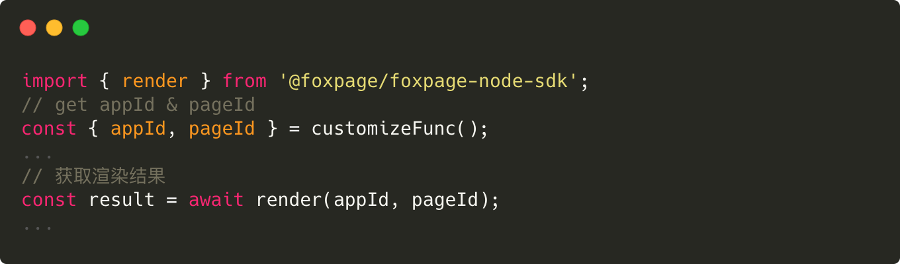
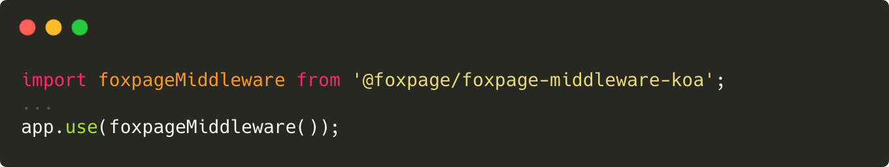
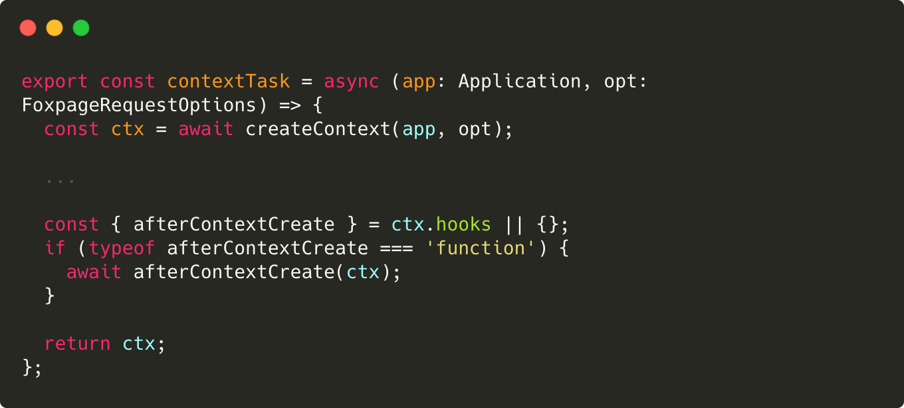
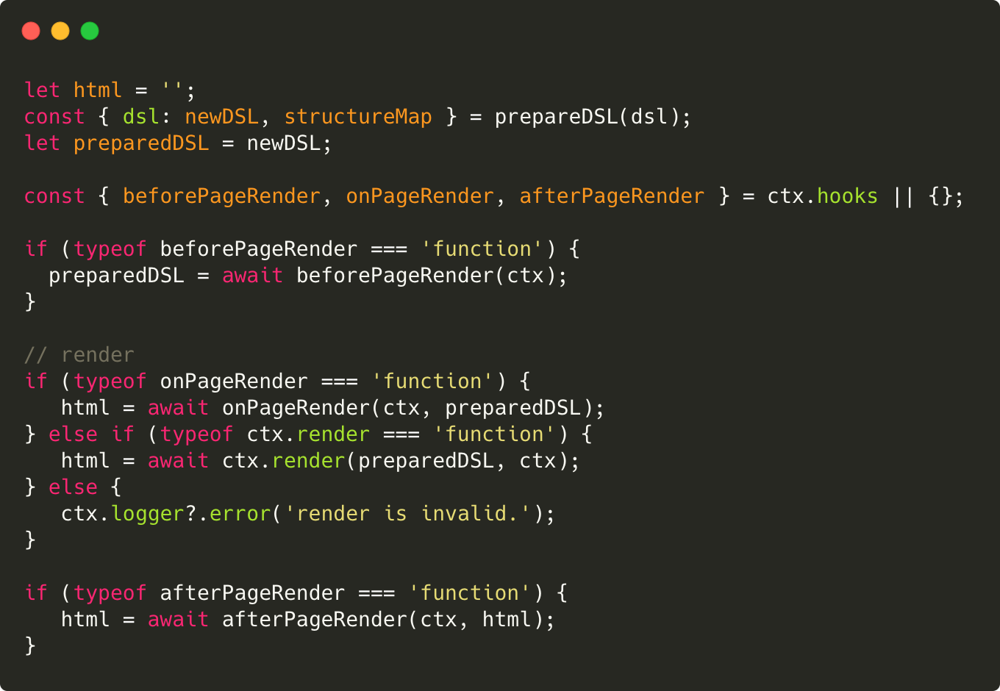

# Foxpage Node SDK 初识篇

## 一、前言

`Foxpage Node SDK`（以下简称：SDK） 是 `Foxpage` 框架的核心部分，是提供给 node 端应用使用的开发工具包。开发者通过使用 SDK 能够快速地接入和使用 `Foxpage` 框架。

在学习 SDK 之前，先简单介绍下 SDK 的架构，如下：

  

说明：

- `App/server` 指的是应用/服务
- `App/server` 可以通过 `Middleware` 和 `API` 两种方式来接入 SDK（`Node-SDK`）
- SDK 包含多个模块：
  - `Manager`：资源管理器，统一方式管理所有依赖资源
  - `Core`：SDK 核心，当前提供 `DSL` 解析功能
  - `Engine`：渲染引擎，主要包含页面构建和渲染功能。
  - `Plugin`：插件系统，结合 `微内核` 理论，提供快速扩展能力
  - ...
- `Shared`：公共工具包
- `Types`：公共类型包

## 二、介绍

SDK 为软件开发工具包，为应用（服务）提供资源管理、页面解析、页面渲染和插件化等一系列功能。

- 资源管理：负责所有依赖的资源管理，通过多进程间通讯方式来同步各个进程间的资源信息，并将资源进行本地缓存来提升性能，同时会建立调度器开启定时任务来更新本地资源。
- 页面解析：包含从用户访问到输出页面结构 DSL 的一系列过程。首先是路由解析，获得用户访问的页面信息，根据页面信息获取所有的依赖信息 relations，并创建上下文，最后通过解析器进行内容解析，输出完整的页面 DSL。
- 页面渲染：根据已解析完成的页面 DSL 进行渲染。渲染过程分为：服务端渲染和客户端渲染。
- 插件化：为了提高扩展性，支持插件化，通过插件来增强业务领域扩展能力。

下面将从各个点来进行介绍。

## 三、核心能力

### 1、资源管理

资源是每个系统重要的一部分，资源的管理也尤为重要。  
SDK 的资源管理是通过统一资源管理器来管理所有资源的。在 SDK 初始化阶段，会将资源管理器初始化好，并伴随在应用（服务）的整个生命周期中。

资源管理器所做的事情主要包含三个方面：资源更新、多进程间资源同步和多级缓存。

- 资源更新

资源更新就是将 `CMS` 上已更新的资源同步到本地，同步过程则是通过调度器 `Scheduler` 定时从 `CMS` 拉取已更新资源的索引集合，随后分发给各个类型的资源管理器进行最新资源拉取操作。流程如下：

  

> 为了保证资源的一致性，采用了“强一致性”的机制，即当接收到需要更新的资源时给对应资源打上标记，在用户下次访问时该资源不可以用，需即时从服务端拉取。

- 多进程间资源同步

上面我们提到了资源的更新同步是通过调度器来实现的，但在真实场景中会涉及到多进程间资源同步问题。如果每个进程都有调度能力，那将是一种资源的浪费，且不能保证资源的一致性。为此，SDK 选举了一个“主进程”来触发调度，接收到结果后通知其他的工作进程来分别进行资源更新操作。如下：

  

- 多级缓存

当前 SDK 采用 `冷热分离` 策略来缓存资源。冷指定是磁盘存储，热则指的是内存存储。热资源存储大小需要依据实际情况来定，不能存储过大，当前是通过 `LRU-Cache` 方式来实现的。

> `LRU` 是最近最少使用的策略，可以设定最大存储量。

  

### 2、页面解析

页面解析包含从用户访问路由解析，获取页面内容（DSL），DSL 解析等过程。并且在获取 DSL 之前会创建一个统一的上下文（Context）来为解析和渲染提供支持。

> DSL 是 Domain Specific Language 的缩写，中文翻译为领域特定语言。在 Foxpage 框架中，DSL 为 JSON 格式的数据，页面结构即称为 DSL。

- 路由解析
  支持两种路由管理方式：应用自身管理和`Foxpage`统一管理。  
  应用自身管理路由，即用户访问的时候，应用自己实现解析路由的逻辑，最终只需要提供 appId 和 pageId 交给 SDK 渲染即可。

  

`Foxpage`统一管理路由，只需接入 SDK 提供相应中间件 `@foxpage/foxpage-middleware-koa`（koa 为例） 即可。

  

- 创建上下文
  为了方便应用开发者接入和使用 Foxpage 框架，SDK 提供了默认统一的上下文 Context。Context 是在每一次接收到用户的请求时，动态创建的对象，这个对象封装了这次用户的请求信息和所有依赖的数据，而且这些数据可以在整个访问的运行时过程中使用。

当然，在有些业务场景下，默认上下文可能不满足使用，为此，SDK 开放了相应的`生命周期`来支持通过`插件`方式扩展。

  

- DSL 解析

一张页面由多种类型（`Page`、`Template`、`Variable`、`Condition`、`Function`）DSL 组成：

  

各种类型 DSL 之间有着相互引用的关系，如下：

  

DSL 的解析就是将各个依赖资源进行解析合并，其中解析指的是变量、条件、方法和指令的解析，合并则指的是将各个解析好的零散的 DSL 合并成一个完整的页面结构 DSL。

> 想更进一步了解 DSL 解析原理，可移步至进阶之路：[解析器](http://www.foxpage.io/#/advance#%E8%A7%A3%E6%9E%90%E5%99%A8-1)。

### 3、页面渲染

页面渲染包含页面的服务端渲染和客户端渲染。

- 服务端渲染：
  SDK 会根据上面 `DSL解析` 完成后的页面 DSL 去加载页面依赖的组件资源 `Package`。后根据页面结构动态构建页面，生成虚拟 DOM，随后根据不同框架进行渲染。

    

      
    

  服务端渲染阶段提供了对应的生命周期，为此，可以提供业务领域的渲染能力。

    

      
    

- 客户端渲染：
  客户端渲染是根据服务端注水的数据进行初始化。且客户端渲染实现组件化了，SDK 提供统一的 API 供开发者使用，也就是说客户端渲染可以自由的实现和扩展。
  

    
  

> 目前默认支持 `React` 框架的页面渲染，未来可支持多框架渲染。  
> 想更进一步了解页面渲染，可移步至进阶之路：[SSR](http://www.foxpage.io/#/advance#%E6%9C%8D%E5%8A%A1%E7%AB%AF%E6%B8%B2%E6%9F%93ssr) 或 [CSR](http://www.foxpage.io/#/advance#%E5%AE%A2%E6%88%B7%E7%AB%AF%E6%B8%B2%E6%9F%93csr)。

### 4、插件化

我们都知道越来越多的系统或框架通过插件来扩展功能，比如：webpack、babel、...。

为提高扩展能力，结合 `微内核` 理论，SDK 实现了插件系统。和插件紧密相关的就是生命周期钩子，意味着插件执行的时期。SDK 就是通过生命周期和插件系统来实现插件化的，

- 生命周期

SDK 生命周期分为应用生命周期和用户访问生命周期。每个生命周期都提供了相应的生命周期钩子函数。如下为用户访问生命周期：

  

- 插件系统

插件系统是负责加载插件和管理插件的。插件的实现是依据生命周期的。

在 SDK 启动初期，插件系统会根据开发者提供的配置文件去加载插件，加载好插件之后进行一个插件的合并处理，插件合并的方式有很多种：覆盖式、管道式、集散式和洋葱式（目前 SDK 支持了覆盖式和管道式），最后会返回一个合并后的插件集合，也就是对应的生命周期的实现的集合。

最后，会在对应的生命周期中执行对应的插件实现。

  

> 想更进一步了解 Foxpage 插件化，可移步至：[插件系统](http://www.foxpage.io/#/advance#%E6%8F%92%E4%BB%B6)和 [插件开发](http://www.foxpage.io/#/developer/integration/plugin)

## 四、总结

通过以上介绍，我们初步介绍了 SDK 的整体框架，希望能帮助大家对 SDK 有个初步的认识。

## 五、参考链接

1. [如何接入 Foxpage Node SDK？](http://www.foxpage.io/#/developer/integration/node-sdk)。
2. [Foxpage 进阶之路](http://www.foxpage.io/#/advance)
