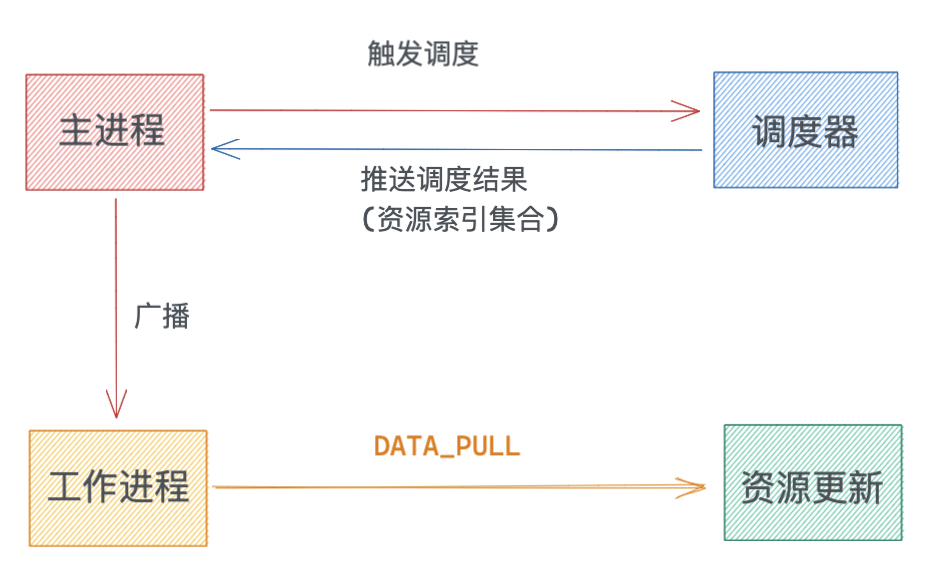

# Foxpage 在 Node 端的落地实践

## 一、前言

Foxpage 是一个前端低代码（Low-Code）框架，从组件化，到页面在线可视化搭建，再到页面渲染等提供了一套完整通用的解决方案。  
当一个应用服务接入 Foxpage 框架，需要支持的核心功能有资源管理和接收用户请求获取解析渲染后的页面等。Node 应用是我们首次尝试的端应用，
以 Node 应用为例，为了满足 Node 应用的快速接入，并支持一些核心功能，提供了对应的 SDK：`Foxpage Node SDK`。

接下来给大家分享下，Foxpage 在 Node 应用服务中的落地实践。

## 二、整体设计

`Foxpage Node SDK`（以下简称：SDK） 是 `Foxpage` 框架的核心部分，是提供给 node 端应用使用的开发工具包。应用服务可以通过使用中间件（Middleware）或者接口调用（API）方式来接入。

<div style="text-align: center;">
  
</div>

- `App/server` 指的是应用/服务
- `App/server` 可以通过 `Middleware` 和 `API` 两种方式来接入 SDK（`Node-SDK`）
- SDK 包含多个模块：
  - `Manager`：资源管理器，统一方式管理所有依赖资源
  - `Core`：SDK 核心，当前提供 `DSL` 解析功能
  - `Engine`：渲染引擎，主要包含页面构建和渲染功能。
  - `Plugin`：插件系统，结合 `微内核` 理论，提供快速扩展能力
  - ...
- `Disk/Memory`：磁盘、内存存储
- `Shared`：公共工具包
- `Types`：公共类型包

## 三、管理应用

### 1、定义

一个 Node 应用服务支持接入多个应用（以下称：application，对应到 Foxpage 无头 CMS 上的创建的应用）。以 application 维度来划分包含多种类型内容，如：`Page`，`Template`，`Package`...，这些内容的管理是一项复杂但重要的任务，接下来所有操作（比如资源管理，业务扩展以及页面渲染等）都是依赖 application 来实现的。

### 2、应用配置

为了让应用服务能快速的接入 SDK 并对一些核心功能的定制，支持通过配置文件进行相关配置。在应用初始化阶段 SDK 会去读取应用提供的（项目根目录下）配置文件`foxpage.config.js`或`.foxpagerc.js`。

#### （1）读取配置

从项目根目录下读取配置文件。

> 配置文件必需提供，否则会异常提醒，原因是 application 的相关配置以及数据服务必须提供。

```ts
// foxpage/foxpage-node-sdk/src/common/config.ts
const filenames = ['.foxpagerc.js', 'foxpage.config.js'];
const tasks = filenames.map(async filename => {
  const path = join(process.cwd(), filename);
  const exist = await pathExists(path);
  return { path, exist };
});

const result = await(await Promise.all(tasks)).find(item => item.exist);
if (result && result.exist) {
  //...
}

const msg = 'Not provider foxpage config file';
const err = new Error(msg);
logger.error('config init failed.', err);
throw err;
```

#### （2）初始化配置

读取好 application 的配置内容之后，会与 SDK 默认的配置进行合并，得到的最终配置会通过初始化资源管理器`Manager`的时候挂在到各个 application 上。

```ts
// foxpage/foxpage-node-sdk/src/common/config.ts
Object.assign(configs, defineC);

// foxpage/foxpage-node-sdk/src/manager/main.ts
import { config } from '../common';
await initManager({
  apps: config.get('apps'),
  dataService: config.get('dataService'),
  plugins: config.get('plugins') || [],
  commonPluginDir: config.get('commonPluginDir') || '',
  //...
} as ManagerOption);
```

- `apps` - application 配置，会根据这个数据进行 application 注册等
- `dateService` - 数据服务配置，api 地址
- `plugins` - 私有插件，application 特有的插件
- `commonPlugins` - 公共插件，支持所有 application

### 3、注册应用

初始化配置之后，需要进行 application 注册，只有注册成功的 application 才能为后续的操作提供服务。

#### （1）实例化应用

从`initManager`入参中获取`apps`配置，获取到所有需要进行实例化的 appIds，从数据服务`Foxpage server`端获取对应的 application 配置内容，相当于动态配置信息，与配置文件提供的配置内容进行合并之后，传给`ApplicationImpl`来创建 application 实例，也就是注册 application。

```ts
// foxpage/foxpage-manager/src/manager.ts
public async registerApplications(appMates: ManagerOption['apps']) {
  const appIds = Array.from(new Set(appMates.map(item => item.appId)));
  this.logger?.info('will register apps:', appIds);

  try {
    const apps = await foxpageDataService.fetchAppDetails(appIds);
    ...
    const batch = apps.map(async app => await this.registerApplication(app, appMateMap.get(app.id)));
    const result = await (await Promise.all(batch)).filter(item => !item);
    if (result.length > 0) {
      throw new Error('init applications failed');
    }

    // succeed
    this.logger?.info('init applications succeed');
  } catch (e) {
    const msg = (e as Error).message;
    this.logger?.error(msg);
    throw new Error(msg);
  }
}

// foxpage/foxpage-manager/service.ts
export const initManager = async (opt: ManagerOption): Promise<ManagerImpl> => {
  if (!manager) {
    manager = new ManagerImpl(opt);
  }
  try {
    if (manager) {
      await manager.prepare();
      // register apps
      await manager.registerApplications(opt.apps);
    }
    return manager;
  } catch (e) {
    manager = null;
    throw new Error(`Init manager failed: ${(e as Error).message}`);
  }
};

// foxpage/foxpage-node-sdk/src/init/main.ts
// init manager
await tryRun(initSourceManager);
```

#### （2）初始化子资源管理器

为什么是子资源管理器？

这里做下解释，对于整个 SDK 来说，提供了一个大的资源管理器`Manager`，包含所有的 application 资源的管理，是一个集合的统称。在`Manager`之下，以 application 维度划分，各个 application 都有自己的各种类型内容的资源管理器，来管理不同的内容。

所以当下“初始化子资源管理器”是对实例化好的 application 下各种类型内容的资源管理器进行初始化，顾名思义，有很多的资源管理器，我们称之为“子资源管理器”。

```ts
// foxpage/foxpage-manager/src/application/application.ts
this.fileManager = new FileManagerImpl(this);
this.pageManager = new PageManagerImpl(this);
this.packageManager = new PackageManagerImpl(this);
this.variableManager = new VariableManagerImpl(this);
this.conditionManager = new ConditionManagerImpl(this);
this.templateManager = new TemplateManagerImpl(this);
this.functionManager = new FunctionManagerImpl(this);
this.tagManager = new TagManagerImpl(this);
this.pluginManager = new PluginManagerImpl({
  plugins: opt.plugins,
  baseDir: opt.pluginDir || '',
  api: {},
});
```

到这里，可能有同学会问，有那么多种类型资源吗？为什么不能合并到一起？以页面维度来进行资源管理呢？

这种方案我们也是做过尝试的，经过一系列的对比之后，最终还是选择以多种类型资源单独管理的方式。

了解过 Foxpage 的同学应该知道，最终一张页面可能有很多部分组成，如：`Page`，`Template`，`Condition`，`Variable`和`Function`等。这样拆分的意义在于能够做到 DSL 更新足够灵活，比如一张页面已经发布过，当某个`Variable`更新的话，只需要更新下`Variable`内容即可以应用到所有的页面上，真正意义上做到了资源的复用和灵活性。

试想一下，如果是以页面维度来划分的话，全部内容都组装到一份 DSL 里面固化下来，任何类型内容的更新都需要将所有引用了该类型内容的页面更新一遍，才能全部更新上，这样做无疑会造成资源的重复性更新，也造成了服务端缓存的冗余。

### 4、多进程管理

在真实场景下 Node 应用一般会存在多个进程，SDK 通过专门的进程管理工具 pm2 来管理进程和同步各个进程的资源。

在多进程的情况下，为了避免多进程都有调度能力而造成资源浪费和不能确保资源的一致性的问题。SDK 会选举出一个“主进程”来负责资源更新的消息调度，“主进程”获取到更新消息之后，广播通知给其他工作进程，然后各进程进行对应资源的更新操作。

<div style="text-align: center;">
  
</div>

“主进程”并非真正的主进程，而且动态选择出来的一个进程，除了和其他进程一样会做的事情之外，会做“资源更新消息调度”的事情，也不是永久存在，如果在运行中 crash 掉的话，会重新选举一个进程作为“主进程”。

其他，“主进程”为什么不能只干一些额外的工作，像 egg-cluster 的“Agent”进程一样？

目前没有这个必要，当下只有“资源更新消息的调度”这么一件事情，还不足以需要单独出一个进程来专门处理，如果后续有更多的任务需要单独进程来执行的话，也许会这么考虑的。

#### （1）pm2

pm2 是一个进程管理工具，可以用它来管理你的 node 进程，并查看 node 进程的状态，当然也支持性能监控，进程守护，负载均衡等功能。

在资源管理器`Manager`初始化好之后，会进行 pm2 的初始化，，主要给已注册的 application 进行“更新事件”绑定。

```ts
// foxpage/foxpage-node-sdk/src/pm2/main.ts
export function initPm2() {
  if (!pm2.isPm2) {
    return null;
  }
  const apps = getApplications();
  // pm2 receive master broadcast then to refresh app
  if (pm2.isWorker) {
    pm2.onMessage(data => {
      apps.forEach(app => {
        app.refresh(data);
      });
    });
  }
}
```

#### （2）消息推送

当“主进程”接收到更新消息之后，会通过 pm2 的`sendDataToProcessId`方法来通知其他工作进程，传输的消息体，包含更新请求的结果。

工作进程以 application 维度接受到消息之后，会触发`DATA_PULL`推送事件，所有监听了该事件的“子资源管理器”会进行各自内容的更新操作。

```ts
public async refresh(updateInfos: AppScheduleDataType) {
  if (updateInfos.appId === this.appId) {
    this.logger.info('refresh source');
    this.emit('DATA_PULL', updateInfos.contents);
  }
}
```

#### （3）缓存

为提高资源利用率和访问效率，减少请求量，采取“冷热分离”策略对资源内容进行缓存，分别是磁盘存储和内存存储。在多进程中，磁盘中的内容是可以共享，内存存储有限制，不能过大，根据`LRU-Cache`（清除最近最少使用）机制来实现的。

<div style="text-align: center;">
  
</div>

各种类型的资源内容都会进行缓存，分别存储到内存`hotResource`和磁盘`diskResource`中。

```ts
// cache content instance to memory
this.hotResources.set(key, instance);
// cache origin content to disk
this.diskResources?.set(key, content as any);
```

用户访问资源，首先从热数据 hot 中查询，若命中，则直接返回；若未命中，则从冷数据 disk 中查询。从磁盘查询命中，则将该资源存入热数据 hot 中，再返回。若未命中，则实时从服务端 server 中获取（各个模块实现不一样，此处使用多态来实现的）。服务端获取成功则将资源同时存入冷热数据中，再返回。若获取不成功则直接返回。

<div style="text-align: center;">
  
</div>

## 四、集成

为了方便在 Node 应用中接入，提高接入的便捷度。SDK 提供了一套 API，如：初始化`init`方法，中间件等。Node 应用只需简单调用即可接入 SDK。

### 1、点火

SDK 点火也称为 SDK 初始化，会将一切依赖性初始化好（如：`config`、`manager`、`pm2`、`parser`、`logger`等），以供运行时访问调用。

```ts
// foxpage/foxpage-node-sdk/src/init/main.ts
// init configs
await tryRun(config.init);
// init manager
await tryRun(initSourceManager);
// init pm2
await tryRun(initPm2);
// init parser
await tryRun(initResourceParser);
// init logger
await tryRun(initLogger);
```

- `config.init` - 配置初始化，读取用户提供的配置，合并 application 动态配置
- `initSourceManager` - 初始化资源管理器
- `initPm2` - 初始化进程管理
- `initSourceParser` - 初始化资源解析器
- `initLogger` - 初始化日志工具

在 Node 应用处需依赖 SDK 的初始化好后，才能算启动服务，如下：

```ts
// server.ts
import * as foxpageSDK from '@foxpage/foxpage-node-sdk';

Promise.all([foxpageSDK.init()]).then(() => {
  const server = app.listen(PORT, () => {
    console.log("App Say : Hi, I'm OK!");
    console.log(`Server running on port ${PORT}`);
  });
});
```

### 2、用户访问监听

监听用户访问提供了两种方式：`Middleware`和`API`。职责是接收用户请求，分析用户访问的页面信息，后交给解析器`Parser`解析页面内容，最后通过渲染引擎`Engine`渲染出 html 内容返回给用户。

用户请求称为路由访问，Node 应用可以使用 Foxpage 默认的路由功能，也可以自己实现路由能力。

#### （1）中间件方式

Foxpage 框架支持默认路由功能，在 CMS 平台上配置好路由信息（通过 tag 来配置的），中间件会监听用户请求，解析出路由信息，再用路由信息去获取到对应的页面，即用户想访问的页面。

```ts
// foxpage/foxpage-node-sdk/src/task/main.ts
export const tagTask = async (app: Application, ctx: Context) => {
  if (!ctx.URL) {
    return null;
  }

  const { pathname, searchParams } = ctx.URL;
  const _pathname = (app.slug
    ? pathname.replace(`/${app.slug}`, '')
    : pathname
  ).substr(1);

  const tags = tag.generateTagByQuerystring(searchParams.toString());

  const file = await app.fileManager.getFileByPathname(_pathname);
  return await app.tagManager.matchTag(tags, {
    pathname: _pathname,
    fileId: file?.id || '',
    withContentInfo: !ctx.isPreviewMode,
  });
};
```

#### （2）API 方式

在某些场景下，Foxpage 框架支持的路由功能可能不足以满足需求，Node 应用可以自己实现路由功能，只需将获取到的页面信息，传给 SDK 对应的 API`renderToHtml*`即可。

#### （3）页面解析和渲染

上面介绍了 Node 应用路由解析的两方式，不管哪种方式，最终都需要获取到用户访问的页面信息。SDK 根据页面信息，从资源管理器中获取全部依赖的内容`relations`，后交给解析器`Parser`进行内容解析，核心工作是把条件、变量、方法、模板解析组装成一个完整的页面 DSL，根据 DSL 加载对应的组件资源，以供渲染引擎`Render Engine`进行服务端渲染。

- 获取`relations`依赖信息
  如在组件`props`上使用了某个变量`{{variableA:name}}`，在页面的`relations`集合里面就会包含该变量的引用信息:

```ts
...
relations: {
  "variableA:name":{
    type: "variable",
    ...
  }
}
```

SDK 会根据这些依赖信息到资源管理器中获取对应的信息，并挂载到上下文（下面会介绍）中，以供解析时使用。

- 页面解析
  页面解析主要是将一些变量引用进行替换操作，解析操作是通过解析器`Parser`来完成的。解析器包含多个不同类型的子解析器，如：变量解析器，条件解析器，方法解析器，模板解析器和指令解析器等。  
  上面已经介绍了，页面 DSL 依赖的全部信息都会挂载到上下文中，在内容解析时，会根据不同解析器来解析对应的内容。解析底层是通过统一的`沙箱`来实现的。这么做的目前是为了隔绝作用域，动态执行代码，保证安全性。

```ts
// foxpage/foxpage-core/src/parser/variable/parser.ts
import { executeObject } from '../sandbox';
// parse
const resolvedProps = executeObject(
  content.props,
  ctx.variables,
  messages,
) as VariableItem['props'];
```

- 页面渲染
  根据解析好的页面 DSL 去加载依赖的组件，将组件信息（包含组件依赖的组件）挂载到上下文（context）上和 DSL 内容一同交给渲染引擎进行页面渲染操作。

```ts
// foxpage/foxpage-node-sdk/src/render/main.ts
// load components
const [components, dependencies] = await loadComponents(preparedDSL, ctx.appId, opt);
ctx.componentMap = components;
ctx.dependencies = dependencies;
...
const html = await ctx.render(preparedDSL, ctx);
```

> 渲染方法`render`是从上下文中获取的，因为页面渲染支持多框架，SDK 核心部分不包含任何框架或业务领域内容，所有支持扩展的内容都是通过统一上下文（context）来连接的，下文扩展中会结合插件来进行介绍。

## 五、扩展

为了应对各种业务场景，框架需要有高扩展性，通过上下文，插件化和客户端渲染组件化，支持了 Node 应用自己业务能力的扩展。

### 1、上下文

上下文 Context 是一个请求级别的对象，在每一次接收到用户的请求时，都会动态创建一个 Context 对象，这个对象封装了这次用户的请求信息和所有依赖的数据。另外这是一个可扩展的结构，通过`afterContextCreate`钩子函数可以自由的扩展自己业务数据。

```ts
export const contextTask = async (
  app: Application,
  opt: FoxpageRequestOptions,
) => {
  const ctx = await createContext(app, opt);

  const { afterContextCreate } = ctx.hooks || {};
  if (typeof afterContextCreate === 'function') {
    await afterContextCreate(ctx);
  }

  return ctx;
};
```

`提醒`：需要合理的规划需要挂载到 Context 上的数据。

### 2、插件化

框架或系统核心程要做到通用性，不能包含业务功能，如果核心程序内置了一些业务功能，程序的关注点将不再是通用性上，会导致核心程序变得不在核心，耦合性大，最终成为业务系统。

插件化是业务领域扩展的一种方式，通过插件化能够解决业务领域的拆分，实现高内聚低耦合。

#### （1）插件注册

根据插件配置信息，进行插件注册。插件以 npm 包的形式提供，Node 应用需要使用哪些插件，需要将插件 install 下来。SDK 通过 require 动态加载插件内容进行初始化。

```ts
// foxpage/foxpage-plugin/src/loader.ts
public registerPlugin(name: string) {
  try {
    const plugin = this.getPlugin(name);
    if (!plugin || !plugin.visitor) {
      throw new Error(`plugin [ ${name} ] is invalid`);
    }

    this.pluginMap.set(name, { ...plugin, name });
  } catch (e) {
    throw new Error(`plugin [ ${name} ] load failed:` + (e as Error).message);
  }
}

public getPlugin(name: string) {
  if (this.hasPlugin(name)) {
    return this.pluginMap.get(name);
  }

  // all plugin must export default
  const plugin = require(this.pluginDir + name).default({ api: this.api }) as FoxpagePlugin;
  return plugin;
}
```

#### （2）钩子合并

插件的实现是对“生命周期钩子函数”的实现，“生命周期钩子函数”是 SDK 暴露的一套钩子函数，会在不同的生命周期中执行。既然支持了插件化，则会存在依赖多个插件的场景，不同的插件可以实现不同的钩子函数，也可以实现同一个钩子函数。为了支持多插件实现统一钩子函数，会对插件实现进行合并操作，合并模式有四种，`覆盖式`、`管道式`、`集散式`、`洋葱式`，

```ts
export enum Mode {
  COVER = 1,
  PIPE = 2,
  DISTRIBUTION = 3,
  ONION = 4,
}
```

目前实现了前三种，且合并操作对 SDK 来说是无感知的，完全由`@foxpage/foxpage-plugin`提供实现。

```ts
public getHooks() {
    const hookKeys = Object.keys(this.visitors) as (keyof FoxpageHooks)[];
    if (hookKeys.length === 0) {
      return {};
    }

    const visitors: Partial<Record<keyof FoxpageHooks, () => void>> = {};
    if (this.mode === Mode.PIPE) {
      hookKeys.forEach(key => {
        const hooks = this.visitors[key];
        const executor = async (...args: unknown[]) => {
          let result;
          for (const hook of hooks) {
            // core
            result = await hook(...args);
          }
          return result;
        };
        visitors[key] = executor;
      });
    } else if (this.mode === Mode.DISTRIBUTION) {
      hookKeys.forEach(key => {
        const hooks = this.visitors[key];
        const executor = async (...args: unknown[]) => {
          const result = [];
          for (const hook of hooks) {
            // core
            result.push(await hook(...args));
          }
          return result;
        };
        visitors[key] = executor;
      });
    } else if (this.mode === Mode.COVER) {
      hookKeys.forEach(key => {
        const hooks = this.visitors[key];
        // core: get the last one
        visitors[key] = hooks[hooks.length - 1];
      });
    }
    return visitors;
  }
```

#### （3）钩子函数执行

钩子函数的实现会在初始化阶段挂载到对应的上下文上，执行时机是由 SDK 决定的，SDK 会在不同生命周期阶段调用对应的钩子函数执行。

- 挂载
  从 application 的子资源管理器`pluginManager`上获取所有的钩子实现，为了避免大量 hooks 的挂载导致上下文内容庞大，采用代理的 getter 来即时获取。

```ts
// foxpage/foxpage-node-sdk/src/context/render.ts
// init get hook proxy
this.getHooks = () => app.pluginManager.getHooks();

// getter
get hooks() {
  return this.getHooks();
}
```

- 执行
  执行时机是生命周期决定的，用户访问的生命周期如下：
  <div style="text-align: center;">
    
  </div>

例：渲染钩子`beforePageRender`，`onPageRender`，`afterPageRender`执行

```ts
...
// foxpage/foxpage-node-sdk/src/render/main.ts
let html = '';

const { beforePageRender, onPageRender, afterPageRender } = ctx.hooks || {};
if (typeof beforePageRender === 'function') {
  preparedDSL = await beforePageRender(ctx);
}

// render
if (typeof onPageRender === 'function') {
  html = await onPageRender(ctx, preparedDSL);
} else if (typeof ctx.render === 'function') {
  html = await ctx.render(preparedDSL, ctx);
} else {
  ctx.logger?.error('render is invalid.');
}

if (typeof afterPageRender === 'function') {
  html = await afterPageRender(ctx, html);
}
```

### 3、客户端渲染

还一个提高扩展能力的点是，客户端渲染的组件化，组件化意味着，可自由的是实现，以及复用。这样一来，Node 应用可以提供自己的客户端实现，包含不同前端框架的支持。

<div style="text-align: center;">
  
</div>

#### （1）数据脱水

`get initialState` 也叫数据脱水，核心实现就是从 DOM 上获取 SSR 中注入的数据。

```ts
const jsonScriptEl = document.getElementById(INITIAL_STATE_SCRIPT_ID); // INITIAL_STATE_SCRIPT_ID: __foxpage_data__
if (jsonScriptEl) {
  const json = jsonScriptEl.innerText;
  const data: BrowserInitialState = JSON.parse(json);
  const state: InitialState = initInitialState(data);
  // inject to window
  window[WINDOW_INITIAL_KEY] = state;
} else {
  throw new Error('miss initial state');
}
return window[WINDOW_INITIAL_KEY];
```

#### （2）初始化前端框架

从 `get initialState` 获取到前端框架信息进程初始化。

```ts
const initialState = loadInitialState();
...
// load framework
loader.initFramework({
  requirejsLink: initialState.resource.requirejsLink,
  libs: initialState.resource.libs,
});
```

#### （3）事件绑定

这里的事件指的是组件间的联动。如下所示：

<div style="text-align: center;">
  
</div>

当组件 A 触发 `dispatch` 事件时，会携带需要更新的组件的 props 参数，由于组件 B 监听`subscribe`着`Store`的变化，则当 A 组件触发事件时会让 B 组件产生更新，从而实现组件间联动。

- Store API：

```ts
getState<K extends keyof State>(namespace: K, initValue?: State[K]): State[K] | undefined;
dispatch<K extends keyof State>(targetNamespace: K, updated: State[K]): void;
subscribe<K extends keyof State>(namespace: K, consumer: StoreConsumer<State[K]>): void;
unsubscribe<K extends keyof State>(namespace: K, consumer: StoreConsumer<State[K]>): void;
```

## 六、总结

以上分享了 Foxpage 在 Node 应用中的落地实践，产出了`Foxpage Node SDK`，为应用服务提供资源管理、页面解析、页面渲染和插件化等一系列功能。

- 资源管理：负责所有依赖的资源管理，通过多进程间通讯方式来同步各个进程间的资源信息，并将资源进行本地缓存来提升性能，同时会建立调度器开启定时任务来更新本地资源。
- 页面解析：包含从用户访问到输出页面结构 DSL 的一系列过程。首先是路由解析，获得用户访问的页面信息，根据页面信息获取所有的依赖信息 relations，并创建上下文，最后通过解析器进行内容解析，输出完整的页面 DSL。
- 页面渲染：根据已解析完成的页面 DSL 进行渲染。渲染过程分为：服务端渲染和客户端渲染。
- 插件化：为了提高扩展性，支持插件化，通过插件来增强业务领域扩展能力。

更多能力在持续挖掘中，敬请期待。

## 七、参考

- [Foxpage 进阶之路](http://www.foxpage.io/#/advance)
- [如何接入 Foxpage Node SDK？](http://www.foxpage.io/#/developer/integration/node-sdk)
