# Foxpage Node SDK 插件化

作者：肖达荣（Darong Xiao），Trip.com 前端开发工程师

## 一、前言

`插件化`是一项应用非常广泛的技术，从硬件到软件，甚至是生活中，我们都能随处可见。

软件领域中，这项技术在 2015 年（国内）快速兴起，且随着时间的推移，越来越多的框架或系统都倾向使用插件化架构来实现，也验证了插件化设计的重要性。

插件化设计采用 `微内核` 理念，系统核心小而精，通过插件扩展更多功能。如下：

  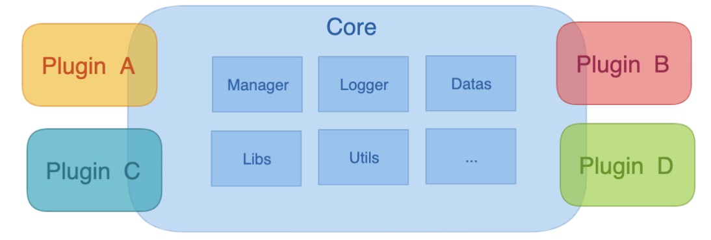

## 二、概念

插件化技术通过插件系统来实现，插件体系结构由两个部分组成：插件系统和插件。

插件系统主要负责插件的管理：插件加载，查询，卸载等。插件则是额外提供的扩展性功能，对核心程序或其它插件毫无影响，核心程序可以 `插拔式` 使用这类插件。

插件化体系各模块之间和核心程序的关系如下：

  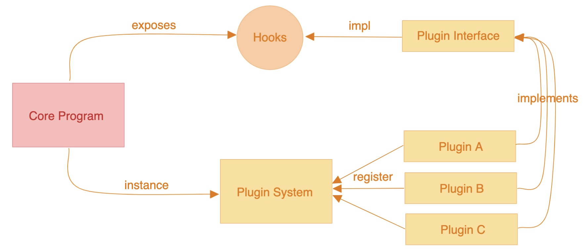

## 三、核心程序

核心程序指的是核心的框架或系统，内置一些通用的功能，比如 `Foxpage` 框架，内置了 `DSL` 解析功能。因为核心程序要达到通用性，所以不能包含业务功能。如果核心程序内置了一些业务功能，程序的关注点将不再是通用性上，会导致核心程序变得不在核心，最终成为业务系统。

核心程序想要实现支持不同业务场景，就需要有 `可扩展` 和 `可插拔` 的能力。

`Foxpage Node SDK` （以下简称 `SDK` ） 就是定位于核心程序，所做的事情专注在框架的通用性能力和扩展性能力上。
为了实现扩展性能力，`SDK` 使用了插件化体系，会包含以下几个流程：

### 1、初始化插件系统

`SDK` 会在程序启动初期，创建插件系统，如下：

  

- `baseDir` - `string` - 插件所在目录路径，告知插件系统去哪加载对应的插件
- `plugins` - `array<string>` - 插件名列表，告知插件系统需要加载哪些插件
- `api` - `object` - `SDK` 暴露给插件使用的 api

### 2、获取插件已实现的钩子函数

`SDK` 在运行过程中从已实例好的插件系统上获取所有的`hook`实现。

  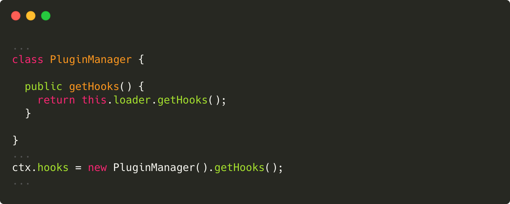

### 3、执行暴露的钩子函数

`SDK` 会暴露一些特定的钩子函数供插件继承实现，且会在对应的 `生命周期` 阶段执行对应的钩子函数，如下：

  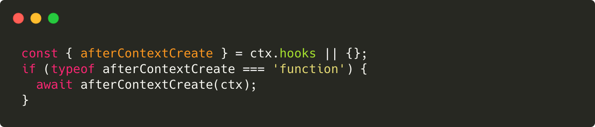

## 四、钩子函数

钩子函数是插件化设计的灵魂之处，可以这么说，一个使用了插件化设计的系统（核心程序）的扩展能力取决于钩子函数的数量和执行的时机。而钩子函数的暴露者则是系统自身。

  

`SDK` 会暴露出 `应用生命周期` 和 `用户访问生命周期` 对应钩子函数 `Hook` ，在这些生命周期阶段，开发者（接入者）可以根据自身业务场景需求进行扩展。`用户访问生命周期` 及对应钩子函数如下：

  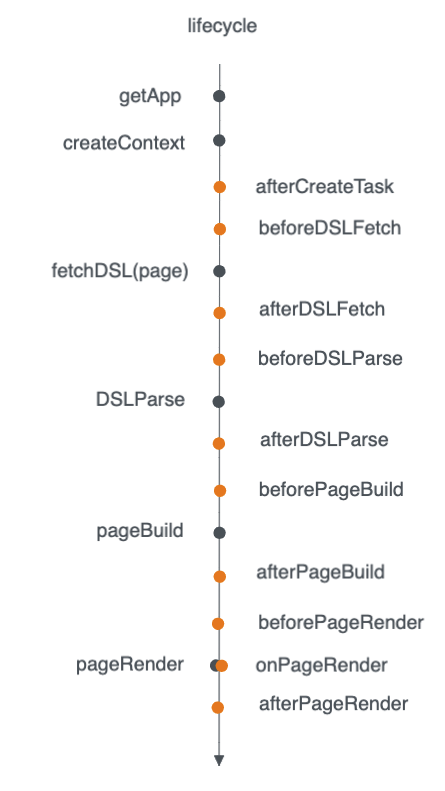

- `getApp` - 获取 application，上下文将根据 application 生成
- `createContext` - 创建上下文阶段，将伴随整个渲染过程。
  | 钩子函数 | 描述 |
  | -------------- | ----------------------------------------------------------------------------------------- |
  | `afterContext` | 在创建好上下文（context）之后执行，在这一阶段，可以通过插件扩展自己业务场景需要的数据结构 |
- `fetchDSL` - 获取 DSL 阶段，包含 page、template、variable、condition 等内容。
  | 钩子函数 | 描述 |
  | ---------------- | ------------------------------------------------------------------------------------------------ |
  | `beforeDSLFetch` | 在获取 DSL 之前执行。在这阶段可以做一些获取 DSL 之前的操作，比如参数校验、路由分析等。 |
  | `afterDSLFetch` | 在获取 DSL 之后执行，返回新的 DSL。在这阶段，已经获取到了 DSL，可以对 DSL 进行二次解析、封装等。 |
- `DSLParse` - DSL 解析阶段
  | 钩子函数 | 描述 |
  | ---------------- | ---------------------------------------------------------------------------------------------------------------- |
  | `beforeDSLParse` | 在 DSL 解析之前执行。在这一阶段，可以对解析需要的内容（变量、条件、方法等）进行自定义处理。 |
  | `afterDSLParse` | 在 DSL 解析之后执行，返回新的已解析完的 DSL。在这阶段，DSL 已经完成了解析，可对已解析完成的 DSL 进行自定义处理。 |
- `pageBuild` - 页面构建阶段
  | 钩子函数 | 描述 |
  | ----------------- | ---------------------------------------------- |
  | `beforePageBuild` | 在页面构建之前执行。可根据需要提供构建的结构。 |
  | `afterPageBuild` | 在页面构建之后执行，返回新的以构建的页面结构。 |
- `pageRender` - 页面渲染阶段
  | 钩子函数 | 描述 |
  | ------------------ | ---------------------------------------------------------------- |
  | `beforePageRender` | 在页面渲染之前执行。 |
  | `onPageRender` | 在页面解析时执行，即可提供自定义渲染的方法。 |
  | `afterPageRender` | 在页面渲染之后执行。在这阶段，可以对已渲染的 html 进行二次处理。 |
  | `onRenderError` | 监听渲染报错，可提供自定义的报错。 |

## 五、插件系统

插件系统也叫插件加载器或插件管理器，主要职责是负责加载和管理插件，其 API 如下：

  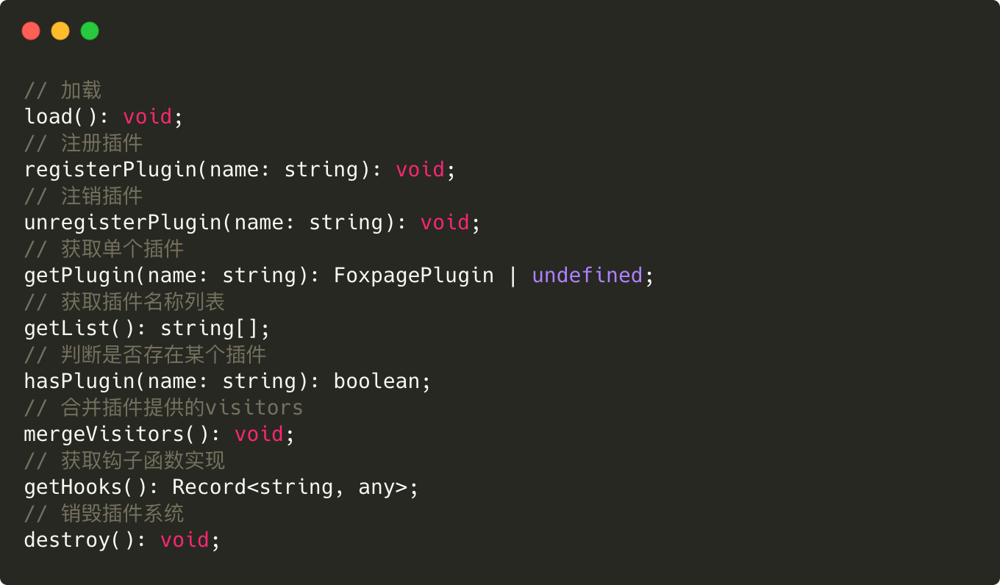

### 1、加载插件

加载插件会先判断插件是否已经存在，如果开发配置的插件不存在（没有正常 install），则会加载异常，无法完成此次加载。如果配置的插件正常，则会将插件注册到系统上。

  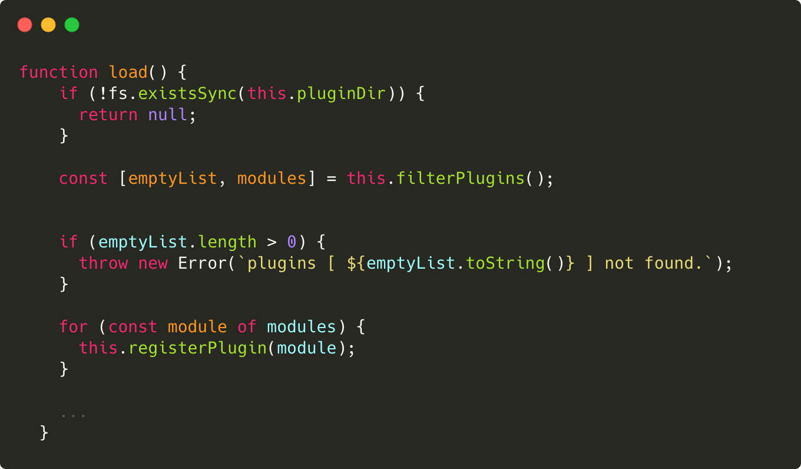

### 2、注册插件

注册插件是将插件内容读取到，并将其缓存到插件系统`pluginMap`当中，以便核心程序随时调用。

  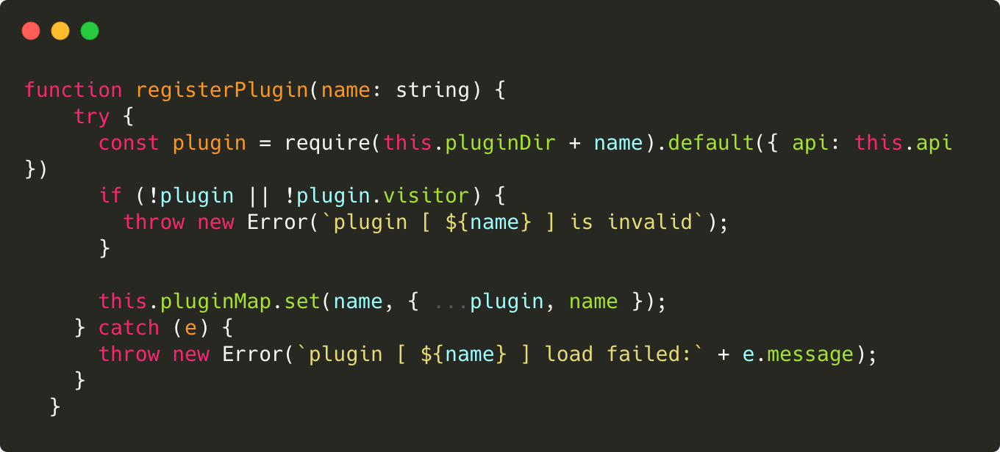

### 3、合并`Visitors`

`Visitors` 译为访问者，意思是拥有能够触及（访问）到核心程序的能力，其包含的是各个钩子函数实现的集合。

- 为何要将其合并？  
  因为插件是自由提供的，每个插件可以实现相同的生命周期钩子函数，注册的多个插件中会存在对同一个钩子函数的实现。所以需要对已注册的插件进行合并处理。  
  合并的方式有三种：管道式、集散式、覆盖式。  
  （1）管道式：一个一个按顺序执行，取最后一个的返回结果。
  

    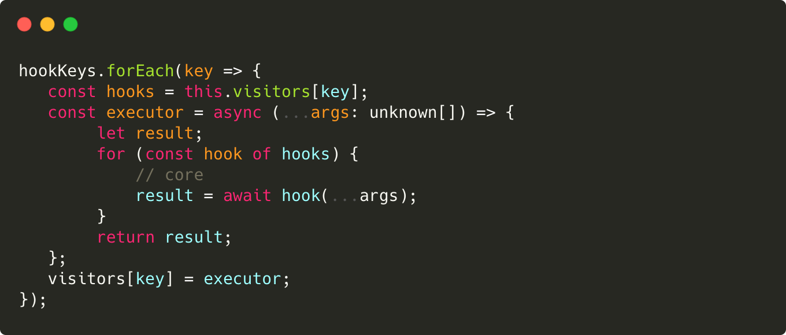
  

（2）集散式：全部执行，无先后顺序，返回所有执行结果的集合。

  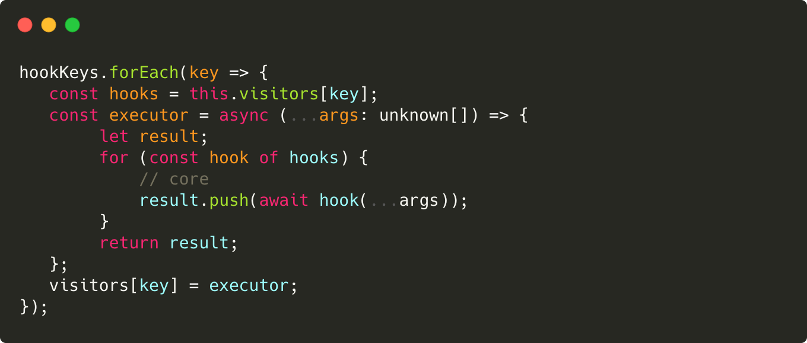

（3）覆盖式：只执行最后一个。

  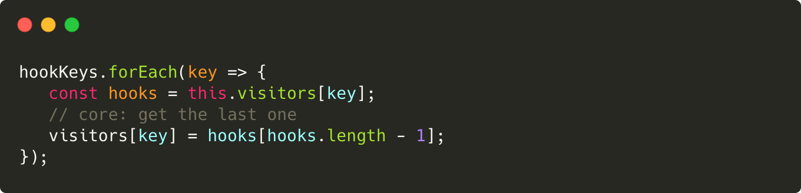

## 六、插件

插件是对核心程序的扩展，可以是业务领域，也可以是核心程序的扩展领域，例如：日志扩展、校验扩展等。  
插件形式有很多种，一个 npm 包、一个公共模块，甚至是一个方法。推荐采用 npm 包形式，这样做的好处在于可以实现插件的复用。  
插件实现非常简单，只需提供在`Visitors`里提供对应钩子的扩展即可。如下是 React 渲染插件的实现：

  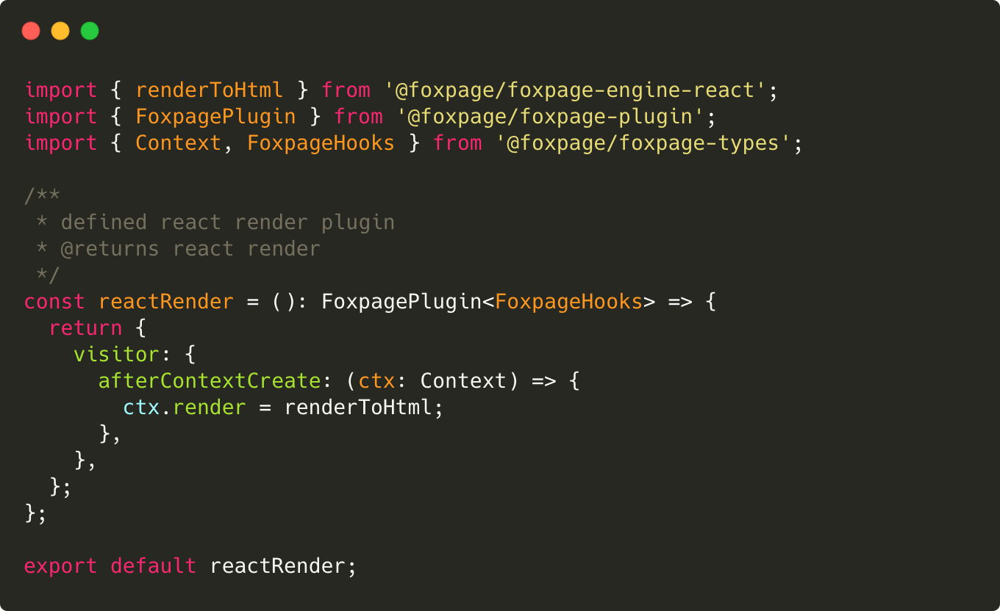

## 七、总结

通过插件化技术架构，可以使得业务与核心程序（框架、平台）隔离，核心程序不再关注业务领域，解决业务的差异性和不确定性，真正做了到高可扩展，同时插件是以 npm 包的形式来支持的，也能更好的实现插件的复用性。

## 八、参考

- [Foxpage 插件设计](http://www.foxpage.io/#/advance#%E6%8F%92%E4%BB%B6)
- [如何开发一个插件？](http://www.foxpage.io/#/developer/integration/plugin)
- [How to Design Software — Plugin Systems](https://betterprogramming.pub/how-to-design-software-plugins-d051ce1099b2)
