# Foxpage Node SDK 资源管理

<p>作者：肖达荣（Darong Xiao），Trip.com 前端开发工程师</p>

## 一、前言

资源是每个系统或平台非常重要的一部分，合理正确的管理亦是非常重要。

当一个应用或服务接入了 `Foxpage` 框架，会依赖多种类型的资源，这些资源来自 `CMS` ，为生成页面和渲染页面服务的。  
为此，`Foxpage Node SDK` 提供了一套通用的解决方案，为应用解决资源管理的难点。

## 二、概念

`Foxpage` 资源包含多种类型，比如：`Page`、`Template`、`Variable`、`Condition`、`Function`、`Package`和插件等。

<div style="text-align: center;">
  
</div>

- `Page` - 页面内容
- `Template` - 模板内容
- `Variable` - 变量，为页面扩展
- `Condition` - 条件，提供条件渲染内容
- `Function` - 方法，支持简单 js 方法，为扩展提供支持
- `Package` - 组件包，为 commonjs 格式文件，用来服务端渲染。

为了方便管理这些资源，以应用维度来进行划分，应用下包含各类资源管理器，相同部分进行统一化管理，差异部分进行私有化管理，通过多态方式实现。

<div style="text-align: center;">
  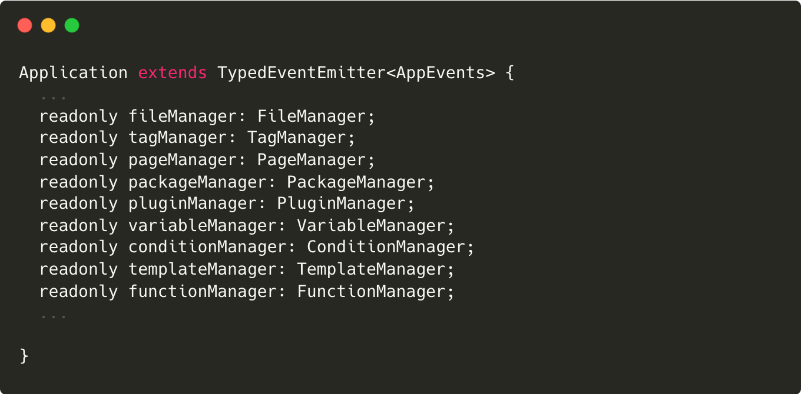
</div>

下面我将从以下几个点来深入了解。

## 三、 拉取、定时更新

我们已经知道所有资源都是在`CMS`平台上创建的，要更新到应用或服务上，需要进行拉取和更新。

### 1、应用启动拉取资源

在应用启动的时候，会优先将一些资源进行首次拉取操作，这部分资源主要特征是更新频率低，依赖度高，比如：`Package`。

- application 实例化
  在应用启动之际会根据配置的 app 信息进行 application 实例化，之后的整个生命周期都是根据 application 实例来获取相关资源：

  <div style="text-align: center;">
    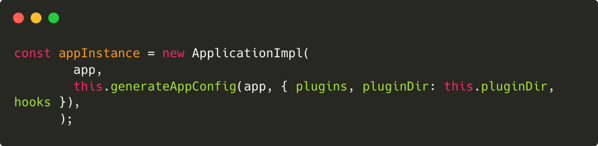
  </div>

- application 准备工作
  application 准备工作即为需要前置的工作，如：初始化首次需要拉取的内容，实例化任务调度器，用于定时更新资源等。

  <div style="text-align: center;">
    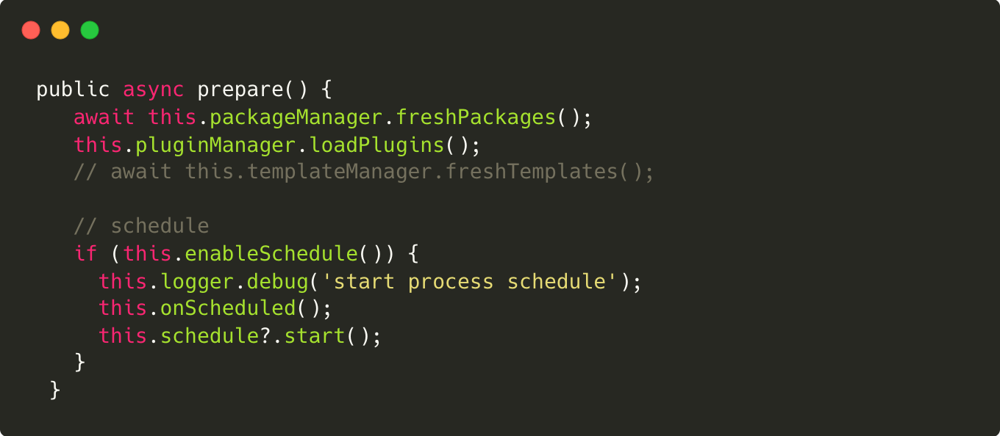
  </div>

- 实例化任务调度器
  <div style="text-align: center;">
    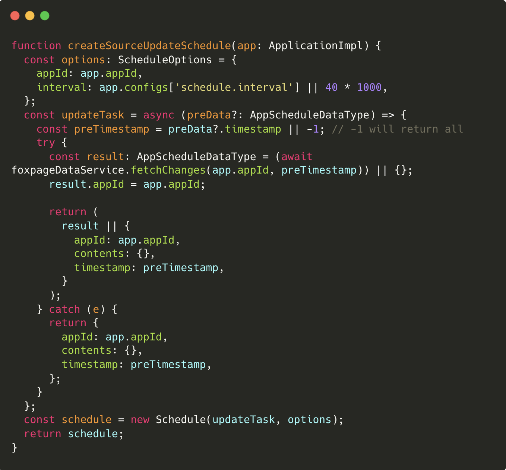
  </div>

### 2、定时更新

目前通过“主进程”定时任务去获取最新的资源，这部分信息是一个资源索引集合，按资源类型划分，结构如下：

```ts
  {
    "template": {
      "updates": [], //新增更新的content id列表
      "removes": [] //删除的content id列表
    },
    "component": {
      "updates": [],"removes": []
    },
    "page": {
      "updates": [],"removes": []
    },
    "variable": {
      "updates": [],"removes": []
    },
    "condition": {
      "updates": [],"removes": []
    },
    "function": {
      "updates": [],"removes": []
    }
    "tag": {
      "updates": [],"removes": []
    }
    "file": {
      "updates":[],"removes":[]
    }
  }
```

当主进程获取到更新消息之后，会将消息分发给所有的工作进程，工作进程进行统一更新，更新机制如下：

<div style="text-align: center;">
  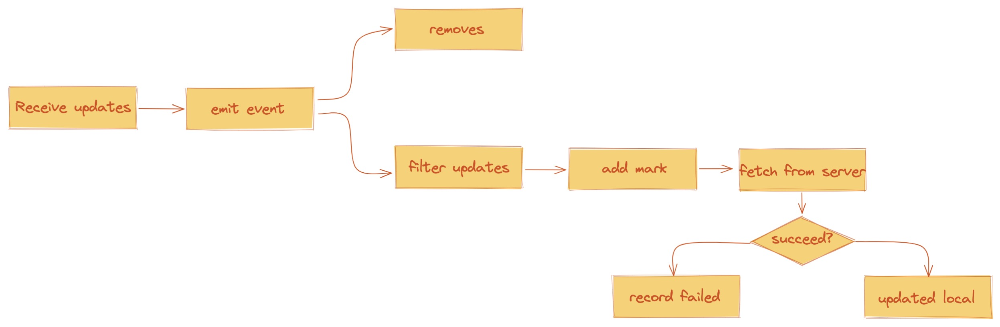
</div>

- 过程

  - `receive updates`：接受资源更新的消息。
  - `emit event`：触发资源更新广播事件。
  - `removes`：根据 removes 信息删除本地对应资源。
  - `filter updates`：这个是重点，各模块略有不同，只更新本地有记录（被访问过的）的资源信息。
  - `add mark`：对需要更新的本地信息添加标记（之后的访问将不可用）。
  - `fetch from server`：对需要更新的资源重新去服务端拉取最新信息。
  - `record filed`：更新失败的资源记录下来，用户下次访问将实时再向服务端拉取。
  - `update local`：更新成功的资源将同时更新掉本地的资源，删除上面 `add mark` 所添加的标记。

## 四、多进程资源同步

上面我们已经得知，更新消息是“主进程”来调度的，获取到更新消息之后，分发给其他工作进程，从而实现多进程资源同步。

### 1、资源空间

在多进程下，每个进程的用户地址空间都是独立的，一般而言不能相互访问的，但内核空间是每个进程共享的，所以进程之间要通信需通过内核。

<div style="text-align: center;">
  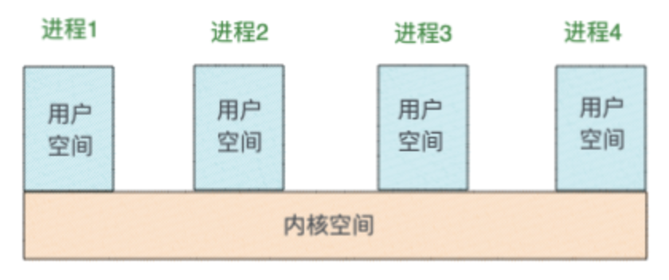
</div>

### 2、进程管理

通过结合 PM2 来实现多进程的管理，在进程创建初期，选举出“主进程”，当主进程接收到更新消息时，广播通知给其他工作进程，从而达到多进程资源同步的能力。

<div style="text-align: center;">
  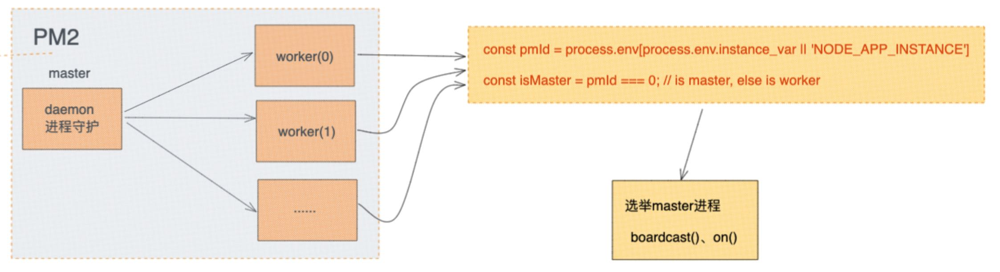
</div>

- 判断主进程
  根据进程实例`instance_var`或“NODE_APP_INSTANCE”属性来判断是否是主进程。

  <div style="text-align: center;">
    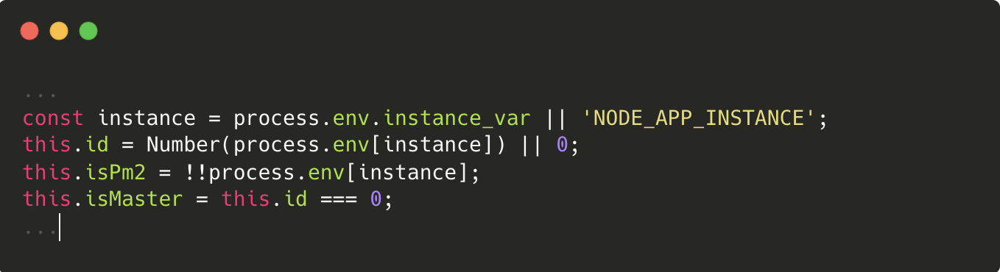
  </div>

- 发送消息通知工作进程
  <div style="text-align: center;">
    
  </div>

### 3、更新事件

当工作进程接收到资源更新消息时，会通知到 application 进行处理。application 有自己的一套更新事件，来支持各类资源的同一更新操作。  
应用和各个子模块管理器之间的消息传递是通过事件 event 来单向传递的，各子模块管理器完全独立，相关事件如下：

<div style="text-align: center;">
  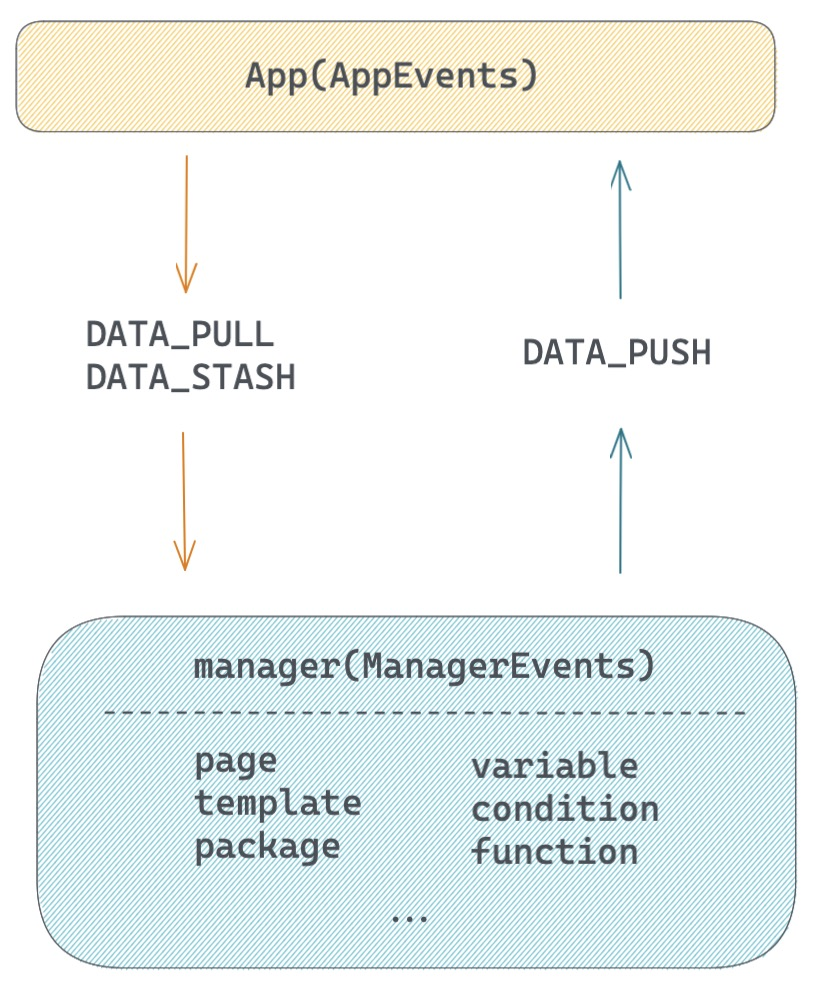
</div>

- `DATA_PULL`：调度器（schedule）轮询去服务端查询间隔时间段内更新过的资源索引集合，之后会广播该事件，所有监听了该事件的管理器会分别去处理接下来的更新操作（更新资源索引去服务端拉取对应的全量信息）。

  - 触发：应用

  ```ts
  // /foxpage-manager/src/application/application.ts
  // 调度器返回结果后执行
  public async refresh(updateInfos: AppScheduleDataType) {
    this.logger.info('refresh source');
    this.emit('DATA_PULL', updateInfos.contents);
  }
  ```

  - 监听：各个子模块

  ```ts
  // /foxpage-manager/src/common/manager-base.ts
  app.on('DATA_PULL', async (data: ResourceUpdateInfo) => {
    // 各个子模块实现
    await this.onPull(data || {});
  });
  ```

- `DATA_PUSH`：当用户首次访问`page`和`tag`的时候，会同时返回所有依赖的资源，这些资源是一个全量信息，可以直接用户缓存到本地。该事件即用来通知已取到新的全量资源信息。

  - 触发：`page`和`tag`模块触发

  ```ts
  // /foxpage-manager/src/page/manager.ts
  // /foxpage-manager/src/tag/manager.ts
  // emit event: cache user request data
  this.emit('DATA_PUSH', relations);
  ```

  - 监听：应用监听

  ```ts
  // /foxpage-manager/src/application/application.ts
  // listen push
  this.tagManager.on('DATA_PUSH', (data: ContentInfo) => {
    ...
  });
  this.pageManager.on('DATA_PUSH', (data: ContentInfo) => {
    ...
  });
  ```

- `DATA_STASH`：该事件和“DATA_PUSH”是配套的。当监听到“DATA_PUSH”事件时，会同时广播该事件，各资源管理器接收到之后进行各自的本地资源更新操作。
  - 触发：应用
  ```ts
  // /foxpage-manager/src/application/application.ts
  // listen push
  this.tagManager.on('DATA_PUSH', (data: ContentInfo) => {
    this.emit('DATA_STASH', data);
  });
  this.pageManager.on('DATA_PUSH', (data: ContentInfo) => {
    this.emit('DATA_STASH', data);
  });
  ```
  - 监听：各个子模块
  ```ts
  // /foxpage-manager/src/common/manager-base.ts
  app.on('DATA_STASH', (data: ContentInfo) => {
    // 各个子模块实现
    this.onStash(data);
  });
  ```

## 五、多级缓存

缓存是一个老生常谈的问题。为了加强性能、降低成本损耗和快速响应用户访问，`Foxpage` 通过“冷热分离”策略来实现多级缓存。

<div style="text-align: center;">
  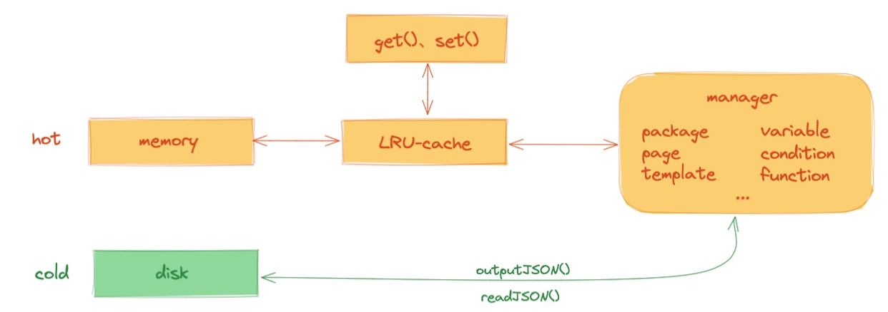
</div>

### 1、热数据缓存

- 位置：内存中
- 详情：由于可使用内存的大小限制，一般也不会将全部数据都存在内存中，所以使用 [LRU-Cache](https://github.com/isaacs/node-lru-cache#readme)（删除最近最少使用）策略，提供可设置最大存储量的配置，默认 3000。
  <div style="text-align: center;">
    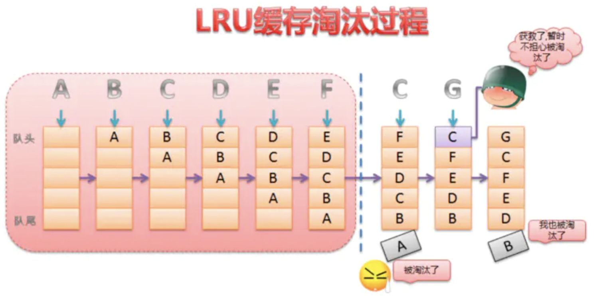
  </div>

### 2、冷数据缓存

- 位置：磁盘中
- 详情：用户访问过的资源都会写入磁盘中。
  <div style="text-align: center;">
    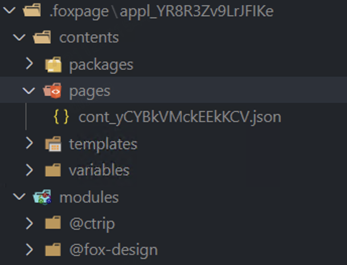
  </div>

### 3、缓存读取

用户访问资源，首先从热数据 hot 中查询，若命中，则直接返回；若未命中，则从冷数据 disk 中查询。

<div style="text-align: center;">
  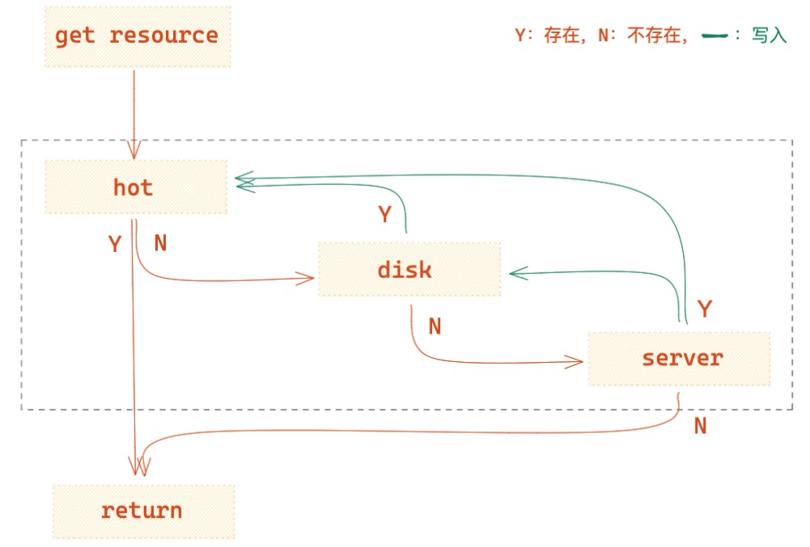
</div>

从磁盘查询命中，则将该资源存入热数据 hot 中，再返回。若未命中，则实时从服务端 server 中获取（各个模块实现不一样，此处使用多态来实现的）。服务端获取成功则将资源同时存入冷热数据中，再返回。若获取不成功则直接返回。

<div style="text-align: center;">
  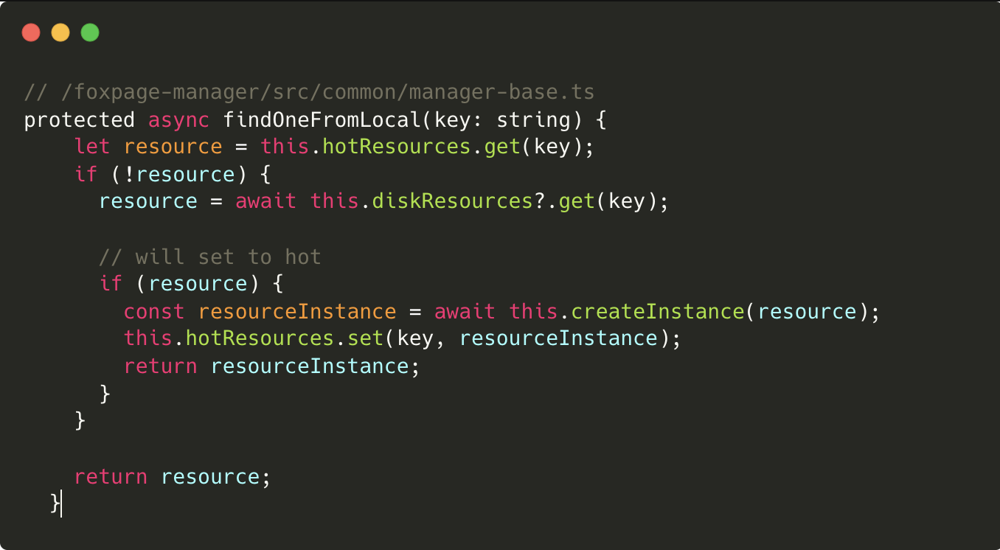
</div>

## 六、总结

从资源初始化、资源更新、资源缓存，以及多进程间资源同步等几个方面分别阐述了`Foxpage`资源管理做了哪些事情。资源的管理直接决定了框架或平台的稳定性，在目前看来资源的稳定性算是有了一定的保障，但还有很多点需要深度的探索和实现。

## 七、参考

- [Foxpage 进阶之路：资源管理器](http://www.foxpage.io/#/advance#%E8%B5%84%E6%BA%90%E7%AE%A1%E7%90%86%E5%99%A8-1)
- [Nodejs cluster](http://nodejs.cn/api/cluster.html)
- [pm2](https://pm2.keymetrics.io/docs/usage/quick-start/)
