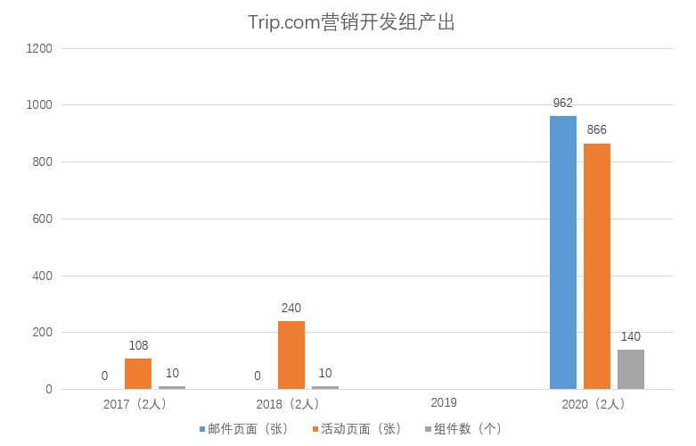

## 低代码在 Trip.com 上的实践

### 背景

随着国际业务的高速发展，营销类的落地页面开发的前端需求变得越来越多，在加上要做国际化，开发的工作量按照语言数量翻了几倍，本来就紧张的开发资源，越发的捉襟见肘。在紧急加人坚持了一段时间后，发现问题不但没有彻底的解决，反而还暴露出了更多的其他问题。在深入到整个开发过程中后发现，典型的“量变引发了质变”，当前端需求量放大后，以前端项目为粒度的工程化效率变的低下，不能够在快速的满足业务多且急的变更需求。响应变慢且靠堆人都难解决问题

#### 问题整理

先看看活动页需求的几个特点：

- 短，活动时间会有一定的时间范围，可能不会太长，由其性质决定
- 频，活动的需求会有确定性的，周期性的和临时性的，需求繁多，玩法各异
- 快，一般活动上线时间都会有要求，他可能配合一个热点事件，如果是突发类的，需要快速响应
- 高，看活动需求，每个活动都可以看成单个大小不一的项目，支持成本比较高

开发视角的几个典型的问题：

1. 每个活动都可能是一个小项目，页面和功能形式各异且繁多。而且要支持国际化，各个国家或地区的运营和策划还会有不同，工作量按语言的数量成倍上涨
2. 页面内容更改频繁，每一次的更改都需要走开发发布流程非常耗时
3. 随着项目中的活动增多，项目中的代码量也膨胀了，按照项目粒度的工程化效率变的低下，如 CI/CD 整个过程

非开发视角的问题：

1. 每次的前端变更需求都强依赖开发
2. 每次的前端变更需求开发响应很慢
3. 各个角色之间接力式的合作效率低下

#### 解决思路

不难看出开发遇到的问题只是表象的，还要从业务需求出发多方面综合考虑，抽丝剥茧找出核心痛点并逐个击破

- 业务需求多，开发工作量大

  `解决思路`：制作页面模板，将常见的活动形式制作成模板，按照不同的风格样式制作成主题。组件化并标准化，将常用的部分内容或功能开发成组件，从需求开始把控尽可能减少定制，最大程度提高组件复用度，减少重复开发。 一段时间的沉淀和积累，会形成一定的标准。部分简单的变更需求转移给运营或编辑分担

- 页面内容的变更需求强依赖开发

  `解决思路`：梳理出编辑或运营关注的内容部分，并交给他们各自去维护。技术提供内容分开维护后在合并的支持

- 开发项目膨胀导致工程化效率低下

  `解决思路`：最简单的方式是按照活动粒度拆分项目或者激进一点绕开传统开发过中的项目工程化

#### 方案调研

带着这些问题和解决思路我们先去了看了外部的解决方案， 先是调研了“静态站点”、“微前端”等方案，虽然这两种方案能的解决开发工程的各类效率的问题，但是终究只解决技术上的部分问题。之后换了思路调研了市场上成熟的 CMS 和一些可视化搭建系统，综合对比分析后发现可视化搭建方案还是和我们贴近一点。但是由于技术栈差异、难扩展、功能臃肿、场景支持单一、页面排版功能弱以及二次开发的成本等因素还是放弃直接使用，选择自研

#### 改进效果

经过半年的开发于 2019 年中旬内部正式上线，一经上线效果明显。下图是平台上线前和上线后的产出对比：

  

截至 2021 年中单活动这个场景大约有 3000+的营销落地页面在平台上制作完成。尝到甜头后，除了营销落地页我们还做了如邮件、SEO、海报、D2C、移动应用等场景的探索，以此来探寻页面搭建系统能力的边界。2021 年 6 月经内部商议决定开源，经过半年的研发正式提交到开源社区

### 低代码的一次探索

严格上来说 Foxpage 其实是低代码实践的产物，本身这类的页面搭建系统都属于低代码范畴的产品。低代码是什么？大家可以自行网上可以搜索有很多资料。这里不过多去介绍，主要聊下低代码到底给项目带来什么？解决了什么样的问题？

1. 开发模式的转变

- 从“pro code”到“low code”的转变

- 从项目粒度的工程化到页面粒度的工程化的转变

  传统的开发模式的工程化都围绕着项目粒度去做的，从前端项目的开发工程的创建，开发，测试，集成，交付等环节。当单个在一定的程度上会约束

2. 组件化的开发思维

组件化是低代码的核心部分，可以说他最终决定了低代码类产品的能力和体验

邮件场景：

1. 前后端分离

2. 组件化

几点注意：

低代码 不等于 零代码

在线配置 不等于 在线写代码

## 低代码开发平台？

开发方式从“pro code” 转变成了 “low code”

随之带来了大量的围绕着“低代码”开发建设的系统或工具的需求。一个较完善的前端低代码开发平台需要做很多事情，单拿前端项目的页面制作来说，页面可视化搭建只是一个基本的功能，页面的搭建，调试，测试，发布，校验，分析等环节都需要对应的方案支持。，项目交付的内容也可能发生了变化，但是对于交付的要求始终是要高质量且高效率的，而为之打造的一套项目工程化的体系还是要有，只是可能换了种形式。

如果这些想体验低代码迭代方式的前端项目都要按照这么一套较完善来体系建设的话，势必会带来相当大的开发和使用成本

对于中小企业或团队来说，开发资源有限，从零开发不太现实。想要快速的体验下低代码迭代的方式显得困难重重。而对于点大企业或团队，他们的开发资源相对丰富，不同业务线可能存在多个低代码类的产品，甚至在同一个业务线的不同使用场景或不同的技术栈也都有不同的低代码类产品。这些系统核心功能和能力大体相似，各自实现造成了大量的重复工作。且由于自身封闭的原因，大量的物料信息也不能流通使用。还有场景支持单一等问题，这里不再一一列举

- 这些系统核心功能和能力大体相似，各自实现造成了大量的重复工作。
- 且由于自身封闭的原因，大量的物料信息也不能流通使用。
- 还有场景，技术栈，端支持单一
