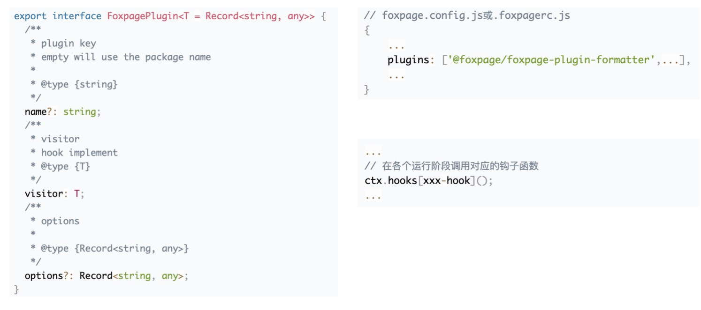

## 初识 Foxpage Node SDK

来到这个章节，想必大家心里都是带着疑问的：

- `Foxpage Node SDK` 有什么能力？能为我们做什么？
- `Foxpage Node SDK` 如何帮助应用管理复杂的资源？
- 我们的业务场景比较特殊，`Foxpage Node SDK` 是否具备扩展能力？
- ...

下面我们将结合以上问题一起来认识 `Foxpage Node SDK`。

#### 一、前言

说在最前面，`Foxpage Node SDK` （以下简称：SDK）是 Foxpage 提供给 node 端应用使用的开发工具包。通过使用 SDK 能让您快速地接入和使用 Foxpage 框架。

#### 二、SDK 的能力，能为我们做什么？

在学习 SDK 具备的能力之前，先简单了解下 SDK 的架构，如下：

  

说明：

- `App(Site) server` 指的是应用（站点）服务
- `App(Site) server` 可以通过 `Middleware` 和 `API` 两种方式来接入 SDK（`Node-SDK`）
- SDK 包含多个模块：
  - `Manager`：资源管理器，统一方式管理所有依赖资源
  - `Core`：SDK 核心，当前提供 `DSL` 解析功能
  - `Engine`：渲染引擎，主要包含页面构建和渲染功能。
  - `Plugin`：插件系统，结合 `微内核` 理论，提供快速扩展能力
  - ...
- `Shared`：公共工具包
- `Types`：公共类型包

经过以上的了解，我们开始学习 SDK 所具备的能力：

##### 1、DSL 解析

> DSL 是 Domain Specific Language 的缩写，中文翻译为领域特定语言。在 Foxpage 框架中，DSL 为 JSON 格式的数据，页面结构即称为 DSL。

DSL 解析是 Foxpage 的核心能力之一。一张页面由多种类型（`Page`、`Template`、`Variable`、`Condition`、`Function`）DSL 组成：

  

各种类型 DSL 之间有着相互引用的关系，如下：

  

DSL 的解析就是将各个依赖资源进行解析合并，其中解析指的是变量、条件、方法和指令的解析，合并则指的是将各个解析好的零散的 DSL 合并成一个完整的页面结构 DSL。

> 想更进一步了解 DSL 解析原理，可移步至进阶之路：[解析器](/advance#解析器-1)。

##### 2、资源管理

资源除了上面 `DSL解析` 部分提到的 DSL 资源，还有包资源 `Package`，所有的资源都是以应用 `Application` 维度来划分的。资源管理主要包含以下三个方面：

- 资源更新
- 多进程间资源同步
- 多级缓存
  更详细的内容会在下面 [如何管理资源？](/advance#资源管理器-1)部分中介绍。

##### 3、统一上下文

为了方便应用开发者接入和使用 Foxpage 框架，SDK 提供了默认统一的上下文 `Context`。`Context` 是在每一次接收到用户的请求时，动态创建的对象，这个对象封装了这次用户的请求信息和所有依赖的数据，而且这些数据可以在整个访问的运行时过程中使用。

当然，在有些特殊场景下，`Context` 可能不满足开发者使用，为此，SDK 开放了相应的生命周期来支持上下文自由扩展的能力。

> 想更进一步了解 Context 结构，可移步至进阶之路：[上下文](/advance#上下文（context）)。

##### 4、页面渲染

页面渲染指的是服务端页面渲染和客户端页面渲染。

- 服务端渲染过程：
  SDK 会根据上面 `DSL解析` 完成后的页面 DSL 去加载页面依赖的组件资源 `Package`。后根据页面结构动态构建页面，生成虚拟 DOM，随后根据不同框架进行渲染。
- 客户端渲染过程：
  客户端渲染是根据服务端注水的数据进行初始化。且客户端渲染实现组件化了，SDK 提供统一的 API 供开发者使用，也就是说客户端渲染可以自由的实现和扩展。
  

    
  

> 目前默认支持 `React` 框架的页面渲染，未来可支持多框架渲染。  
> 想更进一步了解页面渲染，可移步至进阶之路：[SSR](/advance#服务端渲染（ssr）) 或 [CSR](/advance#客户端渲染（csr）)。

##### 5、插件扩展

为提高扩展能力，结合 `微内核` 理论。SDK 实现了插件系统，提供了一套钩子函数和 API，可以帮助开发者开发插件和使用插件。

> 更多实现原理请看：[插件系统](/advance#插件)  
> 如何开发插件请看：[插件开发](/developer/integration/pluigin)

综上，我们可以初步了解到 SDK 能为我们（开发者）做什么：资源管理、DSL 解析和页面渲染等，同时提供我们（开发者）快速扩展自己业务功能的能力。

#### 三、如何管理资源？

资源是每个系统重要的一部分，资源的管理尤为重要。从 SDK 能力介绍部分我们知道 SDK 资源管理主要包含三个方面：资源更新、多进程间资源同步和多级缓存。下面我们将详细介绍。

##### 1、资源更新

资源更新就是将 `CMS` 上已更新的资源同步到本地，同步过程则是通过调度器 `Scheduler` 定时从 `CMS` 拉取已更新资源的索引集合，随后分发给各个类型的资源管理器进行最新资源拉取操作。流程如下：

  

> 为了保证资源的一致性，采用了“强一致性”的机制，即当接收到需要更新的资源时给对应资源打上标记，在用户下次访问时该资源不可以用，需即时从服务端拉取。

##### 2、多进程间资源同步

上面我们提到了资源的更新同步是通过调度器来实现的，但在真实场景中会涉及到多进程间资源同步问题。如果每个进程都有调度能力，那将是一种资源的浪费，且不能保证资源的一致性。为此，SDK 选举了一个“主进程”来触发调度，接收到结果后通知其他的工作进程来分别进行资源更新操作。如下：

  

##### 3、多级缓存

当前 SDK 采用 `冷热分离` 策略来缓存资源。冷指定是磁盘存储，热则指的是内存存储。热资源存储大小需要依据实际情况来定，不能存储过大，当前是通过 `LRU-Cache` 方式来实现的。

> `LRU` 是最近最少使用的策略，可以设定最大存储量。

  

#### 四、是否具备扩展能力？

从第二部分介绍 `SDK的能力` 后我们可以知道答案是肯定的。 那么是如何实现扩展能力的呢？

我们都知道越来越多的系统或框架通过插件来扩展功能，比如：webpack、babel、...，和插件紧密相关的就是生命周期钩子，意味着插件执行的时期。SDK 就是通过生命周期和插件系统来实现扩展能力的。

##### 1、生命周期

SDK 生命周期分为应用生命周期和用户访问生命周期。每个生命周期都提供了相应的生命周期钩子函数。如下为用户访问生命周期：

  

##### 2、插件系统

插件系统是负责加载插件和管理插件的。插件的实现是依据生命周期的。

在 SDK 启动初期，插件系统会根据开发者提供的配置文件去加载插件，加载好插件之后进行一个插件的合并处理，插件合并的方式有很多种：覆盖式、管道式、集散式和洋葱式（目前 SDK 支持了覆盖式和管道式），最后会返回一个合并后的插件集合，也就是对应的生命周期的实现的集合。

最后，会在对应的生命周期中执行对应的插件实现。

  

> 想更进一步了解插件的实现，可移步至：[插件系统](/advance#插件) 和 [插件开发](/developer/integration/pluigin)

#### 五、总结

通过上面三个问题，我们分别了解了 SDK 的一些核心能力，如何管理资源以及如何实现扩展能力的，希望能帮助大家对 SDK 有个初步的认识。

想要开始使用 SDK 可以移步至：[如何接入 Node SDK？](/developer/integration/node-sdk)。  
想要更深层次的了解 SDK 实现，可以移步至高阶篇：[进阶之路](/advance)。
