在制作页面之前，我们需要做一些准备工作，比如创建页面的宿主应用、制作一个页面的模板、添加组件到应用等。这里的应用可以理解为一种`应用的空间`，用来存放和应用相关的信息与实际开发过程中的应用可以一一对应，创建后都会有一个唯一的标识，通过这个标识可以定位到一个应用，也可以用来获取应用相关的信息

## 创建 WEB 应用

应用可以有几种类型，如：WEB，WAP，APP 等。通过类型可以确定应用中存放的内容及其用途。如 WEB 应用我们一般存放 Web 类型的页面，一般用在浏览器站点上。不同的类型应用也会提供一些特有的功能。这里我们看下 WEB 类型应用的创建，需要做哪些配置工作

#### 创建应用

1. 输入应用的名字，注意名字的格式，这里我们按照前端应用的业务+类型命名成“promo-website-demo”

<html>

  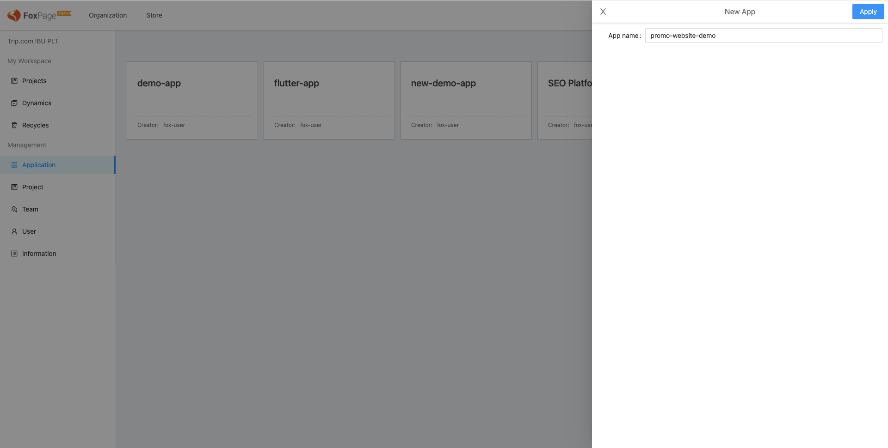

</html>

&ensp; &ensp; &ensp; &ensp; 如要修改应用，可以点击修改按钮

<html>
  

    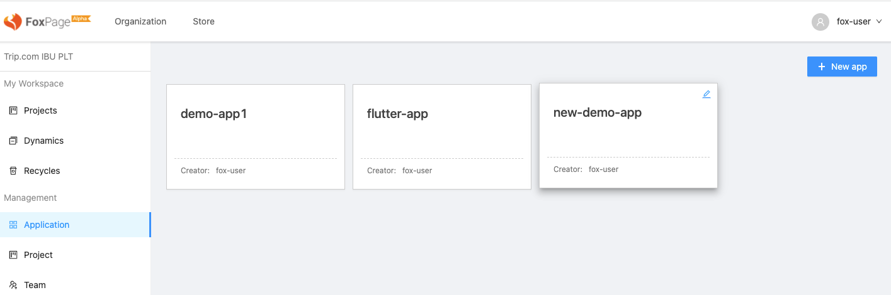
  

</html>

2. 应用创建完成后，我们先做一些基础信息的配置，进入应用里的设置

<html>
  

    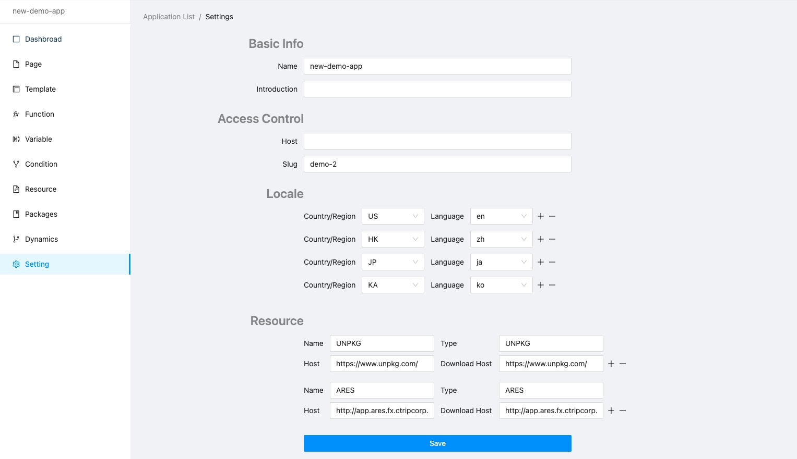
  

</html>

&ensp; &ensp; &ensp; &ensp; - Access Control：如果是站点应用，这里配置的访问站点的域名。slug 为字母、中划线和数字组成的用唯一的字符串，可以作为访问应用的 URL 的组成部分

&ensp; &ensp; &ensp; &ensp; - Locale：需要设置应用所支持的多语言【[详见国际化](/course/create-application#国际化支持)】

### 添加组件，编辑器，类库

应用基础信息配置完成后，我们需要给应用添加一些组件，这样在制作页面或模板时才可以选择使用，添加包之前需要先注册下包所需要的各种静态资源信息【[详见注册资源](/course/create-application#注册静态资源)】

1. 添加组件和属性编辑器（添加类库同添加组件的操作，需要注意的是类库与组件的添加有些区别，比如不需要配置编辑器，Meta，Schema 等信息）

   选择组件的 Tab，点击新添加一个组件，输入组件名称后创创建

  <html>
    

      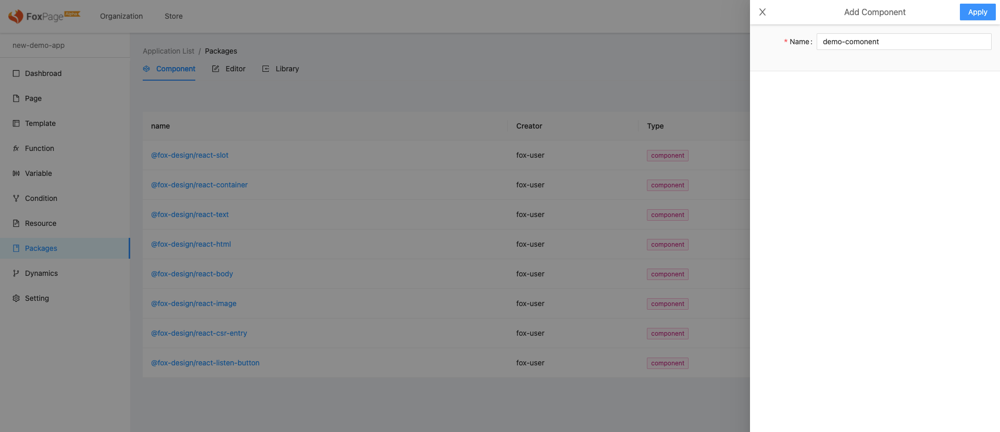
    

  </html>
   进入组件详情，点击右上角按钮创建一个组件版本

  <html>
    

      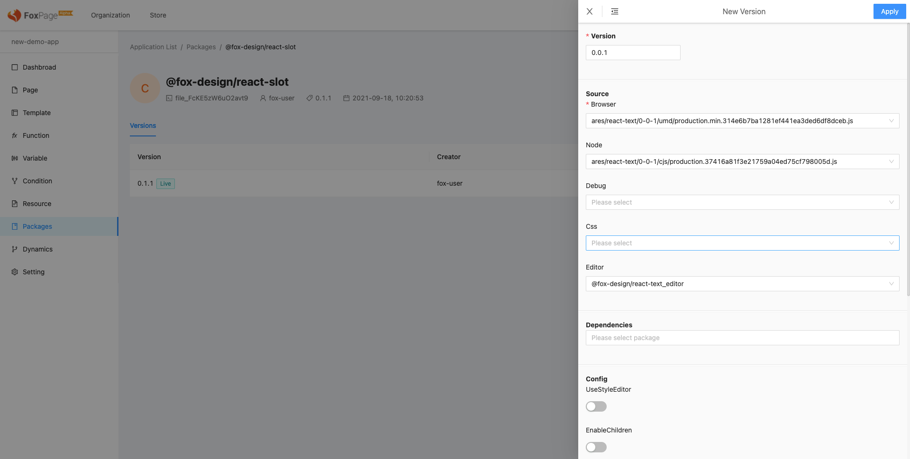
    

  </html>

&ensp; &ensp; &ensp; &ensp; - Version 版本名称：可以同步静态资源本版，也可以自定义

&ensp; &ensp; &ensp; &ensp; - Source 静态资源信息：配置各个端或动能的入口文件

&ensp; &ensp; &ensp; &ensp; &ensp; &ensp; - Browser：浏览器加载的文件地址

&ensp; &ensp; &ensp; &ensp; &ensp; &ensp; - Node：Node 服务端加载的文件地址

&ensp; &ensp; &ensp; &ensp; &ensp; &ensp; - Debug：调试模式加载文件地址

&ensp; &ensp; &ensp; &ensp; &ensp; &ensp; - Css：SSR 过程中加载 CSS 文件地址

&ensp; &ensp; &ensp; &ensp; &ensp; &ensp; - Editor：可视化编辑时编辑器加载文件地址，这里要先添加组件对应的“属性编辑器”才可以选择到，添加的方式同添加组件

&ensp; &ensp; &ensp; &ensp; - Dependencies 依赖信息：依赖包的信息，配置后系统会在加载包信息之前先加载依赖的包信息

&ensp; &ensp; &ensp; &ensp; - Config 配置信息

&ensp; &ensp; &ensp; &ensp; &ensp; &ensp; - Mata

&ensp; &ensp; &ensp; &ensp; &ensp; &ensp; - Schema

&ensp; &ensp; &ensp; &ensp; - Changelog 变更日志：记录每一次版本的变化信息

2. 版本创建完成后，会看到状态显示的是"Base", 需要点击发布才会成为一个可用的版本。发布后仅仅是可用的版本，还没有开“流量”生效

3. 点击 “Live”，这个时候才代表这个版本正式生效，页面在渲染时会选择这个“Live”的版本

按照如上的步骤，可以添加我们制作 HTML 模板所需的组件，如：@fox-design/react-html、@fox-design/react-head、@fox-design/react-body 等

### 注册静态资源

Foxpage 本身不提供静态资源托管服务，你可以选用第三方服务或者选择自建。这里我们拿 unpkg.com 来举例说明

1. 首先我们在应用的设置中配置 UNPKG 仓库的源信息

<html>
  

    
  

</html>

&ensp; &ensp; &ensp; &ensp; - Name 名字：可以用第三方名字来命名

&ensp; &ensp; &ensp; &ensp; - Type 类型：这里目前有两个，一是第三方，二是自建

&ensp; &ensp; &ensp; &ensp; - Host 域：为浏览器端加载资源时的域名信息

&ensp; &ensp; &ensp; &ensp; - Download Host 下载域：下载静态资源的域信息，比如在 SSR 过程中加载静态资源时使用下载域，这个域可以为内网访问域，这样访问速度可以更快

2. 配置完成仓库源信息后，我们进入应用的资源界面添加一个资源组。输入 group 名字，选择 resource type（setting 中设置）、输入 group 描述创建 group

<html>
  

    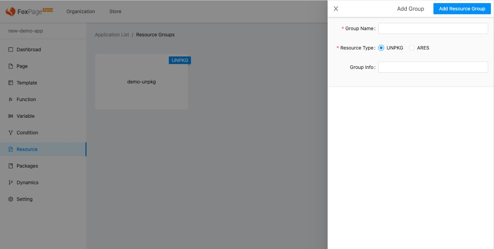
  

</html>

&ensp; &ensp; &ensp; &ensp; - Group Name 组名：可以根据静态资源的信息来命名，比如所属业务

&ensp; &ensp; &ensp; &ensp; - Resource Type 资源类型：这个上第一步中配置的仓库信息，比如选择 UNPKG 即表示这个资源组中的静态资源都来自于 unpkg.com 上

&ensp; &ensp; &ensp; &ensp; - Group Info 组信息：这里添加关于这个资源组的介绍信息

3. 进入到资源组中，注册静态资源信息

<html>
  

    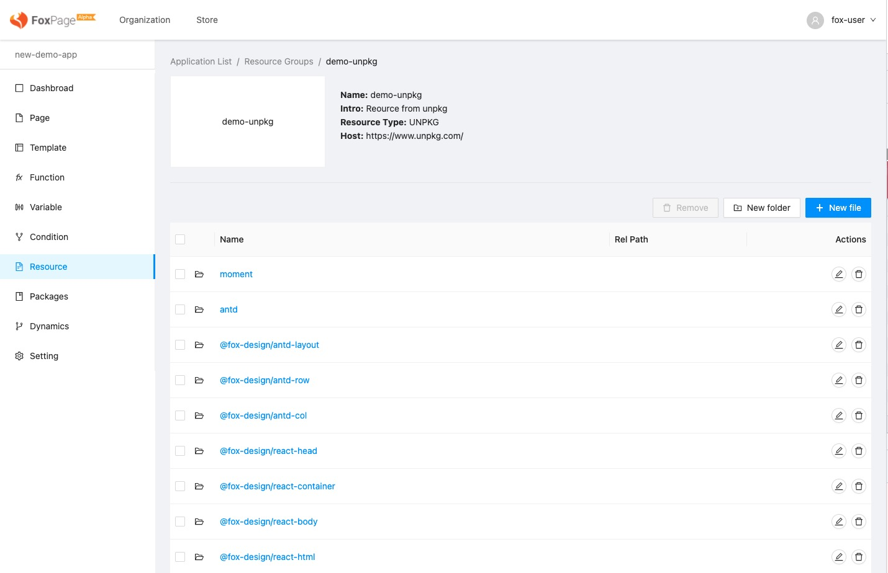
  

</html>

> 由于静态资源托管服务提供方的资源路径各有不同，如果都按照原路径注册进系统，对于后面的资源治理会带来很大的挑战。为了避免这种情况，我们提供统一的路径
>
> - 第一级为资源名称（可以等同包名）
> - 第二级为资源的版本
> - 第三级为打包格式
>
> 资源注册上来后的访问路径可以这样表示：foxpage://[resource name]/[resouce version]/[format]/[file name]

&ensp; &ensp; &ensp; &ensp; 创建文件夹，如上解释可以先创三级，拿 react 资源信息注册说明如：/react/16.0.7/umd

<html> 
  

    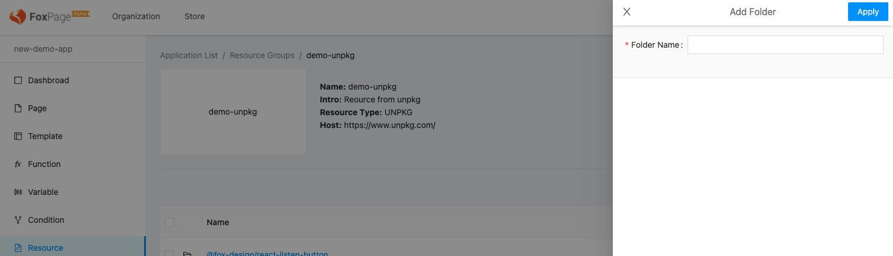
  

</html>

&ensp; &ensp; &ensp; &ensp; 添加文件“react.production.min.js”并配置 UNPKG 上的路径为 “/react@16.7.0/umd/react.production.min.js”

<html>
  

    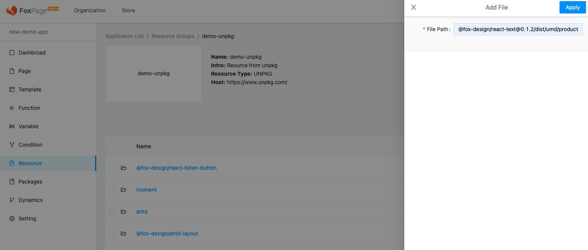
  

</html>

这样一个静态资源文件就注册好了，如果同级还有别的文件，可以继续重复上面的动作即可。Foxpage 提供一些基础的组件【[详见 npm 仓库](https://www.npmjs.com/org/fox-design)】，这些包会同时同步到 unpkg.com 上，后续会提供一键注册到 Foxpage 功能

### 制作页面模板

页面模板的作用是能够然让用户快速的创建页面，页面模板管理着页面的公共部分内容，这样用户不需要每次创建页面的时候都做一些重复的配置。那哪些内容是公共的？应用的 Owner 可以根据自身的业务来自行决定。这里我们用一个比较通用的 HTML 模版的列子来讲解下模版制作过程

1. 首先创建一个项目，进入项目后创建一个 template 类型的文件，命名为“base-template”

2. 进入模板，添加内容（这个可以创建多份内容，存放按语言或者其他自定义维度划分的内容）

3. 进入到内容文件，开始制作 HTML 模板部分

   在组件栏中选择所需的组件，按照 HTML 文档的结构拼装如下图内容

  <html>
    

      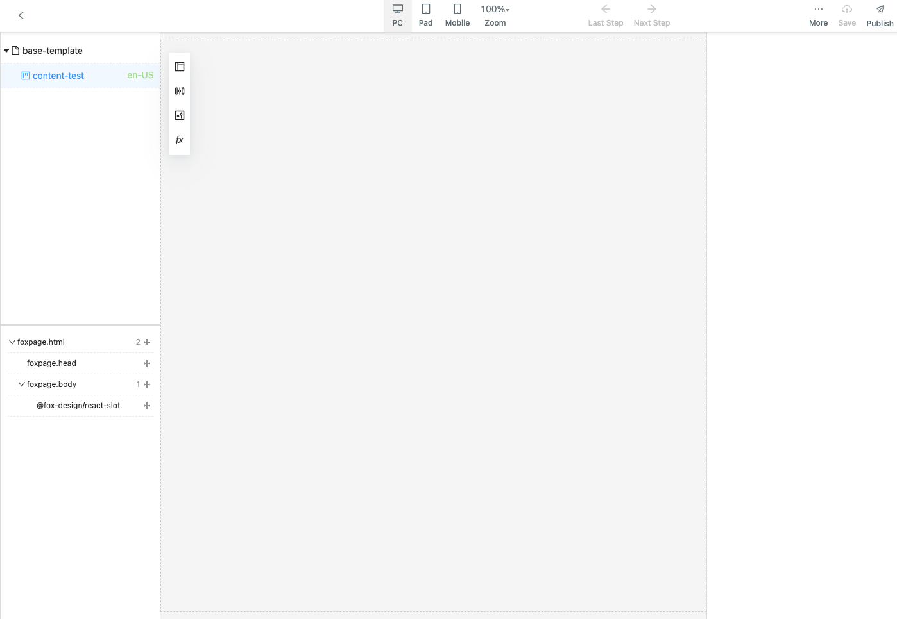
    

  </html>

选中@fox-design/react-slot 节点，选择 Baisc Tab 后，在指令一栏中的 TPL 设置下页面主体内容的挂载点信息

<html>

    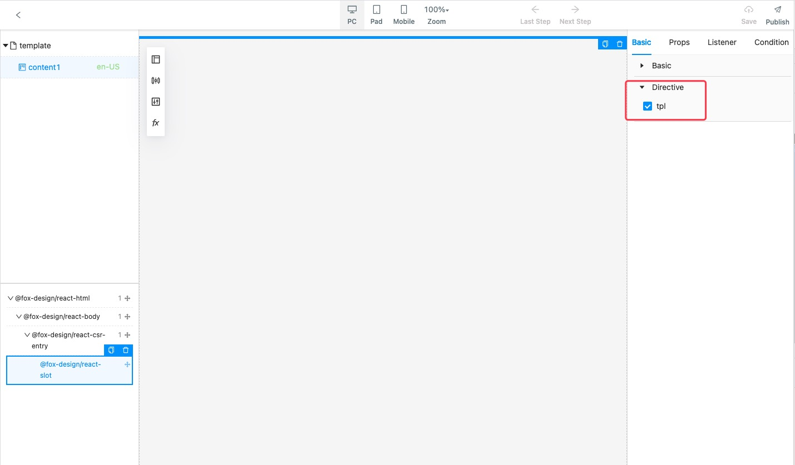
    

</html>

4. 确认无问题后，点击发布即可

## 应用间的内容分享

除了手动的添加包、变量等内容到应用中，我们还提供了一种可以通过商店获得的方式，这样可以减少需要自主配置的工作量，提高效率【[详见商城](/course/store)】

## 国际化支持

Foxpage 提供了一套国际化内容管理方案，可以在应用的设置中开启，应用的 Owner 可以结合业务情况选择性设置所支持的语言

<html>
  

    
  

</html>

按照国际标准预置了大部分常用的代码，当应用设置了支持的语言后，用户在创建页面内容时会出现对应的 Locale 的选择

> Locale = 语言（ISO 639）+ “ - ” + 国家/地区（ISO 3166），代表一个国家或地区的语言

每张页面可以对应多份内容，每份内容可以设置一个或多个 Locale，这样可以有最大程度上的灵活度。拿页面来讲，你可以多种语言使用同一份页面内容，也可以每种语言使用不同的页面内容，
前端想获取对应语言的内容时可以通过 Locale 标识

<html>
  

    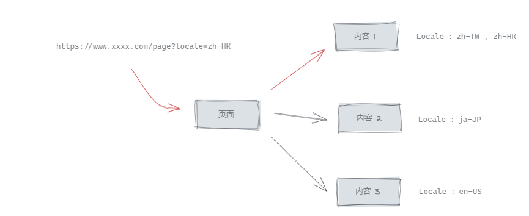
  

</html>
