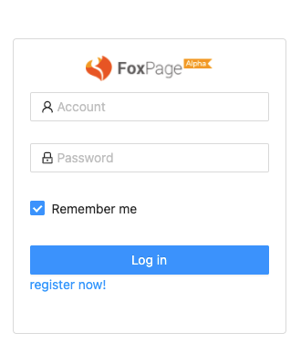

Foxpage Admin 为用户提供内容管理后台，其中包含对组织，应用，项目，团队，用户等模块

## 访问管理界面

进入登录界面后输入用户名和密码，点击登录。身份校验通过后，默认会进入用户所在的组织的操作界面

<html>
  

    
  

</html>

目前每个用户只能有一个所属组织，后续如果支持多个，那么在登录时除了提供用户名和密码外，还要选择登录哪一个组织

### 第三方账号登录

如果在系统中设置了支持第三方账号登录，登录的入口会出现在登录界面的下方，点击入口链接会进入到第三方登录界面

## 账号设置

系统在安装阶段会创建 admin 账号，此账号拥有该系统管理员权限。同时会用 admin 账号去创建一个组织，admin 拥有该组织的管理员权限

#### 添加新的用户

对组织有管理权限的账号（一般是 admin 账号）可以进入组织频道中的“用户”界面去添加新的用户

<html>
  

    
  

</html>

点击“Add User”添加一个新的用户

<html>
  

    
  

</html>

#### 修改用户登录密码

在添加用户时候会随机创建一个的密码，为了安全还是希望用户在登录后修改成自己设置的密码
