## 应用管理

管理组织下的应用及应用下的项目，页面，模板，变量，条件，包，静态资源等信息

#### 页面

管理当前应用下的所有页面。应用的 admin 可对应用下所有 page 进行管理（删除、修改、编辑）

<html>
  

    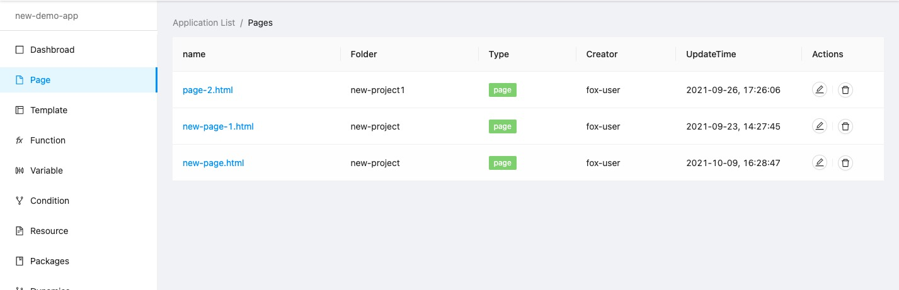
  

</html>

#### 模版

模板、应用 admin 用户可对应用下所有 template 进行管理（删除、修改、编辑）

<html>
  

    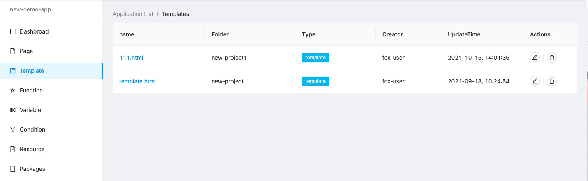
  

</html>

#### 函数

方法、应用 admin 用户可对应用下所有 function 进行管理（删除、修改、编辑）

<html>
  

    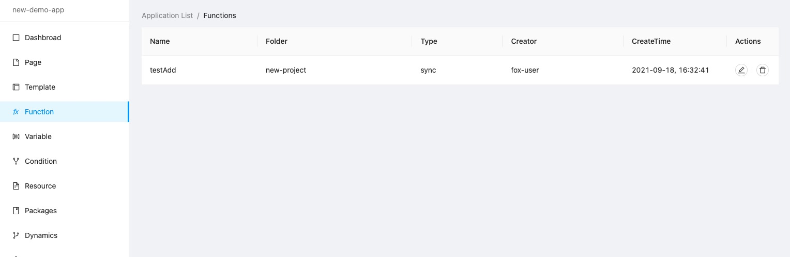
  

</html>

#### 变量

变量、应用 admin 用户可对应用下所有 variable 进行管理（删除、修改、编辑）

<html>
  

    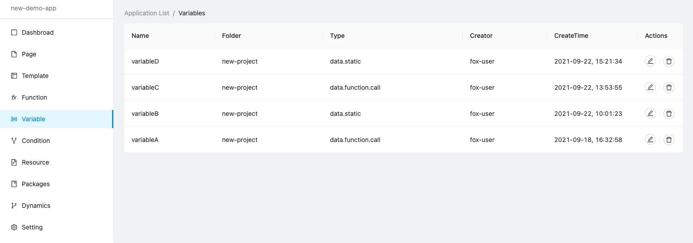
  

</html>

#### 条件

条件、应用 admin 用户可对应用下所有 condition 进行管理（删除、修改、编辑）

<html>
  

    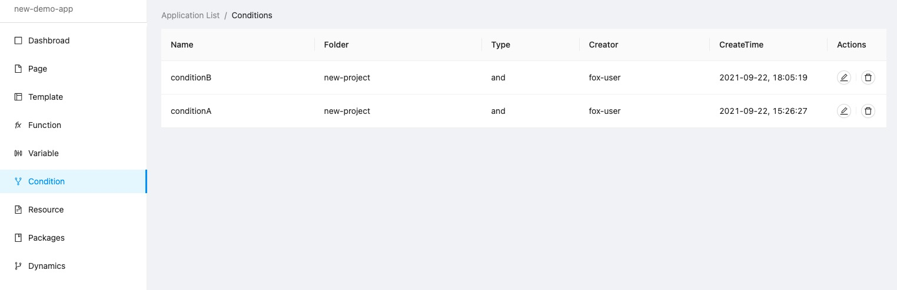
  

</html>

#### 资源

静态资源管理入口

<html>
  

   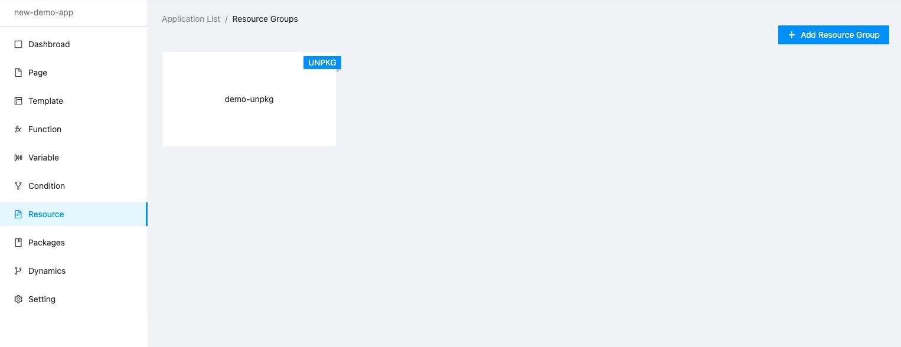
  

</html>

新建 resource group

&nbsp;&nbsp;输入 group 名字，选择 resource type（setting 中设置）、输入 group 描述创建 group

<html>
  

   
  

</html>

点击资源卡片，进入 group 资源管理界面

<html>
  

    
  

</html>

新建 folder 输入文件夹名字创建文件夹

<html>
  

    
  

</html>

新建 file 输入 file 路径创建，(例：@fox-design/react-text\@0.1.2/dist/umd/production.min.js，不包含 host，host 在 setting 中设置)

<html>
  

    
  

</html>

#### 包

应用下包的管理入口，包含 Component-组件、Editor—组件 Editor、Library-lib 文件

<html>
  

    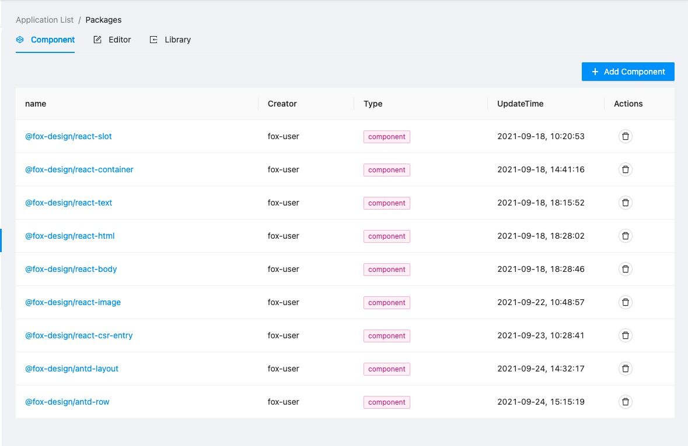
    

</html>

点击组件名字进入组件详情页

<html>
  

    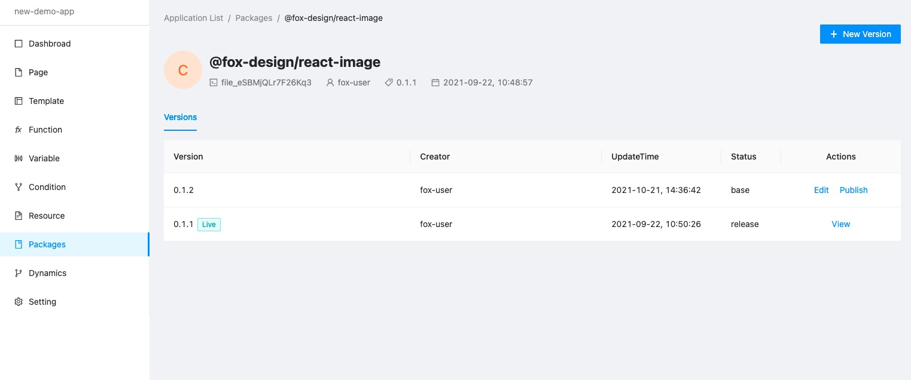
  

</html>

点击 new Version 新建版本

<html>
  

    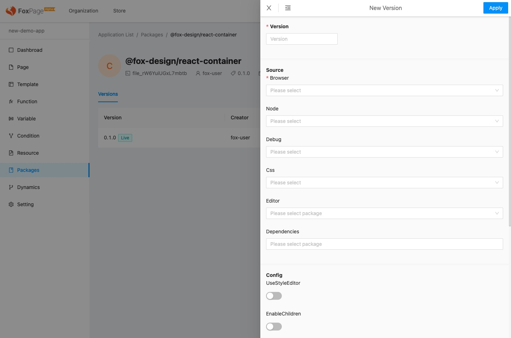
  

</html>

组件版本生效会有一个简单的发布流程

1. edit 编辑当前版本（只有 base 版本可以编辑）
2. view 预览当前版本（版本发布之后不可编辑，只能预览）
3. publish 发布当前版本为 release 版本
4. live 设置当前版本为生效版本

#### 应用设置

可对应用的基本信息、国际化、访问控制、静态资源等进行设置

<html>
  

    
  

</html>

## 项目管理

项目管理入口，组织的 admin 可以管理组织下面所有的项目

<html>
  

    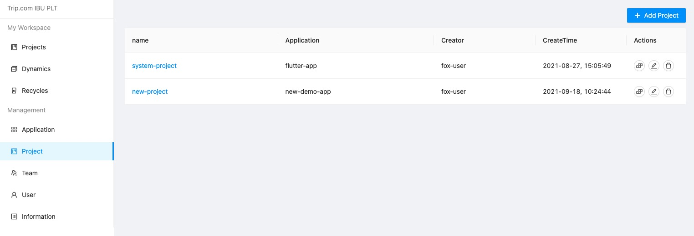
  

</html>

新建项目

- project name：项目名字
- application：项目所属的应用

<html>
  

    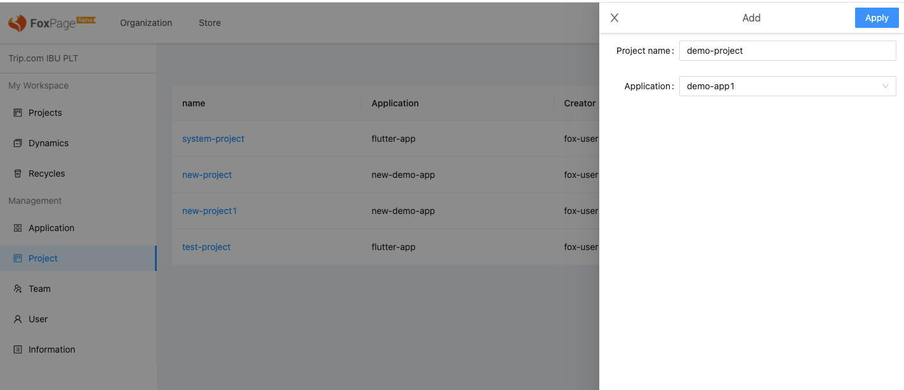
  

</html>

## 团队管理

组织下面可以创建团队，一个组织可以拥有多个团队。团队可以添加多个成员，在创建团队有会同时生成团队的工作空间

<html>
  

    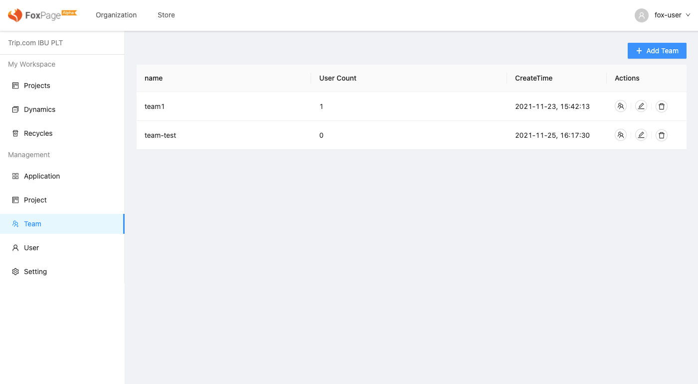
  

</html>

点击“Add Team”创建一个新的团队

<html>
  

    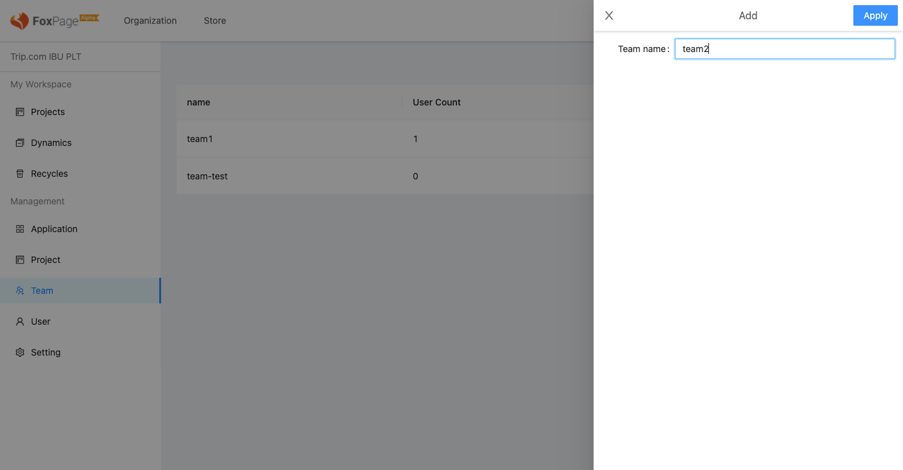
  

</html>

添加团队成员，成员来自组织成员

<html>
  

    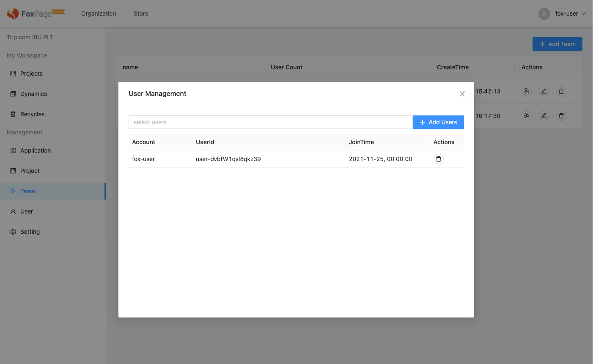
  

</html>

## 用户管理

组织下面的用户管理，可以添加用户相关的信息，添加过后的用户可以使用账号登录系统

<html>
  

    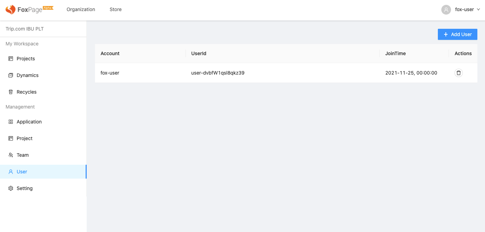
  

</html>

点击“Add User”添加一个新的用户

<html>
  

    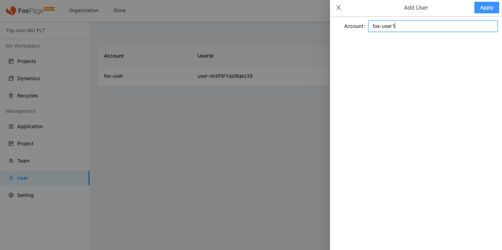
  

</html>
## 组织设置
