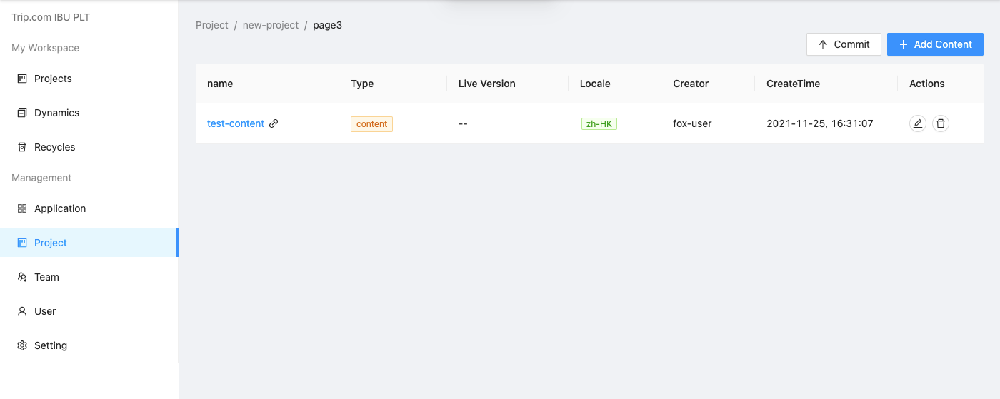
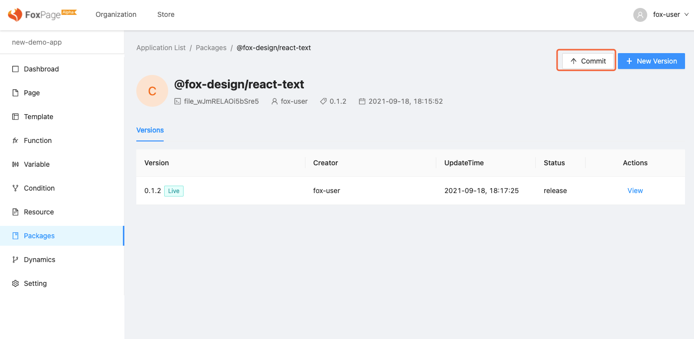
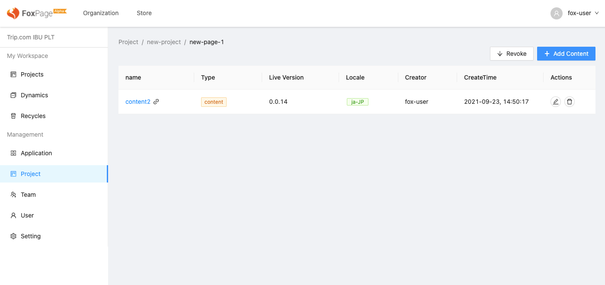
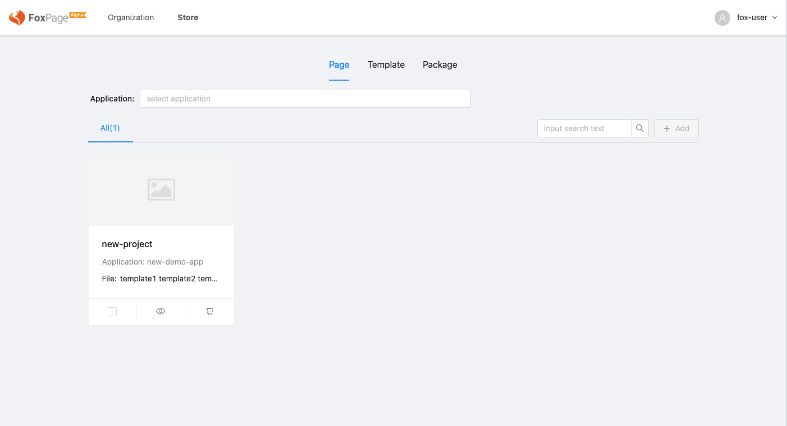
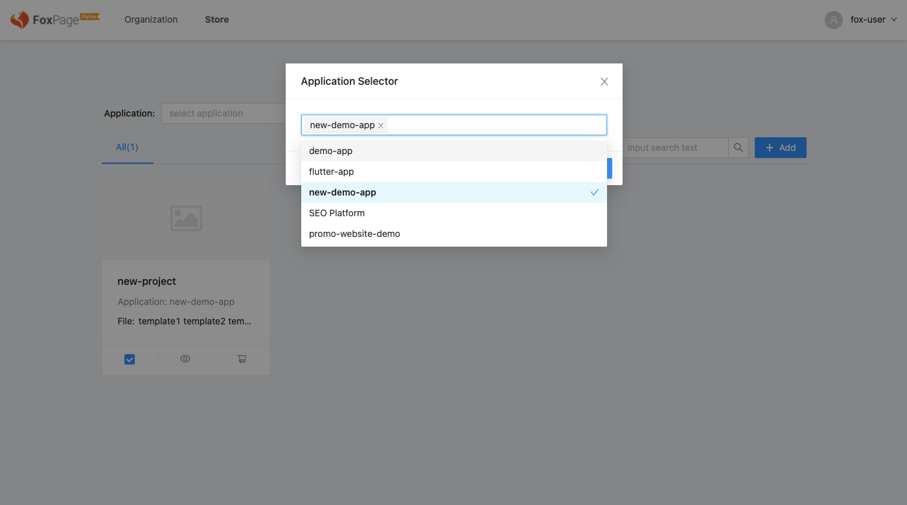
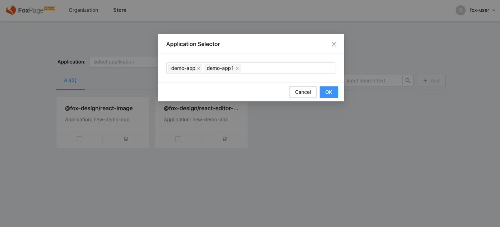
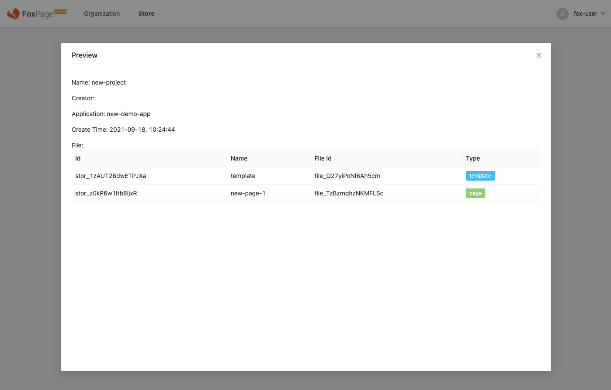

通过商店应用之间可以交换和分享各自私有的内容，这样可以提供内容的复用率，减少不必要的重复的工作，从而提高效率

## 上下架应用文件

理论上应用中的类容都可以通过商店来分享，目前我们先开放了页面，模板，包内容在商店中分享。上下架过程只会对文件打上一些状态标记，不会涉及到内容的拷贝复制，所以不会造成内容的冗余和碎片的产生。同样下架就不会影响已经购买的文件内容，只是用户不会在购买到此文件

### 上架页面，模板到商店

可以通过文件的详情界面中的“commit”按钮上架到商，页面、模板上架后其下的所有内容都默认上架，也就是说是按照页面、模板粒度上架的，上架后下面的内容在商店中都可被访问

<html>
  

    
  

</html>

注意：用户在购买内容时，系统会选取“Live”的版本返回，这样一来当“Live”版本发生变化时，用户新购买的内容也会变化

### 上架包到商店

与上架文件的流程一样，可以进入应用中包管理界面中，通过 “commit” 按钮上架

<html>
  

    
  

</html>

### 下架文件

上架过的文件详情界面中的 “commit” 文案为变成 “Revoke” ，点击后就会下架

<html>
  

    
  

</html>

## 从商店中添加文件到应用

进入到商店频道可以通过 Page，Template，Package 三个分类选取想要的文件。同时也可以通过简单过滤条件，筛选出需要的文件

<html>
  

    
  

</html>

### 添加页面、模板到应用

进入到对应的分类中选择所需要的文件，注意他们是按照所属的项目的维度聚合展示在商店中的。点击购物车图标或 “Add” 按钮

<html>
  

    
  

</html>

选择要添加到的目标应用，这里可以选择多个应用。选择完成后点击确定即可

<html>
  

    
  

</html>

### 添加包，变量到应用

添加包的流程和其他文件有一些差异，页面、模板是以克隆的方式添加到应用中的。但是包和变量除了克隆模式还支持引用模式

- 克隆模式，克隆模式会在目标应用中创建一份副本，内容会和源分开，互不影响

- 引用模式，引用模式会在目标应用中建立一个引用关系，主体的内容是从源中获取，会随着源的变化而变化

用户可以更具自身的需求选择这两种模式

<html>
  

    
  

</html>

### 查看项目详情

点击“眼睛”的图标可以进入的项目的详情信息界面，会查看到项目中的所有的文件列表

<html>
  

    
  

</html>
