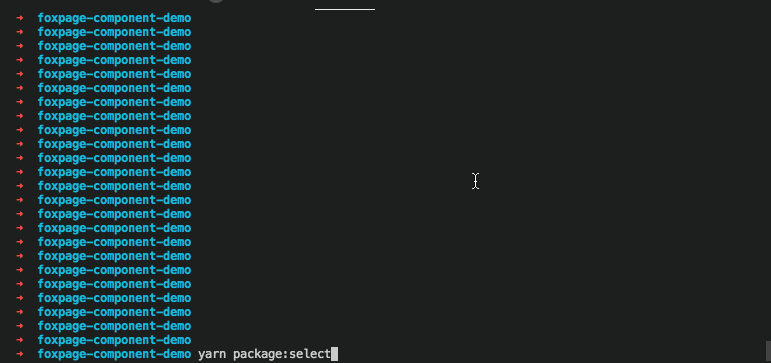
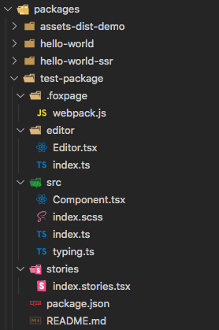

## 创建组件开发项目

通过 Foxpage CLI 组件脚手架工具创建组件项目【[详见命令行工具](/developer/tool/foxpage-cli)】

创建一个名为 "foxpage-component-demo" 的组件开发项目，默认会添加 "foxpage-component-" 前缀, 方便项目分类和维护

```sh
$ foxpage-cmpt project demo
```

创建过程如下：

<html>
  <div style="text-align: center; ">
    
  </div>
</html>

根据提示自动帮我们安装好了项目依赖，进入项目目录后启动项目

```sh
$ cd foxpage-component-demo

$ yarn start
```

注：组件开发项目是一个多包项目

## 创建组件

通过 `scripts` 脚本, 使用 `yarn` 或者 `npm` 运行即可 ,在项目根目录运行以下命令：

根据指定模板创建项目

```sh
$ yarn package:new
```

根据模板目录, 让用户自行选取组件模板

```sh
$ yarn package:select
```

<html>
  <div style="text-align: center; ">
    
  </div>
</html>

## 项目结构

组件的目录结构如下:

<html>
  <div style="text-align: center; ">
    
  </div>
</html>

- `.foxpage/`: 提供单个组件维度的用于 `foxpage` 相关流程的配置文件, 例如为单个组件定制 webpack 配置用于资源优化
- `editor/`: 为组件提供 `props 编辑器`(在 foxpage 中我们统一叫它 editor), 通过 `editor` 我们不仅可以在开发环境编辑组件 props, 也可以在 `foxpage` 平台做同样的事情
- `src/`: 顾名思义, 组建相关的代码都放在该目录里. 你需要遵循以下规范:
  - 通过 `src/index.ts` 导出组件
  - 在 `src/typing.ts` 文件内部提供名称为 `ComponentProps` 类型声明, 用于为组件生成 `schema.json`, `schema.md` 文件
  - 由于 foxpage 平台仅处理 `.js` `.css` 文件, 所以 图片等其他静态资源文件请使用`绝对路径`引入, 相对路径会在 `foxpage` 平台渲染时丢失
- `stories/`: 提供 [storybook](https://storybook.js.org/) 读取的组件 `stories` 文件, 用于展示本地开发组件(需要熟悉 storybook, 不熟悉的话套用组件模板也可以正常开发和展示组件)
- `test/`: 如果你需要的话, 请为你的组件提供测试用例
- `package.json`: 组件包配置文件
- `README.md`: 组件说明文档

## 资源构建

### 构建脚本

首先看看 `package.json` 里我们提供的 `scripts` 脚本:

```json
{
  "build": "npm run build:lib && npm run build:es && npm run build:foxpage",
  "build:foxpage": "foxpage-cmpt build --foxpage",
  "build:lib": "foxpage-cmpt build --lib",
  "build:es": "foxpage-cmpt build --es-module",
  "build:md": "foxpage-cmpt build --schema-md",
  "prepublishOnly": "npm run build"
}
```

我们为组件的资源构建提供了一整套服务, 功能如下:

- `build:foxpage`: 构建出 `/dist` 用于 `foxpage` 平台注册的组件静态资源
- `build:lib`: 构建出 `/lib` 用于 `npm` 包的发布注册 (私有仓库请自行修改仓库地址, 或者自行提供 pipeline 运行的脚本)
- `build:es`: 构建出 `/es` 用于 `npm` 包的发布注册 (私有仓库请自行修改仓库地址, 或者自行提供 pipeline 运行的脚本)
- `build:md`: 基于 `src/typing.ts`(需要遵循 [schema 规范](https://github.com/YousefED/typescript-json-schema/blob/master/api.md)) 构建出 `schema.md`, 快速生成组件的 `Props` 说明文档, 对外方便接入

你不仅可以在单个组件内部运行 `scripts` 脚本构建组件, 也可以在项目根目录通过 [lerna](https://www.lernajs.cn/) 或 `foxpage` 对所有的组件做资源构建的操作

通过运行以下指令对所有的组件进行 `build` 操作, 不了解 `lerna` 的最好了解一下, 这是一个非常强大的包管理工具

```sh
$ lerna run build
```

通过运行以下指令对所有的组件进行 `build:foxpage` 操作, 并提供所有组件的 `dist/` 目录到项目的根目录下的 `dist/` 文件夹, 这样就可以以项目维度来发布组件的静态资源文件到你自己的资源服务器, `foxpage` 暂时不提供静态资源服务, 需要你自己部署

在项目根目录运行一下脚本

```sh
$ yarn build:foxpage
```

### 静态资源内容

首先看用于 `foxpage` 平台的静态资源文件:

<html>
  <div style="text-align: center; ">
    
  </div>
</html>

- `dist/`: 目录下主要由以下内容构成:
  - `umd/`: 存放组件的 umd 资源文件, 用于 `browser` `web` 环境
    - `production.min.js`: 组件资源文件的 `prod` 版本, 用于线上
    - `development.js`: 组件资源文件的 `development` 版本, 用于开发环境
    - `editor.js`: 组件的 `editor` 的资源文件
    - `style.css`: 组件的样式文件
  - `cjs`: 存放组件的 cjs 资源文件, 用于 `node` 环境
    - `production.js`: 组件资源文件 `node` 环境的 `prod` 版本, 一般用于服务端渲染
- `es/`: 用于 npm 发布的 `es-module` 类型的组件资源文件, 在 `package.json` 中通过 `module` 字段引入
- `lib/`: 用于 npm 发布的 `commonjs` 类型的组件资源文件, 在 `package.json` 中通过 `main` 字段引入
- `schema.json`: 组件 Props 类型声明的 schema 描述文件
- `foxpage.json`: 用于 foxpage 平台的组件描述文件 (保留文件, 用它标识更多的组件信息)

## 组件发布到 npm 仓库

组件的发布完全交给 [lerna](https://github.com/lerna/lerna) 工具来处理, 你需要熟悉 [lerna version](https://github.com/lerna/lerna/tree/main/commands/version#readme), [lerna publish](https://github.com/lerna/lerna/tree/main/commands/publish#readme) 两个指令工具, 以及 `lerna.json` 的文件配置规则, 这里不做赘述, 请自行查看官方文档

你要做的就是在 `<root>/lerna.json` 文件中配置好 `registry` 信息:

```json
{
  "command": {
    "publish": {
      "ignoreChanges": ["index.stories.tsx", "package-lock.json"],
      "message": "chore(release): publish",
      "registry": "https://registry.npmjs.org"
    },
    "version": {
      "push": false,
      "conventionalCommits": true,
      "changelog": false
    }
  }
}
```

`registry` 标识组件要发布的仓库, 如果是私有仓库, 请自行提供路径

设置好后, 你需要通过 `npm` 工具登录(npm login, npm adduser)用户(请保证该用户有对应 registry 仓库的发布权限, 特别是私有仓库), 然后你只需要在项目根目录运行 `lerna publish` 命令即可发布所有修改的组件, 如需指定版本请查看 lerna 配置.

你可能会遇到以下问题:

1. npm 仓库是私有仓库怎么办？

无论是什么仓库, npm 发布包的核心流程都是: 登录 npm 用户 => 设置 npm registry => 运行 npm publish => 执行 prepublishOnly 等钩子做资源构建 => 发布构建的资源 => end
所以本质上跟是否是私有仓库无关, 而是看你的私有仓库的发布流程对 `多包发布` 是否有良好的支持程度

> 这里补充下为什么要用 `多包发布`, 多包发布可以让开发者无需关心组件间的依赖关系, 例如: A 依赖 B, 在开发的时候我必须先发布 B, 才能修改 A 进而才能发布 A, 多包发布则无需担心, 同时修改同时发布. 当然还有更多的优点, 开发者可自行查阅

2. 包名带了 `scope`(`@foxpage/foxpage-cli` 中的 @foxpage 就是一个 scope) 发布老是失败

在 package.json 中配置以下信息:

```json
{
  "publishConfig": {
    "access": "public"
  }
}
```

> 注意: 我们会在此持续补充组件发布的相关问题来帮组开发者, 但更加重要的是开发者自身对 `lerna` 工具 以及 `npm 发布流程` 有更多的知识储备
