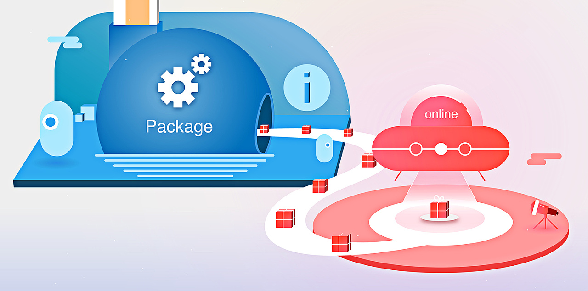

## 简介

这里主要面向开发者提供 Foxpage 框架的安装、部署、接入和使用等相关教程，可以帮助开发者快速的在项目中使用 Foxpage 框架

<html>
  

    
  

</html>

## 注意事项

- Foxpage 作为前端低代码框架，是一个技术框架理论上是不涉及到业务部分的。开发者需要考虑怎么去设计你的业务模型和架构

  拿组件化来说明：在组件化的过程中，开发者需要站在整个应用和业务的角度去考虑，哪些模块需要组件化来降低重复开发的成本，哪些不适合组件化。组件的主体内容是静态数据，还是通过请求接口获取的动态数据，哪些信息根据具体的业务是要做成可配置的才更灵活。组件的粒度粗细怎么控制？这会影响到使用组件的人的体验，越细的粒度可能越灵活，但是组合后使用起来越复杂，会增加配置费力度。还有一些其他问题就不一一说明了

- Foxpage 不提供静态资源存储、部署及 CDN 内容分发相关的功能

  对于静态资源存储，开发者可以按照自身的情况来选择通过云服务自建或者使用第三方托管服务。同时 Foxpage 也不提供组件项目的 CI/CD 相关的功能，因为 Foxpage 本身没有对应的构建和部署环境。开发者可以借助市面上成熟的工具或服务来完成 CI/CD，整个过程 Foxpage 不会介入

- 组件化过程中的支持

  当开发者按照自己设计和架构去完成组件化落地时，Foxpage 会提供一系列的支持。如：我们提供了组件开发的脚手架，提供了可视化调试工具，提供本地构建，线上注册的流程和工具。我们关注组件化落地过程中的整条链路上的开发和使用体验。从组件的定义，开发实现，调试，测试，部署，注册，可视化配置使用，发布及效果分析。当然我们也会提供一些自己的实践供开发者参考

#### 深入浅出

开发者如果想要更深入的了解 Foxpage，可以移步至“[进阶之路](/advance)”频道
