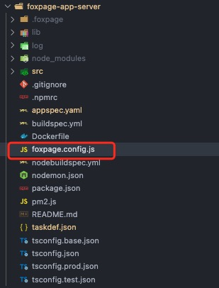

## 如何接入 Node SDK？

`Foxpage Node SDK` （以下简称：Node SDK） 是 Foxpage 核心部分，为 node 服务端提供支持，同时帮助应用快速接入。下面将分步骤说明如何接入并使用。

### 准备应用

在接入 Node SDK 之前，须先创建一个应用，如何创建请看：[创建应用](/course/create-application)。  
创建好应用后，需有一个应用服务项目（例如：[app server](https://github.com/tripcorptech/foxpage-sdk-js/tree/main/packages/foxpage-app-server)）来接入 Node SDK。下面开始介绍如何在应用服务项目中接入 `Foxpage Node SDK`。

### 引入

```sh
$ npm install @foxpage/foxpage-node-sdk --save
# or
$ yarn add @foxpage/foxpage-node-sdk
```

> `@foxpage/foxpage-shared` 包含一些公共 utils，看需要引入。  
> `@foxpage/foxpage-types` 包含一些公共类型。

### 配置

在根目录下新增`foxpage.config.js`或`.foxpagerc.js`文件，添加相应配置。

<div style="text-align: center;">
  
</div>

详细配置项如下：

- apps - `array` - 应用列表，包含对应应用的配置信息。
  - appId - `string` - 应用（上面创建的[应用](/course/create-application)） ID。
  - configs - `object` - 基础配置集合。
    ```ts
    // 是否开启调度器
    'schedule.enable'?: boolean;
    // 调度器间隔时长
    'schedule.interval'?: number;
    ...
    ```
  - plugins - `array` - 插件列表。
    > 需要哪些插件可以从 [插件市场](/resource/plugin) 自行搜索，也可以参考 [插件开发](/developer/integration/plugin) 开发自己的插件。
  - pluginDir - `string` - 插件目录，一般为 node_modules 目录，默认不配置则为当前执行目录即：process.cwd()。
- dataService - `object` - 数据服务配置。
  - host - `string` - 服务域名

### 使用

目前可以通过两种方式来接入 Node SDK，分别是中间件和 API。具体如下：

#### 方式一：中间件

目前提供的中间件是处理路由匹配的，如果路由交给`Foxpage`来管理的话，则可以接入该中间件，自动[解析匹配路由](/advance#foxpage-路由)。

```ts
import { createKoaMiddleware } from '@foxpage/foxpage-node-sdk';
...
app.use(createKoaMiddleware());
...
```

#### 方式二：API

如果不使用`Foxpage`路由，希望应用自己管理路由，则可以通过调用相关 API 的方式来实现页面渲染。

```ts
import { renderToHtmlByPageId } from '@foxpage/foxpage-node-sdk'';
...
// get appId & pageId by application customize logic
const { appId, pageId } = customizeFunc();
...
const html = renderToHtmlByPageId(appId, pageId)
```

> 页面渲染详情请看：[服务端渲染](/advance#服务端渲染ssr)。

### 最后

目前，你已经接入 Node SDK，如果想更深度了解 Node SDK 的一些高阶功能和实现原理，可以移步到高阶篇：[Foxpage Node SDK 进阶之路](/advance)。
