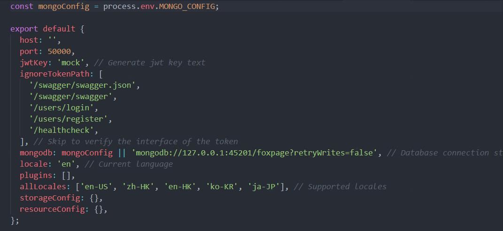
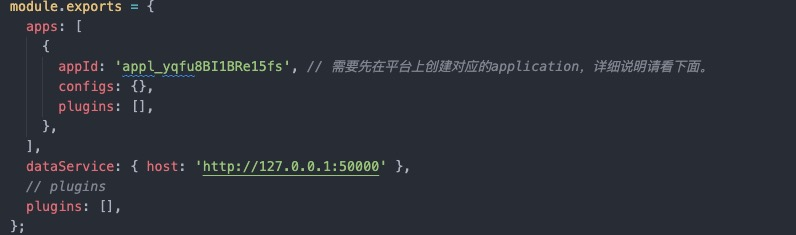

## 本地安装

`Foxpage`作为一款前端低码框架，支持二次开发和私有化部署。为此，`Foxpage`提供了一整套完整的工具来支持开发者快速接入和使用。下面将详细地来介绍如何在本地安装。

### 环境准备

nodejs >= 14.15.1 <= 16.0：需要提前安装 node，14.15.x 版本以上, 16.0 以下的版本。  
mongodb 5.0.2+：需要提前安装 mongodb，5.0.2 版本以上。
Mongoose 5.12.14+：需要提前安装 mongoose，5.12.14 版本以上。

### 安装工具

安装统一 CLI 工具，快速下载项目。

```sh
$ npm install @foxpage/foxpage-cli -g
# or
$ yarn global add @foxpage/foxpage-cli
```

> 更多 CLI 工具详细介绍请看：[Foxpage CLI](/developer/tool/foxpage-cli)

### 创建项目

在指定目录下，通过简单的命令即可下载完整的项目。

```sh
$ foxpage-server fetch
# or
$ foxpage-server fetch <root>
```

默认创建的项目名称为 foxpage，`<root>`可指定项目名称。

根据命令提示或手动下载各项目的依赖包：

```sh
$ foxpage-server install
```

下载好后的目录如下：

```ts
<...>
  └── foxpage
      ├─foxpage-admin               // foxpage admin portal project
      ├─foxpage-app-server          // foxpage application project
      └─foxpage-server              // foxpage api server project
```

至此，项目本地基本安装就完成了。但需要能在本地启动项目需要经过以下配置。

### 项目配置&启动

项目下载好之后，即可开始配置相关项目。

#### 步骤 1：配置 foxpage server

- 进入 Foxpage server 项目下：

```sh
$ cd foxpage/foxpage-server/config/environments
```

- 找到公共配置文件`development.ts`，按需要修改相应的[配置](/developer/integration/server-apis)，样例如下：
  <div style="text-align: center;">
    
  </div>

数据库`mongodb`必需配置好，才能让 server 顺利启动。由于使用了事务，mongodb 需要启动至少 2 个节点

- 本地启动

```shell
$ yarn boot

$ npm run start-server:prod

// 初始化数据
$ npm run init-server:prod
```

此时，本地 Server 服务已启动成功，可通过 http://127.0.0.1:50000/ （端口可自定义） 来访问，下面两个项目中会使用到。

#### 步骤 2：配置 foxpage admin

- 进入 Foxpage admin 项目下：

```sh
$ cd foxpage/foxpage-admin
```

- 找到公共配置文件`config.profile.js`，按需要修改相应配置，样例如下：
  <div style="text-align: center;">
    
  </div>

本地配置`dev.foxpageApi`（foxpage server 的访问地址）即可。

- 本地启动

```sh
$ npm run start
# or
$ yarn start
```

此时，本地 Admin portal 已启动成功，可通过 http://127.0.0.1:3002/ 来访问。

> 本地端口可在`/foxpage-admin/webpack/webpack.dev.server.js`下自行设置，生产端口默认 80，在`/foxpage-admin/server/app-express.js`设置

#### 步骤 3：配置 foxpage app server

> 说明：foxpage app server 是框架提供的 Node 端前端应用的 demo（模板）项目，可在此基础上进行二次开发和安装。

- 进入 Foxpage app server 项目下：

```sh
$ cd foxpage/foxpage-app-server
```

- 找到公共配置文件`foxpage.config.js`，按需要修改相应配置，样例如下：
  <div style="text-align: center;">
    
  </div>

本地配置`apps[idx].appId`（应用 id）和`dataServer.host`（foxpage server 访问地址）即可。其他更多配置详情请看：[配置](/developer/integration/node-sdk#配置)。

- 本地启动

```sh
$ npm run start
# or
$ yarn start
```

### 最后

通过以上步骤，`Foxpage`的项目已经安装完成，并且可以在本地启动了，快来试一试吧。
