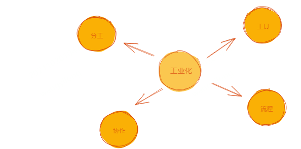
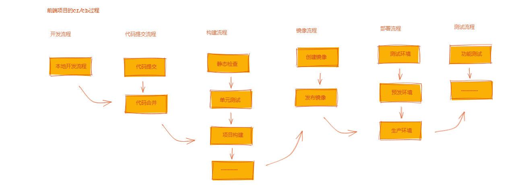

## 背后故事

Foxpage 前身是 Trip.com 在 2019 年在内部上线的一个活动页面可视化搭建的系统。他的诞生原因也很简单，随着业务的高速发展，当时候活动页面制作的需求急速增加，导致开发跟不上。简单粗暴点的办法，靠加人也解决不了问题，没办法只能从技术上寻求突破，深入到开发过程后梳理出一些问题：

1. 每个活动都可能是一个小项目，页面和功能形式各异且繁多，每每都需要重新开发
2. 页面内容更改频繁，每一次更改都要走一次开发发布流程，非常耗时
3. 随着项目中的活动增多，项目中的代码量也膨胀了。整个 CI/CD 过程变得非常耗时
4. 活动要支持国际化，各个国家或地区的运营和策划会有一些个性化的需求，工作量按语言的数量成倍上涨

找到问题后（这里就不一个个去分析了），直接说说我们做了哪些事：

- 将活动页面代码按业务模块化，将出现频率高的部分组件化，经常会变化的内容做成可配置的
- 从产品需求和页面设计的部分就开始控制，尽可能在参考我们已有的组件进行设计，这样时间长了会沉淀出一些标准化的组件
- 将页面结构化，用结构化的数据去描述页面。同时将常用的结构制作成模版供别人使用
- 提供一个页面在线配置系统，同时提供在线协作功能。多种角色可同时对页面内容编辑，互不影响
- 按照语言粒度在页面下创建页面结构内容，不同语言的页面结构可以各不相同
- ..........

这一系的事情我提取了几个关键词 “组件化”，“赋能”，“在线协作”，“可视化编辑”，“模版”，看到这里是不是有种似曾相识感觉？这不就是市面上的那些可视化搭建页面的系统吗？不错，我们也研发了这么一套系统，我们按照自身业务的需求还增加了一些扩展功能。系统一经上线，效果明显。截至 2021 年中为止，大约有 3000+的 Trip.com 的活动页面在页面配置系统上制作完成，同时在线的页面有 1000+，平均每天有 100+的页面在不间断的更新。制作效率大大提高，而我们在活动页面上投入的开发人员却一直只有一个到两个。从结果上看这套方案是成功的，保质保量的完成页面制作需求

在尝到甜头后，我们就考虑在别的场景中使用。整个 2020 年我们就一直在探 Foxpage 的边界，通过 Trip.com 这块试验田，在 “D2C”，“邮件页面“，“静态站点页面“，“SEO 页面”，“文章和博客页面”，“海报”，“移动 APP 页面” 等方面做了一些尝试，结果也是非常不错。这让我们更加确信这套方案的可行。2021 年年中内部决定选择开源，希望更多的人可以使用到这套方案或是给业界提供一个解决这类问题的思路。同时也希望集思广益，借助大家的力量来推动其发展，互利互惠。在定位上我们确定 Foxpage 为一个前端低代码轻量级的框架。

其实在方案选择上，我们还有有考虑过用市场上现成的 CMS 产品，但是由于技术栈，难扩展，功能臃肿，页面排版功能弱以及考虑到二次开发的成本等原因，最后还是放弃了。最终还是选择自研，也正是这个决定，才有了现在的 Foxpage 框架，他还年轻，未来可期

## 一些思考

从业务需求出发，引发了开发的问题，在不停的解决问题的过程中，又一步步地沉淀出 Foxpage 框架。认真思考，为什么会有 Foxpage 这么一个框架？ 他到底解决了什么问题？ 市场上有没有需求？ 他的未来会怎样？ 。。。。。。很多很多问号，一时间也不知如何作答。其实 Foxpage 的诞生是偶然的也是必然的，为什么这么说？目前我还没看到过有人对 “可视化搭建工具”，“低代码开发平台”，“CMS”等这类产品的出现的原因做过分析过及核心解决的问题。这里我想从工业化的角度来浅谈下前端开发的过去，现在及未来。从侧面说说这些产品出现的必然性

## 从工业化看前端开发

大家都知道前端技术发展史，真是百家争鸣，百花齐放。各类技术和框架层出不穷，迭代迅速。这也导致前端技术的撕裂，各自为政，大大增加了前端项目的开发难度。当然大家还是有一致的目标的，那就是 “ 提高效率，降低成本 ”，这也恰恰和工业化核心目标是一致的，最终的目的也都是最大化的提高生产力。

如果依照工业化发展的阶段来看，前端开发也可能经历如下几个阶段：

1. `初级阶段`
2. `工程化阶段`
3. `自动化阶段`
4. `智能化阶段`

个人认为这四个阶段每个阶段都需要经历的，不可能实现跨越式发展，有了前一段的沉淀和积累才可能进入下一阶段。对后端开发也同样适用，其他行业也大多这样。其实前端开发目前还一直是劳动密集型行业，项目还是依靠大量开发不停的堆叠起来的。在经历过工程化的加持后，其实效率已经有大的提高，但也仅仅是相对的，整体工业化程度还不是很高。

可以从这几个特征去看的工业化程度，细致明确的分工、标准完善的流程、丰富的工具、流畅的协作:

> 工业化解释这里不做过多赘述，大家可以自行搜索

### 初级阶段

特点：单人作战，一气呵成

这个阶段就是“个人英雄主义”的表现，单打独斗，仅凭一己之力完成需求，只看结果不注重过程。有少量的工具支持

### 工程化阶段

特点：开始有分工，流程，工具。分工合作，各司其职

这里指的是前端项目的工程化，当前我们应该正处于工程化阶段。对于工程化大家都有各自的理解，没有统一的解释。个人觉得工程化可是算是工业化过程中的一种应用实践。

> 工程是科学和数学的某种应用，通过这一应用，使自然界的物质和能源的特性能够通过各种结构、机器、产品、系统和过程，是以最短的时间和最少的人力、物力做出高效、可靠且对人类有用的东西。将自然科学的理论应用到具体工农业生产部门中形成的各学科的总称。(摘自百度百科)

当下我们前端开发的过程，有各类的工具和系统支持，流程上也都挺完善。从前端项目工程的搭建，业务开发，调试，测试，部署到运维等环节都有体现，而且还在持续不断的进步。从项目代码上看，我们做了模块化，做了前后端分离，做了组件化，做了动静分离，还有诞生了大量的框架和工具等等。从单个项目角度来看工程化阶段工业化程度还是蛮高的，那我们是不是就可以顺利渡过这个阶段将到达下一个阶段呢？个人认为不是，我们来先来看看如下两种情况：

1. 假设某公司有前端项目数量成千上百个，都是独立部署。这时业务对前端提了大量的页面结构的变更需求，同时涉到上百个的项目的更改

2. 假设某一个项目【[参考项目实践](/guide/practice)】有上千张不同的动态页面，每张页面背后都可能承载了一次业务需求，开发的时候都按一个个独立小项目开发的。这时业务对前端提了大量的页面结构的变更需求，同时涉到上百张的更改

第 2 点的这种情况一般都会分拆分成多个小的项目，最后又可能会和第 1 点情况相似，这样拆分本身会解决掉一部分流程上相互依赖影响的问题，有点“微前端“的方案的思路。那我们就先看第 1 点的问题，开发接到需要后开始实现，但量变引发了质变，发现整个过程出现的问题很多，比如说所有项目中都要升级某一个包的版本、比如在所有页面中加一个模块等有很多这样的批量操作，只能靠能人力来堆耗时耗力。在比如开发和业务及编辑的协作问题变的无序低效，还有就是 CI/CD 等环节也都都出现了问题。我们来重点看下 CI/CD 的这个过程, 每当有变更哪怕是一个字母的更改都要走一次如下图的流程

虽然很多环节的流程都实现了自动化，但是整个过程还是需要开发介入的。在变更需求量变得很大的时候可以想象是多么的费时费力。这个时候按项目粒度的工程化是不是就变得没那么高效了？当然正常的项目开发过程中是没什么影响的，但是当数量放大到一定的程度的时候，所有环节上的问题都暴露出来了。如果把解决需求比作成生产产品，我们遇到的问题在制造业里就是无法实现规模化生产，无法按时足量的交付，无法量产。按照项目粒度的工程化还在不停的向前发展，也许在不久的将来。。。。。。可以量产，从而进入下一个阶段

### 自动化阶段

特点：标准化，流程化，规模化

既然工程化阶段目前还解决不了量产的问题，我们能不能换个思路绕过他？我们先来看看 CI/CD 的这个问题，过程为什么要这么复杂？不就是为了要保证高质量高效率的交付吗？那最终交付的是些什么呢？站在开发的角度不就是代码吗？也就是说由于修改了代码，需要做交付，所以要走一系列的流程保证交付质量。那是不是不改代码就不需要走这个过程了？那么问题来了怎么在不更改代码前提下满足业务或技术变更需求呢？这个时候出现了动态内容配置和更新的方案，简单来说就是把动态的内容存在服务端，在需要的时候通过接口在拿到内容去更新或展示。页面从静态转变为动态的这个过程就是动态化方案的体现，这种形式在开发过程中非常的常见

那么哪些内容可以做成可配置的呢？我们举几个不涉及到代码变更的需求例子如下：

- 项目运行参数配置变更

- 前端页面中产品信息变更

- 前端页面中部分的静态文案变更

- 前端页面结构和内容变更

各类的在线的配置系统也应运而生。 中心化的配置系统，产品信息管理系统，文案配置系统，CMS（Content Management System）等等，当然这些系统的诞生也不仅仅是因为要动态化，这几类系统实现的原理和方式都差不太多，每个系统都管理着部分的内容，从部分内容的动态化发展到后来的整张页面内容的动态化。也正是因为这类动态化方案的进一步发展，才有了现在的自动化生产页面的能力。让量产成为可能，从而大大的提高了解决大量变更需求的效率

我们在回过头看看第 2 点的这种情况，除了拆分成多个项目还有别的方法吗？站在业务的视角看每张页面可能承载了一次业务需求，他们都是各自独立的，互不干扰，他不会关心页面背后的所属的项目或应用划分。而站在技术的视角他们又有一定的共性，如是同一种形式的业务、用同一种框架、同一个规则的访问入口、同一个版本的某个包等等。站在业务的角度页面要分，不要互相影响。站在技术的角度项目可合，减少维护成本

CMS（Content Management System）这类方案可以很好的解决多页面项目的这类的问题，他将从项目开发模式转变成页面开发模式，每张页面都可以有独立的开发流程，发布及存储，互不干扰。参考现在流行的“Serverless”概念，对于页面开发者来说，这种模式是不是有点像“Appless”（自创词）？用户不需要关心页面背后的宿主项目或应用，只要实现自己的页面部分的制作即可，开发也不会因为页面繁多的问题有技术上的烦恼，CMS 的到来一定程度也将前端开发领进了自动化阶段，这里的自动化是以页面粒度的开发的自动化。怎么去理解呢？

结合上图来看，把站点看成生产线，页面看成最终生产出来的产品，以前的页面是线下开发拼装，然后伴随着应用的发布发到线上的。结合 CMS 建站方案后，就不需要走线下开发流程了，而是通过制作好的图纸（这里理解为 CMS 中配置的内容）再加上预先生产好的零件在线上自动的拼装出页面结构了。

按照目前的行业技术来看，前端开发应该已经迈进了自动化初级阶段，并可能长期停留这个阶段。虽然目前已经能很大的提高了生产力了，但是还有很大的提升空间。一但技术趋向成熟，将会以星火燎原之势对前端开发产生巨大的影响。这也是 Foxpage 的主战场，我们也将继续深耕这个阶段

### 智能化阶段

特点：能自行感知环境并作出一定反馈

畅想下这个阶段为发生什么？当某个地点的搜索关键词热度突然升高时候，这时候系统自动生成了对应关键词搜索落地页面，里面呈现出该地点周边的酒店和到达这个地点的交通方式及预订信息，并且实时的更具用户的浏览行为做了页面中模块的排序和内容排版调整。还会按照不同年龄段的用户展示不同风格的页面。

个人认为当自动化阶段发展的一定的程度才可能进入智能化阶段，未来会怎样？假如前端还会存在，时间线拉长来看，我们一定会完成自动化阶段的建设，然后进入到智能化阶段。工业化是一双无形之手推动着各行各业向前发展，前端开发、后端开发都不会例外。总会有组织或个人会在某个时间点完成这项使命，让我们怀着积极的心态来拥抱智能化的未来。

## 核心能力

作为前端低代码框架，Foxpage 能做什么？我们帮助开发者搭建了一条页面自动化生产线，并提供了一系列的配套支持。以下借制造业的核心的构成部分来说明下 Foxpage 提供了什么

- 零件（组件）：提供了一套零件生产工具及流程（脚手架、可视化调试工具，开发、调试及使用流程）
- 图纸（页面结构内容）：提供了画图工具（可视化编辑器），模版
- 生产线（站点）：提供了自动化生产设备（解析器，渲染引擎），自建物流（资源管理器）
- 配套（平台）：提供建设各类仓库所需要的场地（按组织，团队，应用提供了相应的独立的空间），交易市场（商店）

有了这条生产线后，页面生产车间中在也不需要组装工人了（前端开发），也不需要质检工人了。在零件能支持的前提下，有画图纸能力的人就能生产页面，整个过程都是在线进行并由系统提供一系列的支持

> 框架（Framework）是一个框子——指其约束性，也是一个架子——指其支撑性。
>
> IT 语境中的框架，特指为解决一个开放性问题而设计的具有一定约束性的支撑结构。在此结构上可以根据具体问题扩展、安插更多的组成部分，从而更迅速和方便地构建完整的解决问题的方案。
> (摘自知乎)

从工作流上看，Foxpage 提供的平台能力让各个职能可以在线合作，改变了传统线性的工作流程，减少了各职能之间不必要的依赖，缩短制作工期

同时以页面为粒度的工程化，提高了生产效率，质量，降低了成本。让组件化价值最大化。

## 不适用场景

主要是从体验和使用成本角度总结出以下不适用场景：

- 交互逻辑复杂的前端项目

- 定制化程度高且不易组件化的前端项目

- 页面内容或结构不会频繁变化的前端项目

两个需要用户注意的事项：

1. 在线搭建不等于在线写代码，不要把低代码系统变成了在线的 IDE

2. 不要为了低代码而低代码，有些交互复杂，定制化程度高的项目，使用低码的方式不仅成本高，而且体验也差

低代码虽好却并非适合所有的项目，根据实际情况谨慎使用！
